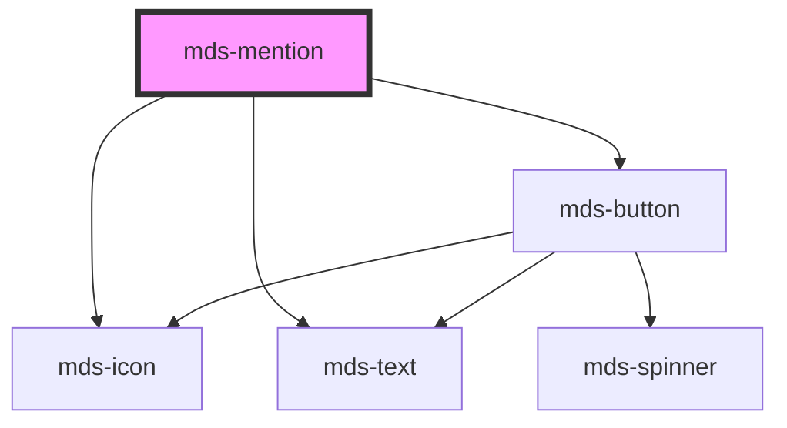

# mds-mention


<!-- Auto Generated Below -->


## Usage

### 1. Description

The `<mds-mention>` web component renders a compact inline chip that references a person or entity - the kind of token produced when you type `@name` in an editor or comment field. It pairs an icon, a text label, and a removable action into a single self-contained pill.

#### Semantic Behavior

- **Props-only**: It has no default slot and exposes its content exclusively through props.
- **Default icon**: When `icon` is not set the component falls back to the `alternate-email` (`@`) glyph, reinforcing the mention metaphor.
- **Built-in remove affordance**: Always renders a trailing remove button, signalling that the mention can be dismissed.
- **Size-driven typography**: `size` maps to a fixed typography ramp (`sm` → `caption`, `md` → `detail`, `lg` → `h6`); the label is bold at `sm` and `md`, and normal weight at `lg`.

#### Properties & Visual Configurations

- **`icon`** is an SVG filename slug from the Magma icon library, shown at the left of the label; omit it to keep the default `@` mention glyph.
- **`size`** controls both the physical scale and the typography of the label - pick `sm` for dense inline contexts, `lg` for prominent, headline-adjacent placements. Note that `size` also flips the label weight (bold below `lg`).


### 2. Pattern

Correct and idiomatic ways to use the `<mds-mention>` component, ordered from most common to most specialized. Patterns assume a working knowledge of the variant / tone ladders documented in [`docs/COMPONENTS.md`](../../../../../../docs/COMPONENTS.md) and the generic stencil rules in [`projects/stencil/SPEC.md`](../../../../SPEC.md).

#### Basic Inline Mention

The canonical form. Provide `label` with the user handle or display name. The component renders the default `@` glyph and a trailing remove button automatically.

```html
<mds-text>
  Ciao <mds-mention label="mario.rossi"></mds-mention>, sei riuscito a inviare il messaggio?
</mds-text>
```

#### Custom Icon

Override the default `@` glyph with any Magma icon slug via the `icon` prop. Use this when the mention refers to a team, group, or entity that has a dedicated icon.

```html
<mds-mention label="team-design" icon="mi/baseline/group"></mds-mention>
```

#### Sizing

Use the `size` prop to match the mention's visual weight to its context. `sm` is the default for dense inline use; `md` scales up the icon and typography; `lg` uses headline-weight typography for prominent placements.

```html
<!-- Dense list or comment thread -->
<mds-mention label="anna.verdi" size="sm"></mds-mention>

<!-- Standard body text -->
<mds-mention label="anna.verdi" size="md"></mds-mention>

<!-- Heading-adjacent or featured mention -->
<mds-mention label="anna.verdi" size="lg"></mds-mention>
```

#### Mention Inside a Comment or Message

Place `<mds-mention>` inline within `<mds-text>` to embed it naturally in body copy, preserving vertical alignment.

```html
<mds-text>
  Il documento e' stato approvato da
  <mds-mention label="lucia.ferrari" icon="mi/baseline/person"></mds-mention>
  e sara' pubblicato domani.
</mds-text>
```

#### Multiple Mentions in One Sentence

Drop several `<mds-mention>` tokens in the same text flow. Each is a self-contained pill; they line-wrap independently.

```html
<mds-text>
  <mds-mention label="marco.bianchi"></mds-mention> e
  <mds-mention label="giulia.conti"></mds-mention>
  sono stati assegnati alla revisione.
</mds-text>
```

#### Styling Customization

Adjust the icon size through the documented `--mds-mention-icon-size` CSS custom property. Set it on the host element or a parent selector; use Magma spacing tokens to stay on the design grid.

```css
.featured-comment mds-mention {
  --mds-mention-icon-size: var(--spacing-700);
}
```


### 3. Antipattern

Common incorrect uses of `<mds-mention>`. Each entry pairs the wrong form with the right one and a one-line reason. System-wide rules (boolean-as-string, shadow piercing, Tailwind color utilities, raw native event listening) live in [`docs/COMPONENTS.md`](../../../../../../docs/COMPONENTS.md#system-level-anti-patterns) - they apply here too but are not repeated.

#### Do Not Slot Content Into the Component

`<mds-mention>` has no default slot and no named slots. Any child nodes placed inside the tag are silently ignored. Pass all content through the `label` and `icon` props.

```html
<!-- 🚫 INCORRECT -->
<mds-mention>
  <mds-icon name="mi/baseline/person"></mds-icon>
  mario.rossi
</mds-mention>

<!-- ✅ CORRECT -->
<mds-mention label="mario.rossi" icon="mi/baseline/person"></mds-mention>
```

#### Do Not Use a Raw `<span>` Chip Instead of the Component

Wrapping text in a styled `<span>` misses the built-in remove affordance, icon handling, size ramp, and dark-mode token cascade. Use `<mds-mention>` whenever the UI needs an @-mention token.

```html
<!-- 🚫 INCORRECT -->
<span class="pill">@mario.rossi</span>

<!-- ✅ CORRECT -->
<mds-mention label="mario.rossi"></mds-mention>
```

#### Do Not Override Size with Inline CSS

The `size` prop drives icon dimensions, padding, and typography together as a coordinated unit. Setting `font-size`, `width`, or `height` inline breaks that coordination and can misalign the icon and label.

```html
<!-- 🚫 INCORRECT -->
<mds-mention label="anna.verdi" style="font-size: 20px; height: 40px;"></mds-mention>

<!-- ✅ CORRECT -->
<mds-mention label="anna.verdi" size="lg"></mds-mention>
```

#### Do Not Customize Style by Piercing the Shadow DOM

The only supported customization surface is `--mds-mention-icon-size`. Targeting internal elements via `>>>`, `/deep/`, or undocumented `::part()` names couples your code to implementation details and will break on minor releases.

```css
/* 🚫 INCORRECT */
mds-mention >>> mds-icon {
  width: 32px;
}

/* ✅ CORRECT */
mds-mention {
  --mds-mention-icon-size: var(--spacing-700);
}
```

#### Do Not Listen for `click` on the Remove Button Directly

The internal remove button lives inside the shadow DOM and its click does not bubble out as a standard DOM event you can reliably capture from outside. React to mention removal at the application level - for example by removing the chip from your data model when the outer host receives a custom event or when the element is no longer present in the DOM.

```html
<!-- 🚫 INCORRECT -->
<mds-mention id="m1" label="marco.bianchi"></mds-mention>
<script>
  // shadow-DOM click does not reliably bubble to the host
  document.querySelector('#m1').addEventListener('click', removeMention);
</script>

<!-- ✅ CORRECT: manage removal in your own data layer -->
<mds-mention label="marco.bianchi"></mds-mention>
```


## Properties

| Property | Attribute | Description                                  | Type                                | Default     |
| -------- | --------- | -------------------------------------------- | ----------------------------------- | ----------- |
| `icon`   | `icon`    | Sets the icon shown at the left of the label | `string \| undefined`               | `undefined` |
| `label`  | `label`   | Sets the label of the component              | `string \| undefined`               | `undefined` |
| `size`   | `size`    | Sets the label of the component              | `"lg" \| "md" \| "sm" \| undefined` | `'sm'`      |


## Dependencies

### Depends on

- [mds-icon](../mds-icon)
- [mds-text](../mds-text)
- [mds-button](../mds-button)

### Graph


----------------------------------------------

Built with love @ [Gruppo Maggioli](https://www.maggioli.com) from [R&D Department](https://www.maggioli.com/it-it/chi-siamo/ricerca-sviluppo)
