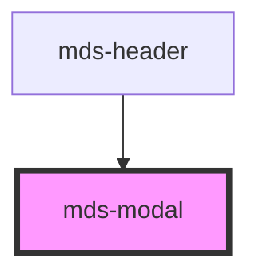

# mds-modal

<!-- Auto Generated Below -->

## Properties

| Property   | Attribute  | Description                                          | Type                                                              | Default    |
| ---------- | ---------- | ---------------------------------------------------- | ----------------------------------------------------------------- | ---------- |
| `opened`   | `opened`   | Specifies if the modal is opened or not              | `boolean`                                                         | `false`    |
| `position` | `position` | Specifies the animation position of the modal window | `"bottom" \| "center" \| "left" \| "right" \| "top" \| undefined` | `'center'` |

## Events

| Event           | Description                  | Type                |
| --------------- | ---------------------------- | ------------------- |
| `mdsModalClose` | Emits when a modal is closed | `CustomEvent<void>` |

## Shadow Parts

| Part       | Description |
| ---------- | ----------- |
| `"window"` |             |

## Slots

| Slot        | Description                                                                                                                |
| ----------- | -------------------------------------------------------------------------------------------------------------------------- |
| `"bottom"`  | Contents that will be placed on bottom of the window. Add `text string`, `HTML elements` or `components` to this slot.     |
| `"default"` | Contents that will be placed in the center of the window. Add `text string`, `HTML elements` or `components` to this slot. |
| `"top"`     | Contents that will be placed on top of the window. Add `text string`, `HTML elements` or `components` to this slot.        |
| `"window"`  | Use directly a window component if you need it. Add `text string`, `HTML elements` or `components` to this slot.           |

## Shadow Parts

| Part       | Description |
| ---------- | ----------- |
| `"window"` |             |

## Dependencies

### Used by

 - [mds-header](../mds-header)

### Graph

----------------------------------------------

Built with love @ **Maggioli Informatica / R&D Department**
