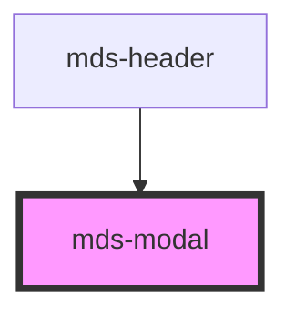

# mds-modal

<!-- Auto Generated Below -->

## Properties

| Property   | Attribute  | Description                                          | Type                                                 | Default     |
| ---------- | ---------- | ---------------------------------------------------- | ---------------------------------------------------- | ----------- |
| `opened`   | `opened`   | Specifies if the modal is opened or not              | `boolean`                                            | `undefined` |
| `position` | `position` | Specifies the animation position of the modal window | `"bottom" \| "center" \| "left" \| "right" \| "top"` | `null`      |

## Events

| Event   | Description                  | Type                |
| ------- | ---------------------------- | ------------------- |
| `close` | Emits when a modal is closed | `CustomEvent<void>` |

## CSS Custom Properties

| Name                            | Description                                                                                                                                        |
| ------------------------------- | -------------------------------------------------------------------------------------------------------------------------------------------------- |
| `--mds-modal-overlay-color`     | Set the overlay color of the background when the component is opened, this property can be inherited from `globals.css` in `styles^8.0.0`.         |
| `--mds-modal-overlay-opacity`   | Set the overlay color opacity of the background when the component is opened, this property can be inherited from `globals.css` in `styles^8.0.0`. |
| `--mds-modal-window-background` | Set the background color of the window                                                                                                             |
| `--mds-modal-window-overflow`   | Set the overflow of the window                                                                                                                     |
| `--mds-modal-window-shadow`     | Set the box shadow of the window                                                                                                                   |
| `--mds-modal-z-index`           | Set the z-index of the window when the component is opened                                                                                         |

## Dependencies

### Used by

 - [mds-header](../mds-header)

### Graph

----------------------------------------------

Built with love @ **Maggioli Informatica / R&D Department**
