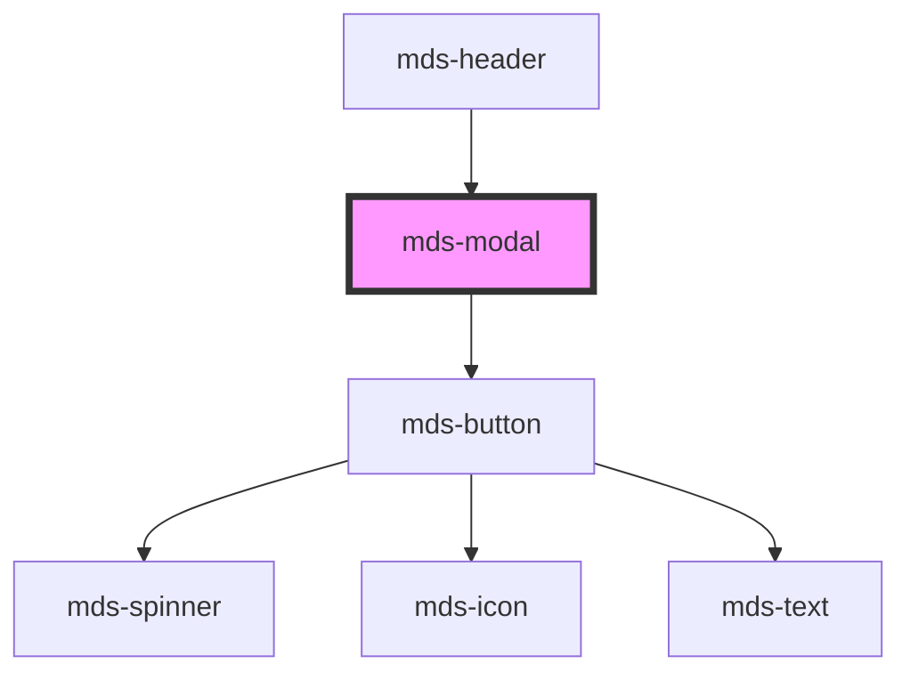

# mds-modal

This is a web-component from Maggioli Design System [Magma](https://magma.maggiolicloud.it), built with StencilJS, TypeScript, Storybook. It's based on the web-component standard and it's designed to be agnostic from the JavaScript framework you are using.

<!-- Auto Generated Below -->

## Properties

| Property    | Attribute   | Description                                                                             | Type                                                                                                                              | Default    |
| ----------- | ----------- | --------------------------------------------------------------------------------------- | --------------------------------------------------------------------------------------------------------------------------------- | ---------- |
| `animating` | `animating` | Specifies if the component is animating itself or not                                   | `"intro" \| "none" \| "outro" \| undefined`                                                                                       | `'none'`   |
| `opened`    | `opened`    | Specifies if the modal is opened or not                                                 | `boolean`                                                                                                                         | `false`    |
| `overflow`  | `overflow`  | Specifies if the component prevents the body from scrolling when modal window is opened | `"auto" \| "manual"`                                                                                                              | `'auto'`   |
| `position`  | `position`  | Specifies the animation position of the modal window                                    | `"bottom" \| "bottom-left" \| "bottom-right" \| "center" \| "left" \| "right" \| "top" \| "top-left" \| "top-right" \| undefined` | `'center'` |

## Events

| Event           | Description                                                                                                     | Type                |
| --------------- | --------------------------------------------------------------------------------------------------------------- | ------------------- |
| `mdsModalClose` | Emits when a modal is closed                                                                                    | `CustomEvent<void>` |
| `mdsModalHide`  | Emits when a modal is totally invisible, can be useful to detach the component when it's hidden and gain memory | `CustomEvent<void>` |

## Slots

| Slot        | Description                                                                                                                |
| ----------- | -------------------------------------------------------------------------------------------------------------------------- |
| `"bottom"`  | Contents that will be placed on bottom of the window. Add `text string`, `HTML elements` or `components` to this slot.     |
| `"default"` | Contents that will be placed in the center of the window. Add `text string`, `HTML elements` or `components` to this slot. |
| `"top"`     | Contents that will be placed on top of the window. Add `text string`, `HTML elements` or `components` to this slot.        |
| `"window"`  | Use directly a window component if you need it. Add `text string`, `HTML elements` or `components` to this slot.           |

## Shadow Parts

| Part       | Description                                          |
| ---------- | ---------------------------------------------------- |
| `"close"`  | Selects the close button visible on mobile viewport. |
| `"window"` | Selects the native window component if it's used.    |

## Dependencies

### Used by

 - [mds-header](../mds-header)

### Depends on

- [mds-button](../mds-button)

### Graph

----------------------------------------------

Built with love @ [Gruppo Maggioli](https://www.maggioli.com) from [R&D Department](https://www.maggioli.com/it-it/chi-siamo/ricerca-sviluppo)
