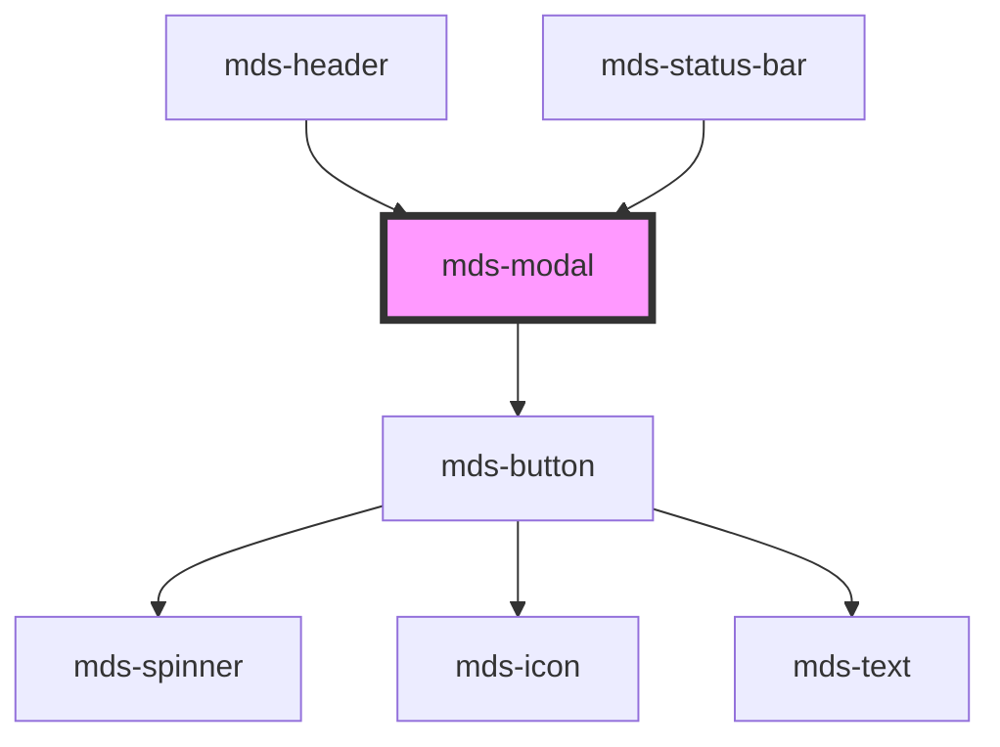

# mds-modal


This is a web-component from Maggioli Design System [Magma](https://magma.maggiolicloud.it), built with StencilJS, TypeScript, Storybook. It's based on the web-component standard and it's designed to be agnostic from the JavaScript framework you are using.

<!-- Auto Generated Below -->


## Usage

### 1. Description

The `<mds-modal>` web component is the Magma Design System overlay container for dialogs, presenting content in a windowed surface layered above the page with an optional backdrop. It is the system equivalent of the native `<dialog>` element, adding managed open/close animations, body scroll locking, positioning, and a built-in close affordance.

#### Semantic Behavior

- **Open state**: Visibility is driven by the `opened` prop. Setting it `true` runs the intro animation and emits `mdsModalOpen`; clearing it runs the outro animation and emits `mdsModalClose`.
- **Programmatic close**: Exposes an async `close()` method that dismisses the modal regardless of `interaction`, mirroring the close-button action.
- **Show/hide events**: `mdsModalShow` fires when the intro finishes (fully visible) and `mdsModalHide` when the outro finishes (fully hidden), the latter being the safe point to detach the modal to reclaim memory.
- **Backdrop dismissal**: With `interaction="relaxed"` (default) a click on the backdrop closes the modal; with `interaction="strict"` only the close button or `close()` can dismiss it.
- **Body scroll lock**: When `overflow="auto"` the component locks body scroll while open and restores it on close.
- **Touch dismissal**: On touch devices a horizontal swipe past a threshold closes the modal, respecting the swipe direction implied by edge `position` values.
- **Slot-driven layout**: With no `window` slot, the default slot renders centered content framed by optional `top` (header) and `bottom` (footer) slots, and a close button is rendered automatically. Slotting a `window` element suppresses the built-in chrome and close button so the consumer supplies the entire surface.

#### Properties & Visual Configurations

This component does not use the shared `variant` / `tone` ladders; its configuration is structural and motion-oriented.

#### Other behavioral props

- **`position`** sets where the window animates from and rests, from `'center'` to edge and corner anchors (`'top'`, `'bottom-left'`, etc.); edge positions also define the valid swipe-to-dismiss direction.
- **`animation`** selects the motion style of the window: `'slide'` (default), `'3d'`, or `'custom'` (driven entirely by CSS custom properties).
- **`interaction`** governs how forgiving dismissal is - `'relaxed'` allows backdrop clicks, `'strict'` requires the close button.
- **`overflow`** chooses whether the component manages body scroll locking (`'auto'`) or leaves it to the consumer (`'manual'`).
- **`backdrop`** toggles the dimmed overlay behind the window.


### 2. Pattern

Correct and idiomatic ways to use the `<mds-modal>` component, ordered from most common to most specialized. Patterns assume a working knowledge of the overlay conventions documented in [`docs/COMPONENTS.md`](../../../../../../docs/COMPONENTS.md) and the generic stencil rules in [`projects/stencil/SPEC.md`](../../../../SPEC.md).

#### Basic Modal with Inline Content

The simplest form: toggle `opened` from JavaScript to show the dialog. The built-in close button and backdrop dismiss the modal automatically with `interaction="relaxed"` (default). React to the `mdsModalClose` event to sync your state.

```html
<mds-button id="btn-apri">Apri dialogo</mds-button>

<mds-modal id="dialogo">
  <div class="p-400">
    <mds-text>Sei sicuro di voler continuare?</mds-text>
  </div>
</mds-modal>

<script>
  const btn = document.getElementById('btn-apri');
  const modal = document.getElementById('dialogo');
  btn.addEventListener('mdsButtonClick', () => { modal.opened = true; });
  modal.addEventListener('mdsModalClose', () => { modal.opened = undefined; });
</script>
```

#### Fixed Header and Footer via `top` / `bottom` Slots

Use the `top` slot for a sticky header and the `bottom` slot for a sticky footer (e.g. action buttons). The default slot renders scrollable body content between them.

```html
<mds-modal id="modifica-utente" position="right">
  <header slot="top" class="p-400 bg-tone-neutral shadow-outline-light">
    <mds-text typography="h5">Modifica utente</mds-text>
  </header>

  <div class="p-400 grid gap-400">
    <mds-input name="nome" label="Nome"></mds-input>
    <mds-input name="cognome" label="Cognome"></mds-input>
  </div>

  <footer slot="bottom" class="p-400 flex gap-300 justify-end bg-tone-neutral shadow-outline-light">
    <mds-button variant="dark" tone="outline" id="btn-annulla">Annulla</mds-button>
    <mds-button variant="primary" tone="strong" id="btn-salva">Salva</mds-button>
  </footer>
</mds-modal>
```

#### Edge and Corner Positions

`position` anchors the window to an edge or corner and drives the slide-in direction. Use `right` or `left` for side panels, `bottom` for mobile drawers.

```html
<!-- Side panel from the right (default in most app shells) -->
<mds-modal id="pannello-laterale" position="right">
  <div class="p-400">
    <mds-text>Dettagli del documento</mds-text>
  </div>
</mds-modal>

<!-- Drawer from the bottom (mobile) -->
<mds-modal id="drawer-mobile" position="bottom">
  <div class="p-400">
    <mds-text>Azioni disponibili</mds-text>
  </div>
</mds-modal>
```

#### Strict Interaction Mode

Set `interaction="strict"` when the user must explicitly confirm or cancel before the dialog closes - for example, a form with unsaved changes. Backdrop clicks are ignored; only the close button or the `close()` method can dismiss the modal.

```html
<mds-modal id="conferma-elimina" interaction="strict">
  <div class="p-400 grid gap-400">
    <mds-text typography="h5">Eliminare il documento?</mds-text>
    <mds-text>Questa operazione non e' reversibile.</mds-text>
    <div class="flex gap-300 justify-end">
      <mds-button variant="dark" tone="outline" id="btn-no">Annulla</mds-button>
      <mds-button variant="error" tone="strong" id="btn-si">Elimina</mds-button>
    </div>
  </div>
</mds-modal>

<script>
  document.getElementById('btn-no').addEventListener('mdsButtonClick', () => {
    document.getElementById('conferma-elimina').close();
  });
</script>
```

#### Programmatic Close via `close()` Method

Call the async `close()` method from JavaScript when you need to dismiss the modal from outside its UI - for example, after a successful async operation.

```html
<mds-modal id="salvataggio">
  <div class="p-400">
    <mds-text>Salvataggio in corso...</mds-text>
  </div>
</mds-modal>

<script>
  async function salva() {
    const modal = document.getElementById('salvataggio');
    modal.opened = true;
    await salvaRisorsa();
    await modal.close();
  }
</script>
```

#### Listening to Animation Events

`mdsModalShow` fires when the intro animation completes (the modal is fully visible). Use it to focus the first interactive element. `mdsModalHide` fires when the outro animation completes; use it to detach the element or reset content.

```html
<mds-modal id="modal-focus" position="right">
  <div class="p-400">
    <mds-input id="input-ricerca" label="Cerca"></mds-input>
  </div>
</mds-modal>

<script>
  const modal = document.getElementById('modal-focus');
  const input = document.getElementById('input-ricerca');

  modal.addEventListener('mdsModalShow', () => {
    input.setFocus();
  });
  modal.addEventListener('mdsModalHide', () => {
    // safe point to detach or reset content
    modal.opened = undefined;
  });
</script>
```

#### Custom Animation Styles

`animation` selects the motion style. `'slide'` (default) translates from the entry edge; `'3d'` adds a perspective tilt; `'custom'` delegates entirely to the CSS custom properties `--mds-modal-custom-closed-transform` and `--mds-modal-custom-window-distance`.

```html
<!-- 3D perspective tilt animation -->
<mds-modal id="modal-3d" animation="3d" position="center">
  <div class="p-400">
    <mds-text>Animazione 3D</mds-text>
  </div>
</mds-modal>

<!-- Custom animation driven by CSS vars -->
<mds-modal id="modal-custom" animation="custom" position="center">
  <div class="p-400">
    <mds-text>Animazione personalizzata</mds-text>
  </div>
</mds-modal>
```

#### Custom Window via `window` Slot

Slot any element with `slot="window"` to completely replace the built-in chrome (the white window surface and the close button). The slotted element receives `role="dialog"` automatically. Use this when a completely bespoke surface is needed - for example, a full-screen banner.

```html
<mds-modal id="modal-banner" animation="custom">
  <mds-banner
    slot="window"
    class="max-w-md w-full mx-400"
    tone="box"
    deletable
    headline="Azione richiesta"
  >
    <mds-text typography="detail">Conferma la tua identita' per procedere.</mds-text>
    <mds-button slot="actions" variant="primary" tone="text">Annulla</mds-button>
    <mds-button slot="actions" variant="primary" tone="strong">Conferma</mds-button>
  </mds-banner>
</mds-modal>
```

#### Disabling the Backdrop

Set `backdrop` to absent (or `undefined`) to render the modal without the dimmed overlay - useful for non-blocking side panels that coexist with interactive page content.

```html
<mds-modal id="pannello-info" position="right">
  <div class="p-400">
    <mds-text>Informazioni contestuali</mds-text>
  </div>
</mds-modal>
```

```javascript
// Remove the backdrop at runtime
document.getElementById('pannello-info').backdrop = undefined;
```

#### CSS Customization

Style the window surface only through the documented `--mds-modal-*` CSS custom properties. Set them on the host element.

```css
/* Rounded card-style center modal */
#modal-card {
  --mds-modal-window-radius: var(--radius-xl);
  --mds-modal-window-distance: var(--spacing-600);
  --mds-modal-window-overflow: hidden;
  --mds-modal-window-background: rgb(var(--tone-neutral));
  --mds-modal-window-shadow: var(--shadow-2xl);
  --mds-modal-window-max-width: 480px;
}

/* Full-width drawer */
#drawer-bottom {
  --mds-modal-window-radius: var(--radius-lg) var(--radius-lg) 0 0;
  --mds-modal-window-max-width: 100%;
  --mds-modal-window-min-width: 100%;
}
```


### 3. Antipattern

Common incorrect uses of `<mds-modal>`. Each entry pairs the wrong form with the right one and a one-line reason. System-wide rules (boolean-as-string, shadow piercing, Tailwind color utilities, raw native event listening) live in [`docs/COMPONENTS.md`](../../../../../../docs/COMPONENTS.md#system-level-anti-patterns) - they apply here too but are not repeated.

#### Do Not Set `opened="false"` to Close the Modal

Boolean props in Stencil treat any non-empty string as truthy. Setting `opened="false"` keeps the modal open instead of closing it. Remove the attribute or set the prop to `undefined`.

```html
<!-- 🚫 INCORRECT -->
<mds-modal id="dialogo" opened="false"></mds-modal>

<!-- ✅ CORRECT -->
<mds-modal id="dialogo"></mds-modal>
```

```javascript
// 🚫 INCORRECT
modal.opened = false;

// ✅ CORRECT
modal.opened = undefined;
```

#### Do Not Put Content in the `window` Slot Without Replacing the Entire Chrome

The `window` slot completely bypasses the built-in surface, header/footer regions, and close button. Do not use it to add a header element while expecting the default content area and close button to still render - they will not.

```html
<!-- 🚫 INCORRECT: only the slotted header renders; default slot and close button are suppressed -->
<mds-modal id="modal">
  <header slot="window" class="p-400">Titolo</header>
  <div>Contenuto del dialogo</div>
</mds-modal>

<!-- ✅ CORRECT: use slot="top" for a sticky header, default slot for body -->
<mds-modal id="modal">
  <header slot="top" class="p-400 bg-tone-neutral">Titolo</header>
  <div class="p-400">Contenuto del dialogo</div>
</mds-modal>
```

#### Do Not Reach Into Shadow Parts to Style the Window

The only supported customization surface is `--mds-modal-*` CSS custom properties and the two documented shadow parts (`window`, `action-close`). Targeting internal shadow selectors couples your code to implementation details that will break on minor releases.

```css
/* 🚫 INCORRECT */
mds-modal >>> .window-content {
  padding: 0;
}
mds-modal::part(window) > div {
  border: 2px solid red;
}

/* ✅ CORRECT */
mds-modal {
  --mds-modal-window-background: rgb(var(--tone-neutral));
  --mds-modal-window-radius: var(--radius-xl);
  --mds-modal-window-distance: var(--spacing-400);
}
```

#### Do Not Listen for Native `click` on the Backdrop to Close

`mds-modal` emits `mdsModalClose` when it closes (and `mdsModalHide` when the animation finishes). Listening for a raw `click` on the host or backdrop is fragile - the event target varies by browser and shadow DOM boundary, and `interaction="strict"` will silently break your handler.

```javascript
// 🚫 INCORRECT
document.getElementById('modal').addEventListener('click', (e) => {
  if (e.target === e.currentTarget) modal.opened = undefined;
});

// ✅ CORRECT
document.getElementById('modal').addEventListener('mdsModalClose', () => {
  modal.opened = undefined;
});
```

#### Do Not Skip the `close()` Method When Dismissing Programmatically from Strict Modals

When `interaction="strict"` is set, the internal `closeModal` guard prevents backdrop-click dismissal. Manually setting `opened = undefined` bypasses the guard but skips the `mdsModalClose` event and animation teardown. Use the `close()` method instead.

```javascript
// 🚫 INCORRECT (skips event emission when interaction="strict")
document.getElementById('modal-strict').opened = undefined;

// ✅ CORRECT
await document.getElementById('modal-strict').close();
```

#### Do Not Use `backdrop` to Toggle the Backdrop at Runtime via String

`backdrop` is a boolean prop. Passing the string `"false"` is truthy and leaves the backdrop visible. To hide the backdrop, set the prop to `undefined` (remove the attribute in HTML).

```html
<!-- 🚫 INCORRECT -->
<mds-modal backdrop="false"></mds-modal>

<!-- ✅ CORRECT (no attribute = no backdrop) -->
<mds-modal></mds-modal>
```

#### Do Not Use `<dialog>` Directly When `<mds-modal>` Is Available

Using a raw `<dialog>` element bypasses the system's managed animation, body-scroll locking, touch-swipe dismissal, and design-token theming. Always use `<mds-modal>` for overlays in a Magma application.

```html
<!-- 🚫 INCORRECT -->
<dialog id="raw-dialog">
  <p>Contenuto del dialogo</p>
  <button>Chiudi</button>
</dialog>

<!-- ✅ CORRECT -->
<mds-modal id="modal">
  <div class="p-400">
    <mds-text>Contenuto del dialogo</mds-text>
  </div>
</mds-modal>
```


## Properties

| Property      | Attribute     | Description                                                                                                                                                                                                                                                                              | Type                                                                                                                              | Default     |
| ------------- | ------------- | ---------------------------------------------------------------------------------------------------------------------------------------------------------------------------------------------------------------------------------------------------------------------------------------- | --------------------------------------------------------------------------------------------------------------------------------- | ----------- |
| `animation`   | `animation`   | Specifies the animation style of the modal window                                                                                                                                                                                                                                        | `"3d" \| "custom" \| "slide" \| undefined`                                                                                        | `'slide'`   |
| `backdrop`    | `backdrop`    | Specifies if the modal shows the backdrop                                                                                                                                                                                                                                                | `boolean \| undefined`                                                                                                            | `true`      |
| `interaction` | `interaction` | Specifies if the component can be closed with close button, or also if the backdrop background is cliccked. If `strict` is selected only the close button can dismiss the component via UI. If `relaxed` is selected the component can be dismissed also by cliccking the backdrop area. | `"relaxed" \| "strict"`                                                                                                           | `'relaxed'` |
| `opened`      | `opened`      | Specifies if the modal is opened or not                                                                                                                                                                                                                                                  | `boolean \| undefined`                                                                                                            | `false`     |
| `overflow`    | `overflow`    | Specifies if the component prevents the body from scrolling when modal window is opened                                                                                                                                                                                                  | `"auto" \| "manual"`                                                                                                              | `'auto'`    |
| `position`    | `position`    | Specifies the animation position of the modal window                                                                                                                                                                                                                                     | `"bottom" \| "bottom-left" \| "bottom-right" \| "center" \| "left" \| "right" \| "top" \| "top-left" \| "top-right" \| undefined` | `'center'`  |


## Events

| Event           | Description                                                                                                     | Type                |
| --------------- | --------------------------------------------------------------------------------------------------------------- | ------------------- |
| `mdsModalClose` | Emits when a modal is closed                                                                                    | `CustomEvent<void>` |
| `mdsModalHide`  | Emits when a modal is totally invisible, can be useful to detach the component when it's hidden and gain memory | `CustomEvent<void>` |
| `mdsModalOpen`  | Emits when a modal is closed                                                                                    | `CustomEvent<void>` |
| `mdsModalShow`  | Emits when a modal is totally visible, when the modal intro animation is finished                               | `CustomEvent<void>` |


## Methods

### `close() => Promise<void>`


#### Returns

Type: `Promise<void>`


## Slots

| Slot        | Description                                                                                                                |
| ----------- | -------------------------------------------------------------------------------------------------------------------------- |
| `"bottom"`  | Contents that will be placed on bottom of the window. Add `text string`, `HTML elements` or `components` to this slot.     |
| `"default"` | Contents that will be placed in the center of the window. Add `text string`, `HTML elements` or `components` to this slot. |
| `"top"`     | Contents that will be placed on top of the window. Add `text string`, `HTML elements` or `components` to this slot.        |
| `"window"`  | Use directly a window component if you need it. Add `text string`, `HTML elements` or `components` to this slot.           |


## Shadow Parts

| Part             | Description                                                |
| ---------------- | ---------------------------------------------------------- |
| `"action-close"` | Selects the close button of the modal.                     |
| `"dialog"`       |                                                            |
| `"window"`       | Selects the default window element of the modal when used. |


## CSS Custom Properties

| Name                                     | Description                                                                                                                                        |
| ---------------------------------------- | -------------------------------------------------------------------------------------------------------------------------------------------------- |
| `--mds-modal-custom-closed-transform`    | Sets the transform position of the custom window when it's outside the viewport, to it's default position                                          |
| `--mds-modal-custom-window-distance`     | Set the distance between the slotted modal window and the screen bounds                                                                            |
| `--mds-modal-overlay-color`              | Set the overlay color of the background when the component is opened, this property can be inherited from `globals.css` in `styles^8.0.0`.         |
| `--mds-modal-overlay-opacity`            | Set the overlay color opacity of the background when the component is opened, this property can be inherited from `globals.css` in `styles^8.0.0`. |
| `--mds-modal-transition-duration`        | Sets the `transition-duration` of the modal elements                                                                                               |
| `--mds-modal-transition-timing-funciton` | Sets the `transition-timing-funciton` of the modal elements                                                                                        |
| `--mds-modal-window-background`          | Set the background color of the window                                                                                                             |
| `--mds-modal-window-distance`            | Set the distance between the modal window and the screen bounds                                                                                    |
| `--mds-modal-window-max-width`           | If the viewport is greather than mobile, max-width will be considered with this value;                                                             |
| `--mds-modal-window-min-width`           | If the viewport is greather than mobile, min-width will be considered with this value;                                                             |
| `--mds-modal-window-overflow`            | Set the overflow of the window                                                                                                                     |
| `--mds-modal-window-radius`              | Set the border radius of the window                                                                                                                |
| `--mds-modal-window-shadow`              | Set the box shadow of the window                                                                                                                   |
| `--mds-modal-z-index`                    | Set the z-index of the window when the component is opened                                                                                         |


## Dependencies

### Used by

 - [mds-header](../mds-header)
 - [mds-status-bar](../mds-status-bar)

### Depends on

- [mds-button](../mds-button)

### Graph


----------------------------------------------

Built with love @ [Gruppo Maggioli](https://www.maggioli.com) from [R&D Department](https://www.maggioli.com/it-it/chi-siamo/ricerca-sviluppo)
