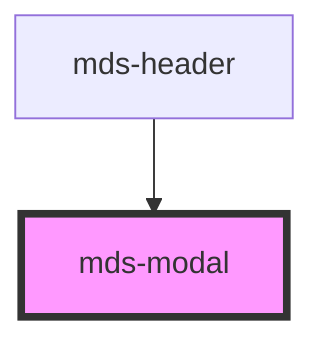

# mds-modal

This is a web-component from Maggioli Design System [Magma](https://magma.maggiolicloud.it), built with StencilJS, TypeScript, Storybook. It's based on the web-component standard and it's designed to be agnostic from the JavaScirpt framework you are using.

<!-- Auto Generated Below -->

## Properties

| Property   | Attribute  | Description                                          | Type                                                              | Default    |
| ---------- | ---------- | ---------------------------------------------------- | ----------------------------------------------------------------- | ---------- |
| `opened`   | `opened`   | Specifies if the modal is opened or not              | `boolean`                                                         | `false`    |
| `position` | `position` | Specifies the animation position of the modal window | `"bottom" \| "center" \| "left" \| "right" \| "top" \| undefined` | `'center'` |

## Events

| Event           | Description                  | Type                |
| --------------- | ---------------------------- | ------------------- |
| `mdsModalClose` | Emits when a modal is closed | `CustomEvent<void>` |

## Slots

| Slot        | Description                                                                                                                |
| ----------- | -------------------------------------------------------------------------------------------------------------------------- |
| `"bottom"`  | Contents that will be placed on bottom of the window. Add `text string`, `HTML elements` or `components` to this slot.     |
| `"default"` | Contents that will be placed in the center of the window. Add `text string`, `HTML elements` or `components` to this slot. |
| `"top"`     | Contents that will be placed on top of the window. Add `text string`, `HTML elements` or `components` to this slot.        |
| `"window"`  | Use directly a window component if you need it. Add `text string`, `HTML elements` or `components` to this slot.           |

## Shadow Parts

| Part       | Description |
| ---------- | ----------- |
| `"window"` |             |

## CSS Custom Properties

| Name                            | Description                                                                                                                                        |
| ------------------------------- | -------------------------------------------------------------------------------------------------------------------------------------------------- |
| `--mds-modal-overlay-color`     | Set the overlay color of the background when the component is opened, this property can be inherited from `globals.css` in `styles^8.0.0`.         |
| `--mds-modal-overlay-opacity`   | Set the overlay color opacity of the background when the component is opened, this property can be inherited from `globals.css` in `styles^8.0.0`. |
| `--mds-modal-window-background` | Set the background color of the window                                                                                                             |
| `--mds-modal-window-overflow`   | Set the overflow of the window                                                                                                                     |
| `--mds-modal-window-shadow`     | Set the box shadow of the window                                                                                                                   |
| `--mds-modal-z-index`           | Set the z-index of the window when the component is opened                                                                                         |

## Dependencies

### Used by

 - [mds-header](../mds-header)

### Graph

----------------------------------------------

Built with love @ [Gruppo Maggioli](https://www.maggioli.com) from [R&D Department](https://www.maggioli.com/it-it/chi-siamo/ricerca-sviluppo)
