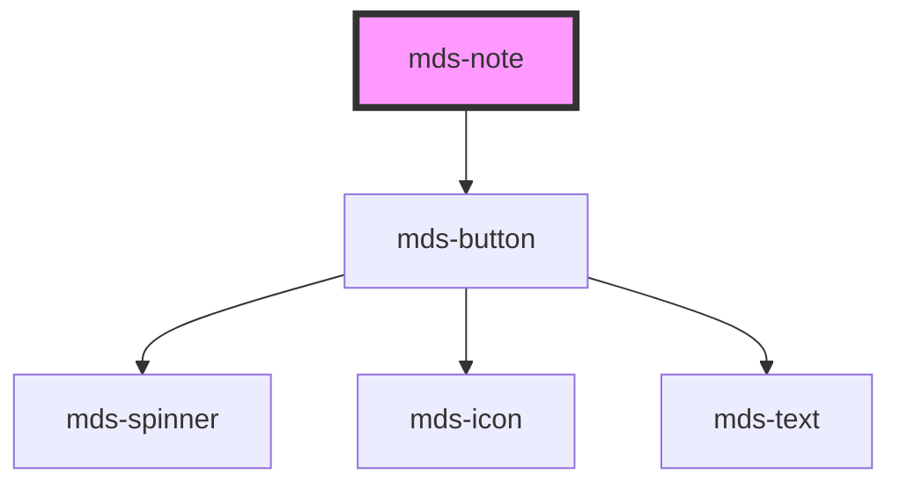

# mds-note


This is a web-component from Maggioli Design System [Magma](https://magma.maggiolicloud.it), built with StencilJS, TypeScript, Storybook. It's based on the web-component standard and it's designed to be agnostic from the JavaScript framework you are using.

<!-- Auto Generated Below -->


## Usage

### 1. Description

The `<mds-note>` web component is the annotation surface of the Magma Design System: a short, colored sticky-note block used to attach a remark, reminder, or callout to surrounding content. It has no native HTML primitive - it renders as a semantic note region with an optional title and a decorative folded corner.

#### Semantic Behavior

- **Note role**: Exposed to assistive technology as a standalone annotation regardless of theme, variant, or size.
- **Deletable mode**: When `deletable` is set, the component renders an embedded close button; activating it emits the delete event without removing the note itself, leaving the host application in control of dismissal.
- **Delete event**: `mdsNoteDelete` fires when the close control is activated, signalling intent to cancel or remove the note.
- **Keyboard handling**: While `deletable`, the close action is keyboard-reachable.
- **Localized close label**: The close button's accessible title is resolved in the active language (el/en/es/it).
- **Title vs. body slots**: The named `title` slot holds the note heading; the default slot holds the note body text, HTML, or nested components.

#### Properties & Visual Configurations

- **`deletable`** turns the note from a static annotation into a dismissible one by exposing the close control and its delete event; pick it only when the consuming application is prepared to handle `mdsNoteDelete`.

#### Component-specific variants and tones

`<mds-note>` does **not** use the shared `tone` / `variant` ladders from [`projects/stencil/SPEC.md`](../../../../SPEC.md#tone-and-variant-system). Instead, its `variant` prop selects a flat **color palette** for the note paper (the `ThemeLabelVariantType` set, e.g. `'yellow'`, `'blue'`, `'green'`, `'red'`), defaulting to `'yellow'`. Choose the color to convey the note's category or urgency, not a hierarchy of emphasis.


### 2. Pattern

Correct and idiomatic ways to use the `<mds-note>` component, ordered from most common to most specialized. Patterns assume a working knowledge of the label-color variants documented in [`docs/COMPONENTS.md`](../../../../../../docs/COMPONENTS.md) and the generic stencil rules in [`projects/stencil/SPEC.md`](../../../../SPEC.md).

#### Plain Note with Body Text

The minimal form: a sticky-note block with only body content in the default slot. `variant` defaults to `'yellow'`; omit it when yellow suits the context.

```html
<mds-note>
  <mds-text typography="detail">Ricordare di aggiornare le credenziali prima del 30 giugno.</mds-text>
</mds-note>
```

#### Note with a Title

Use the named `title` slot for the heading and the default slot for the body. Both slots accept text, HTML elements, and components.

```html
<mds-note variant="blue">
  <mds-text typography="h5" slot="title">Nota riunione del 5 giugno</mds-text>
  <mds-text typography="detail">Confermare la disponibilita' di sala entro venerdi'.</mds-text>
  <mds-text typography="detail">Invitare anche il responsabile del progetto Synbee.</mds-text>
</mds-note>
```

#### Color Variant for Category or Urgency

Choose `variant` based on the note's category or urgency, not on aesthetic preference. All twelve label colors are available.

```html
<!-- Reminder (neutral warm) -->
<mds-note variant="yellow">
  <mds-text typography="detail">Scadenza domani: inviare il report trimestrale.</mds-text>
</mds-note>

<!-- Action required (attention) -->
<mds-note variant="orange">
  <mds-text typography="detail">Approvazione in attesa - contattare il responsabile.</mds-text>
</mds-note>

<!-- Informational (cool) -->
<mds-note variant="sky">
  <mds-text typography="detail">Questo blocco e' in sola lettura fino al completamento della revisione.</mds-text>
</mds-note>

<!-- Positive / done -->
<mds-note variant="green">
  <mds-text typography="detail">Configurazione completata con successo.</mds-text>
</mds-note>
```

#### Dismissible Note via `deletable`

Set `deletable` to expose the close button. The component emits `mdsNoteDelete` when the button is activated but does not remove itself - the host application is responsible for removal.

```html
<mds-note variant="amaranth" deletable>
  <mds-text typography="h5" slot="title">Attenzione</mds-text>
  <mds-text typography="detail">Questo avviso sparira' una volta confermata l'azione.</mds-text>
</mds-note>
```

```javascript
document.querySelector('mds-note').addEventListener('mdsNoteDelete', () => {
  document.querySelector('mds-note').remove();
});
```

#### Styling Customization via CSS Custom Properties

Customize the note only through the documented `--mds-note-*` CSS custom properties. Set them on the host or a parent selector; use Magma color tokens via `rgb(var(--<token>))` so dark mode and high-contrast modes keep working. The undocumented `--mds-note-fold-color` controls the decorative corner fold.

```css
.featured-note mds-note {
  --mds-note-background: rgb(var(--label-orchid-09));
  --mds-note-color: rgb(var(--label-orchid-02));
  --mds-note-fold-size: 28px;
}
```

#### Multiple Notes in a Grid

Place several notes in a layout container; each note is independent and carries its own variant and deletable state.

```html
<div style="display: grid; grid-template-columns: repeat(auto-fill, minmax(240px, 1fr)); gap: 1rem;">
  <mds-note variant="yellow" deletable>
    <mds-text typography="h6" slot="title">Da fare</mds-text>
    <mds-text typography="detail">Revisionare il capitolato prima di lunedi'.</mds-text>
  </mds-note>
  <mds-note variant="lime">
    <mds-text typography="h6" slot="title">Completato</mds-text>
    <mds-text typography="detail">Migrazione database eseguita con successo.</mds-text>
  </mds-note>
  <mds-note variant="red" deletable>
    <mds-text typography="h6" slot="title">Bloccante</mds-text>
    <mds-text typography="detail">Servizio di autenticazione non raggiungibile in produzione.</mds-text>
  </mds-note>
</div>
```


### 3. Antipattern

Common incorrect uses of `<mds-note>`. Each entry pairs the wrong form with the right one and a one-line reason. System-wide rules (boolean-as-string, shadow piercing, Tailwind color utilities, raw native event listening) live in [`docs/COMPONENTS.md`](../../../../../../docs/COMPONENTS.md#system-level-anti-patterns) - they apply here too but are not repeated.

#### Do Not Remove the Note Directly - Listen for `mdsNoteDelete`

The component emits `mdsNoteDelete` when the close button is activated; it never removes itself. Removing the element without listening to the event means deletable notes can never be dismissed, while bypassing the event skips any cleanup logic the host application needs to run.

```html
<!-- 🚫 INCORRECT: close button present but nothing removes the note -->
<mds-note variant="yellow" deletable>
  <mds-text typography="detail">Questa nota non sparira' mai.</mds-text>
</mds-note>

<!-- ✅ CORRECT: listen for the event and remove programmatically -->
<mds-note id="nota-avviso" variant="yellow" deletable>
  <mds-text typography="detail">Chiudi per rimuovere questa nota.</mds-text>
</mds-note>
<script>
  document.getElementById('nota-avviso').addEventListener('mdsNoteDelete', (e) => {
    e.target.remove();
  });
</script>
```

#### Do Not Use `variant` Values from the Status or Brand Ladders

`<mds-note>` uses `ThemeLabelVariantType` - the twelve decorative label colors (`yellow`, `blue`, `green`, `red`, `orange`, `sky`, `violet`, `lime`, `aqua`, `orchid`, `purple`, `amaranth`). Status values (`info`, `success`, `warning`, `error`) and brand values (`primary`, `secondary`) are not part of this type and will silently fall back to the default, breaking the intended color.

```html
<!-- 🚫 INCORRECT: status variant not accepted by mds-note -->
<mds-note variant="warning">
  <mds-text typography="detail">Operazione in corso.</mds-text>
</mds-note>

<!-- ✅ CORRECT: use a label color that communicates the same intent -->
<mds-note variant="orange">
  <mds-text typography="detail">Operazione in corso.</mds-text>
</mds-note>
```

#### Do Not Put the Title in the Default Slot

The component provides a dedicated named `title` slot for the note heading. Placing a heading element in the default slot renders it inside the body content area with no special heading styling or ordering.

```html
<!-- 🚫 INCORRECT: heading mixed into default body slot -->
<mds-note variant="blue">
  <mds-text typography="h5">Nota importante</mds-text>
  <mds-text typography="detail">Dettagli dell'annotazione qui.</mds-text>
</mds-note>

<!-- ✅ CORRECT: heading goes in the title slot -->
<mds-note variant="blue">
  <mds-text typography="h5" slot="title">Nota importante</mds-text>
  <mds-text typography="detail">Dettagli dell'annotazione qui.</mds-text>
</mds-note>
```

#### Do Not Set `deletable="false"` to Disable the Close Button

`deletable` is a boolean attribute. Any non-empty string value - including `"false"` - is truthy in HTML, so `deletable="false"` still renders the close button. Remove the attribute entirely to hide it.

```html
<!-- 🚫 INCORRECT: the close button is still rendered -->
<mds-note variant="green" deletable="false">
  <mds-text typography="detail">Questa nota dovrebbe essere fissa.</mds-text>
</mds-note>

<!-- ✅ CORRECT: omit the attribute -->
<mds-note variant="green">
  <mds-text typography="detail">Questa nota e' fissa.</mds-text>
</mds-note>
```

#### Do Not Style the Note with Arbitrary CSS or Tailwind Utilities

The only supported customization surface is the documented `--mds-note-*` CSS custom properties. Applying Tailwind background utilities or raw color values couples the note's appearance to the utility layer and breaks dark mode and high-contrast handling.

```css
/* 🚫 INCORRECT */
mds-note {
  background-color: #fffacd;
  color: #3a3000;
}

/* ✅ CORRECT */
mds-note {
  --mds-note-background: rgb(var(--label-yellow-09));
  --mds-note-color: rgb(var(--label-yellow-02));
}
```


## Properties

| Property    | Attribute   | Description                                                       | Type                                                                                                                                             | Default    |
| ----------- | ----------- | ----------------------------------------------------------------- | ------------------------------------------------------------------------------------------------------------------------------------------------ | ---------- |
| `deletable` | `deletable` | Enables the cross icon to perform cancel/delete action on element | `boolean \| undefined`                                                                                                                           | `false`    |
| `variant`   | `variant`   | Specifies the color variant for the element                       | `"amaranth" \| "aqua" \| "blue" \| "green" \| "lime" \| "orange" \| "orchid" \| "purple" \| "red" \| "sky" \| "violet" \| "yellow" \| undefined` | `'yellow'` |


## Events

| Event           | Description                             | Type                |
| --------------- | --------------------------------------- | ------------------- |
| `mdsNoteDelete` | Emits when the note has to be cancelled | `CustomEvent<void>` |


## Methods

### `updateLang() => Promise<void>`


#### Returns

Type: `Promise<void>`


## Slots

| Slot        | Description                                                      |
| ----------- | ---------------------------------------------------------------- |
| `"default"` | Add `text string`, `HTML elements` or `components` to this slot. |
| `"title"`   | Add `text string`, `HTML elements` or `components` to this slot. |


## CSS Custom Properties

| Name                              | Description                                                               |
| --------------------------------- | ------------------------------------------------------------------------- |
| `--mds-note-background`           | Sets the background-color of the component                                |
| `--mds-note-color`                | Sets the text color of the component                                      |
| `--mds-note-fold-size`            | Sets the size of the fold decoration at the bottom right of the component |
| `--mds-note-selection-background` | Sets the selection text background-color of the component                 |
| `--mds-note-selection-color`      | Sets the selection text color of the component                            |


## Dependencies

### Depends on

- [mds-button](../mds-button)

### Graph


----------------------------------------------

Built with love @ [Gruppo Maggioli](https://www.maggioli.com) from [R&D Department](https://www.maggioli.com/it-it/chi-siamo/ricerca-sviluppo)
