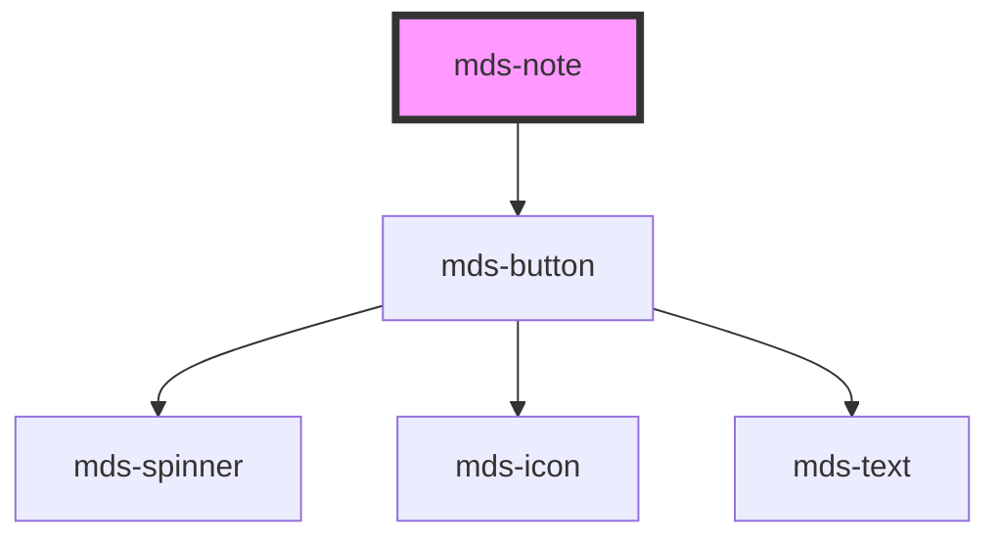

# mds-note

This is a web-component from Maggioli Design System [Magma](https://magma.maggiolicloud.it), built with StencilJS, TypeScript, Storybook. It's based on the web-component standard and it's designed to be agnostic from the JavaScirpt framework you are using.

<!-- Auto Generated Below -->

## Properties

| Property    | Attribute   | Description                                                       | Type                                                                                                                        | Default    |
| ----------- | ----------- | ----------------------------------------------------------------- | --------------------------------------------------------------------------------------------------------------------------- | ---------- |
| `deletable` | `deletable` | Enables the cross icon to perform cancel/delete action on element | `boolean \| undefined`                                                                                                      | `false`    |
| `variant`   | `variant`   | Specifies the color variant for the element                       | `"amaranth" \| "aqua" \| "blue" \| "green" \| "lime" \| "orange" \| "orchid" \| "sky" \| "violet" \| "yellow" \| undefined` | `'yellow'` |

## Events

| Event           | Description                             | Type                |
| --------------- | --------------------------------------- | ------------------- |
| `mdsNoteDelete` | Emits when the note has to be cancelled | `CustomEvent<void>` |

## Slots

| Slot        | Description                                                      |
| ----------- | ---------------------------------------------------------------- |
| `"default"` | Add `text string`, `HTML elements` or `components` to this slot. |
| `"title"`   | Add `text string`, `HTML elements` or `components` to this slot. |

## CSS Custom Properties

| Name                              | Description                                                               |
| --------------------------------- | ------------------------------------------------------------------------- |
| `--mds-note-background`           | Sets the background-color of the component                                |
| `--mds-note-color`                | Sets the text color of the component                                      |
| `--mds-note-fold-size`            | Sets the size of the fold decoration at the bottom right of the component |
| `--mds-note-selection-background` | Sets the selection text background-color of the component                 |
| `--mds-note-selection-color`      | Sets the selection text color of the component                            |

## Dependencies

### Depends on

- [mds-button](../mds-button)

### Graph

----------------------------------------------

Built with love @ [Gruppo Maggioli](https://www.maggioli.com) from [R&D Department](https://www.maggioli.com/it-it/chi-siamo/ricerca-sviluppo)
