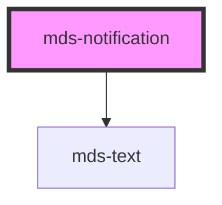

# mds-notification


<!-- Start script-generated Magma Docs -->

# Install

Install the component via `npm` by running the following command

```bash
npm install @maggioli-design-system/mds-notification
```

This package works also with yarn:

```bash
yarn add @maggioli-design-system/mds-notification
```

#### Import

Import the components in your project via `TypeScript` as follows:

```typescript
import { defineCustomElements as dceMdsNotification } from '@maggioli-design-system/mds-notification/loader'

dceMdsNotification()
```

`MdsNotification` depends on `MdsText`, so you will have to import it as well:

```typescript
import { defineCustomElements as dceMdsText } from '@maggioli-design-system/mds-text/loader'

dceMdsText()
```

You will have to import also the css style from `@maggioli-design-system` as follows:

```css
@import '~@maggioli-design-system/styles/dist/css/colors-rgb.css`
```

If you need to support older browsers (i.e. IE or early version of Edge), you can wrap the `defineCustomElements` in another utility awailable in the same package:

```typescript
import { applyPolyfills as apMdsNotification, defineCustomElements as dceMdsNotification } from '@maggioli-design-system/mds-notification/loader'

apMdsNotification().then(dceMdsNotification())
```

Use alias for `defineCustomElements` method to initialize multiple web components in the same place:

```typescript
import { defineCustomElements as dceMdsComponentOne } from '@maggioli-design-system/mds-component-one/loader'
import { defineCustomElements as dceMdsComponentTwo } from '@maggioli-design-system/mds-component-two/loader'

dceMdsComponentOne()
dceMdsComponentTwo()
```

You can check how browser support works at [this page][stencil-browser-support].

# Integration

<!-- This section is useful to describe usages and configurations -->

#### How to use it in HTML

`MdsNotification` is meant to be used to support another HTML component (like an icon or a button) to notify the user of pending notifications.

The component accepts the following attributes:
- `target`: (mandatory) specifies the id of the element to which is attached
- `value`: specifies the number of notification to display (if set to the element will be hidden)
- `visible`: specifies if the notification should be visible or not

```html
<mds-notification target='my-button' value=22 visible=true></mds-notification>
<button id='my-button'>Click here!</button>
```

You can try it out on the component's [Storybook website][storybook]!

[storybook]: https://magma.maggiolicloud.it/storybook/?path=/story/ui-notification--default
[stencil-browser-support]: https://stenciljs.com/docs/browser-support

<!-- End script-generated Magma Docs -->

<!-- Auto Generated Below -->


## Properties

| Property   | Attribute  | Description                                                                                                                                        | Type                                  | Default     |
| ---------- | ---------- | -------------------------------------------------------------------------------------------------------------------------------------------------- | ------------------------------------- | ----------- |
| `max`      | `max`      | Specifies the maximum number that can be seen, assuming that the number is for example 9 and that this is exceeded with 15, the component shows +9 | `number`                              | `undefined` |
| `strategy` | `strategy` | Specifies the position strategy of the notification                                                                                                | `"absolute" \| "disabled" \| "fixed"` | `'fixed'`   |
| `target`   | `target`   | Specifies the id of the caller element.                                                                                                            | `string`                              | `null`      |
| `value`    | `value`    | Specifies number of notifications to display, if it set to 0, the element will be hidden                                                           | `number`                              | `null`      |
| `visible`  | `visible`  | Specifies if the notification is visible                                                                                                           | `boolean`                             | `null`      |


## CSS Custom Properties

| Name                                    | Description                                           |
| --------------------------------------- | ----------------------------------------------------- |
| `--mds-notification-color`              | Sets the text color of the component                  |
| `--mds-notification-dot-background`     | Sets the background-color of the component            |
| `--mds-notification-dot-padding`        | Sets the size of the component                        |
| `--mds-notification-ring-color`         | Sets the border color of ring around the notification |
| `--mds-notification-ring-size`          | Sets the border size of ring around the notification  |
| `--mds-notification-size`               | Sets the size of the component                        |
| `--mds-notification-translate-offset-x` | Sets offset x positioning of the notification         |
| `--mds-notification-translate-offset-y` | Sets offset y positioning of the notification         |


## Dependencies

### Depends on

- [mds-text](../mds-text)

### Graph


----------------------------------------------

Built with love @ **Maggioli Informatica / R&D Department**
