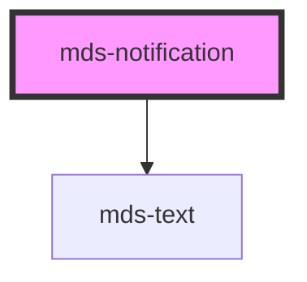

# mds-notification

<!-- Auto Generated Below -->

## Properties

| Property              | Attribute | Description                                                                              | Type      | Default     |
| --------------------- | --------- | ---------------------------------------------------------------------------------------- | --------- | ----------- |
| `target` _(required)_ | `target`  | Specifies the id of the caller element.                                                  | `string`  | `undefined` |
| `value`               | `value`   | Specifies number of notifications to display, if it set to 0, the element will be hidden | `number`  | `null`      |
| `visible`             | `visible` | Specifies if the notification is visible                                                 | `boolean` | `null`      |

## Dependencies

### Depends on

- [mds-text](../mds-text)

### Graph

----------------------------------------------

Built with love @ **Maggioli Informatica / R&D Department**
