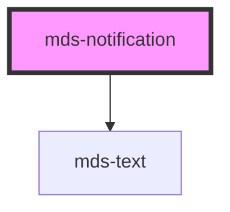

# mds-notification

<!-- Start script-generated Magma Docs -->

# Install

Install the component via `npm` by running the following command

```bash
npm install @maggioli-design-system/mds-notification
```

This package works also with yarn:

```bash
yarn add @maggioli-design-system/mds-notification
```

#### Import

Import the components in your project via `TypeScript` as follows:

```typescript
import { defineCustomElements as dceMdsNotification } from '@maggioli-design-system/mds-notification/loader'

dceMdsNotification()
```

`MdsNotification` depends on `MdsText`, so you will have to import it as well:

```typescript
import { defineCustomElements as dceMdsText } from '@maggioli-design-system/mds-text/loader'

dceMdsText()
```

You will have to import also the css style from `@maggioli-design-system` as follows:

```css
@import '~@maggioli-design-system/styles/dist/css/colors-rgb.css`
```

If you need to support older browsers (i.e. IE or early version of Edge), you can wrap the `defineCustomElements` in another utility awailable in the same package:

```typescript
import { applyPolyfills as apMdsNotification, defineCustomElements as dceMdsNotification } from '@maggioli-design-system/mds-notification/loader'

apMdsNotification().then(dceMdsNotification())
```

Use alias for `defineCustomElements` method to initialize multiple web components in the same place:

```typescript
import { defineCustomElements as dceMdsComponentOne } from '@maggioli-design-system/mds-component-one/loader'
import { defineCustomElements as dceMdsComponentTwo } from '@maggioli-design-system/mds-component-two/loader'

dceMdsComponentOne()
dceMdsComponentTwo()
```

You can check how browser support works at [this page][stencil-browser-support].

# Integration

<!-- This section is useful to describe usages and configurations -->

#### How to use it in HTML

`MdsNotification` is meant to be used to support another HTML component (like an icon or a button) to notify the user of pending notifications.

The component accepts the following attributes:
- `target`: (mandatory) specifies the id of the element to which is attached
- `value`: specifies the number of notification to display (if set to the element will be hidden)
- `visible`: specifies if the notification should be visible or not

```html
<mds-notification target='my-button' value=22 visible=true></mds-notification>
<button id='my-button'>Click here!</button>
```

You can try it out on the component's [Storybook website][storybook]!

[storybook]: https://magma.maggiolicloud.it/storybook/?path=/story/ui-notification--default
[stencil-browser-support]: https://stenciljs.com/docs/browser-support

<!-- End script-generated Magma Docs -->

This is a web-component from Maggioli Design System [Magma](https://magma.maggiolicloud.it), built with StencilJS, TypeScript, Storybook. It's based on the web-component standard and it's designed to be agnostic from the JavaScript framework you are using.

<!-- Auto Generated Below -->


## Usage

### 1. Description

The `<mds-notification>` web component is a numeric badge/dot indicator of the Magma Design System that attaches to another element (an icon, a button, an avatar) to signal a count of pending items. It has no HTML primitive equivalent: it positions itself relative to a target element rather than wrapping content of its own.

#### Semantic Behavior

- **Target attachment**: The component anchors to the element matched by the `target` selector and tracks it as it scrolls or resizes.
- **Missing target falls back**: If `target` is not set, positioning is disabled; if `target` is set but resolves to no element, it throws `No valid target found`.
- **Zero-value hiding**: When `value` is `0` the badge renders empty, so it effectively disappears until there is a count to show.
- **Count overflow**: When `max` is set and `value` exceeds it, the displayed text becomes `+max` (e.g. `+9`) instead of the raw number; otherwise the value is locale-formatted.
- **Accessibility**: The badge labels its target with the current value.

#### Properties & Visual Configurations

- **`target`** is the CSS selector of the element the badge anchors to; it is effectively mandatory for positioned rendering.
- **`value`** is the count shown in the badge and also the source of the accessible label; `0` hides the badge.
- **`max`** caps the visible number - pick it when raw counts could grow large and you want a compact `+N` ceiling.
- **`visible`** toggles whether the badge is shown independently of its value.

#### Other behavioral props

- **`strategy`** selects the positioning mode (`'fixed'` by default, `'absolute'`, or `'disabled'`). Use `'disabled'` to opt out of dynamic tracking; it is also set automatically when no `target` is provided.


### 2. Pattern

Correct and idiomatic ways to use the `<mds-notification>` component, ordered from most common to most specialized. Patterns assume a working knowledge of the variant / tone ladders documented in [`docs/COMPONENTS.md`](../../../../../../docs/COMPONENTS.md) and the generic stencil rules in [`projects/stencil/SPEC.md`](../../../../SPEC.md).

#### Badge Inside `mds-button` via Named Slot

The most common usage. Drop `<mds-notification>` into the `notification` slot of [`mds-button`](../../mds-button) so the badge is positioned and animated automatically by the button's internal layout. Set `strategy="disabled"` because the button handles placement; the component is no longer responsible for floating positioning.

```html
<mds-button label="Messaggi" icon="mdi/email" variant="secondary" tone="weak">
  <mds-notification slot="notification" value="5" strategy="disabled"></mds-notification>
</mds-button>
```

#### Floating Badge Anchored to an Arbitrary Element

Use the `target` prop with a CSS selector to attach a floating badge to any element on the page. The component uses `position: fixed` by default and tracks the target through scroll and resize automatically.

```html
<mds-notification target="#icona-notifiche" value="12"></mds-notification>
<mds-icon id="icona-notifiche" name="mi/baseline/notifications"></mds-icon>
```

#### Count Overflow via `max`

When raw counts can grow large, set `max` to cap the visible number. Values above the cap display as `+max` (e.g. `+99`), keeping the badge compact.

```html
<mds-notification target="#posta-in-arrivo" value="127" max="99"></mds-notification>
<mds-icon id="posta-in-arrivo" name="mi/baseline/mail"></mds-icon>
```

#### Hiding and Showing the Badge

Use the `visible` prop to show or hide the badge independently of its count. This is useful when the notification state is known but should not be displayed yet - for example while a panel is already open.

```html
<!-- Badge nascosto anche se ha un valore -->
<mds-notification target="#avatar-utente" value="3" visible="false"></mds-notification>

<!-- Badge visibile (valore predefinito) -->
<mds-notification target="#avatar-utente" value="3"></mds-notification>
```

#### Zero Value Produces an Empty Dot

When `value` is `0` the badge renders without a number, appearing as a plain dot. Use this when you need a presence indicator without a count - for example to signal new activity without exposing a specific number.

```html
<mds-notification target="#attivita-recente" value="0"></mds-notification>
<mds-button id="attivita-recente" label="Attivita" variant="secondary" tone="weak"></mds-button>
```

#### Absolute Positioning Strategy

Use `strategy="absolute"` when the badge must be positioned relative to a scrolling container rather than the viewport. The target element must have `position: relative` (or another non-static position) set on its nearest containing block.

```html
<div style="position: relative; overflow: auto;">
  <mds-notification target="#elemento-lista" value="2" strategy="absolute"></mds-notification>
  <mds-button id="elemento-lista" label="Documenti" variant="secondary"></mds-button>
</div>
```

#### Disabled Strategy for Manual Placement

Use `strategy="disabled"` when you want to position the badge yourself with utility classes or CSS instead of delegating to the floating-UI engine. This is the right choice whenever the badge lives inside a slot (the slot's host already controls layout) or when you use Tailwind position utilities.

```html
<mds-button label="Avvisi" icon="mi/baseline/notifications" variant="primary" tone="strong">
  <mds-notification
    slot="notification"
    value="4"
    strategy="disabled"
  ></mds-notification>
</mds-button>
```

#### Styling Customization via CSS Custom Properties

Customize the badge only through the documented `--mds-notification-*` CSS custom properties. Set them on the host element or a parent selector. Use the Magma color tokens with `rgb(var(--<token>))` so dark mode and high-contrast stay consistent.

```css
/* Colore di sfondo personalizzato, cerchio senza bordo */
.header-nav mds-notification {
  --mds-notification-dot-background: rgb(var(--status-warning-05));
  --mds-notification-color: rgb(var(--tone-kaolin-10));
  --mds-notification-ring-size: 0px;
  --mds-notification-size: 18px;
}
```


### 3. Antipattern

Common incorrect uses of `<mds-notification>`. Each entry pairs the wrong form with the right one and a one-line reason. System-wide rules (boolean-as-string, shadow piercing, Tailwind color utilities, raw native event listening) live in [`docs/COMPONENTS.md`](../../../../../../docs/COMPONENTS.md#system-level-anti-patterns) - they apply here too but are not repeated.

#### Do Not Use a Floating Strategy When Slotted Inside `mds-button`

When `<mds-notification>` sits inside the `notification` slot of [`mds-button`](../../mds-button), the button's own layout handles placement. Keeping `strategy="fixed"` (the default) causes the badge to escape the slot and position itself relative to the viewport instead.

```html
<!-- 🚫 INCORRECT -->
<mds-button label="Messaggi" icon="mdi/email" variant="secondary">
  <mds-notification slot="notification" value="5"></mds-notification>
</mds-button>

<!-- ✅ CORRECT -->
<mds-button label="Messaggi" icon="mdi/email" variant="secondary">
  <mds-notification slot="notification" value="5" strategy="disabled"></mds-notification>
</mds-button>
```

#### Do Not Omit `target` When Using a Floating Strategy

Without `target`, the component cannot locate its anchor, automatically falls back to `strategy="disabled"`, and renders in document flow wherever the tag appears - usually in the wrong place.

```html
<!-- 🚫 INCORRECT -->
<mds-notification value="3"></mds-notification>
<mds-icon id="icona-posta" name="mi/baseline/mail"></mds-icon>

<!-- ✅ CORRECT -->
<mds-notification target="#icona-posta" value="3"></mds-notification>
<mds-icon id="icona-posta" name="mi/baseline/mail"></mds-icon>
```

#### Do Not Set `visible="false"` to Hide the Badge When the Count Is Zero

Setting `value="0"` already collapses the visible dot. Mixing `visible="false"` (a string, not a boolean) with a non-zero value also triggers the boolean-as-string system anti-pattern: the string `"false"` is truthy in HTML and the component will not treat it as `false`.

```html
<!-- 🚫 INCORRECT - boolean passed as string -->
<mds-notification target="#elemento" value="0" visible="false"></mds-notification>

<!-- ✅ CORRECT - remove the attribute or let value=0 do the work -->
<mds-notification target="#elemento" value="0"></mds-notification>
```

#### Do Not Use `<mds-notification>` as a Status Dot Without a Count

`<mds-notification>` is a numeric counter badge. For a purely visual status indicator with no count, use [`mds-badge`](../../mds-badge) instead, which is designed for dot, icon, and label status scenarios.

```html
<!-- 🚫 INCORRECT - abusing notification as a plain dot indicator -->
<mds-notification target="#utente-online" value="0"></mds-notification>

<!-- ✅ CORRECT - use mds-badge for status dots -->
<mds-badge variant="success"></mds-badge>
```

#### Do Not Wrap the Target in a Relative Container and Use `strategy="fixed"`

`strategy="fixed"` anchors the badge to the viewport coordinate system. If the target sits inside a CSS-transformed or `position: relative` parent, `fixed` positioning will not track it correctly. Switch to `strategy="absolute"` and ensure the containing block has a non-static position.

```html
<!-- 🚫 INCORRECT - fixed badge inside transformed container -->
<div style="transform: translateX(0);">
  <mds-notification target="#btn-azioni" value="2" strategy="fixed"></mds-notification>
  <mds-button id="btn-azioni" label="Azioni"></mds-button>
</div>

<!-- ✅ CORRECT - absolute strategy with positioned containing block -->
<div style="position: relative;">
  <mds-notification target="#btn-azioni" value="2" strategy="absolute"></mds-notification>
  <mds-button id="btn-azioni" label="Azioni"></mds-button>
</div>
```

#### Do Not Pierce Shadow DOM to Style the Inner Dot

The internal `.dot` element is not a documented `::part()`. Targeting it with `::part(dot)` or deep-selector hacks breaks on any internal refactor. Use the documented `--mds-notification-*` CSS custom properties instead.

```css
/* 🚫 INCORRECT */
mds-notification::part(dot) {
  background-color: purple;
}

/* ✅ CORRECT */
mds-notification {
  --mds-notification-dot-background: rgb(var(--status-warning-05));
}
```


## Properties

| Property   | Attribute  | Description                                                                                                                                        | Type                                  | Default     |
| ---------- | ---------- | -------------------------------------------------------------------------------------------------------------------------------------------------- | ------------------------------------- | ----------- |
| `max`      | `max`      | Specifies the maximum number that can be seen, assuming that the number is for example 9 and that this is exceeded with 15, the component shows +9 | `number \| undefined`                 | `undefined` |
| `strategy` | `strategy` | Specifies the position strategy of the notification                                                                                                | `"absolute" \| "disabled" \| "fixed"` | `'fixed'`   |
| `target`   | `target`   | Specifies the selector of the target element, this attribute is used with `querySelector` method.                                                  | `string`                              | `undefined` |
| `value`    | `value`    | Specifies number of notifications to display, if it set to 0, the element will be hidden                                                           | `number`                              | `0`         |
| `visible`  | `visible`  | Specifies if the notification is visible                                                                                                           | `boolean`                             | `true`      |


## Dependencies

### Depends on

- [mds-text](../mds-text)

### Graph


----------------------------------------------

Built with love @ [Gruppo Maggioli](https://www.maggioli.com) from [R&D Department](https://www.maggioli.com/it-it/chi-siamo/ricerca-sviluppo)
