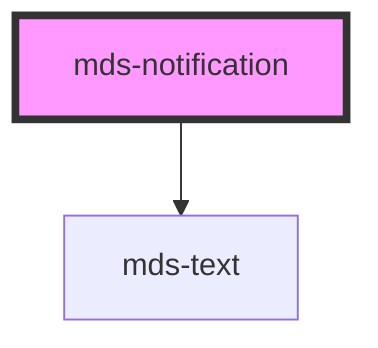

# mds-notification

<!-- Auto Generated Below -->

## Properties

| Property | Attribute | Description                                                                              | Type     | Default |
| -------- | --------- | ---------------------------------------------------------------------------------------- | -------- | ------- |
| `value`  | `value`   | Specifies number of notifications to display, if it set to 0, the element will be hidden | `number` | `0`     |

## Dependencies

### Depends on

- [mds-text](../mds-text)

### Graph

----------------------------------------------

Built with love @ **Maggioli Informatica / R&D Department**
