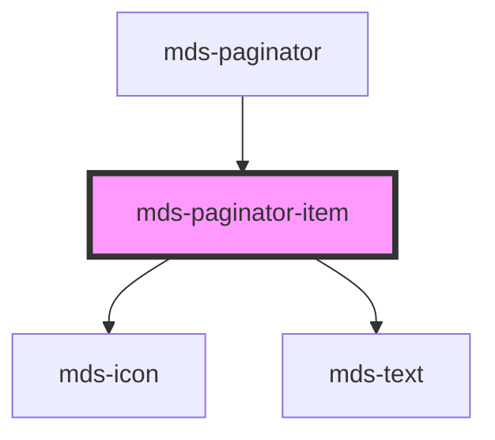

# mds-paginator-item

<!-- Auto Generated Below -->

## Properties

| Property   | Attribute  | Description                                                                    | Type      | Default     |
| ---------- | ---------- | ------------------------------------------------------------------------------ | --------- | ----------- |
| `active`   | `active`   | Specifies if the item is active or not, is handled from the parent paginator   | `boolean` | `undefined` |
| `disabled` | `disabled` | Specifies if the item is disabled or not, is handled from the parent paginator | `boolean` | `undefined` |
| `icon`     | `icon`     | Specifies the icon used inside the paginator item                              | `string`  | `undefined` |

## Dependencies

### Used by

 - [mds-paginator](../mds-paginator)

### Depends on

- [mds-icon](../mds-icon)
- [mds-text](../mds-text)

### Graph

----------------------------------------------

Built with love @ **Maggioli Informatica / R&D Department**
