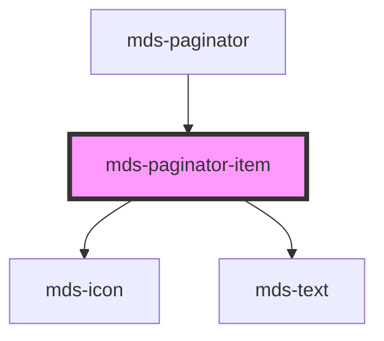

# mds-paginator-item


This is a web-component from Maggioli Design System [Magma](https://magma.maggiolicloud.it), built with StencilJS, TypeScript, Storybook. It's based on the web-component standard and it's designed to be agnostic from the JavaScript framework you are using.

<!-- Auto Generated Below -->


## Usage

### 1. Description

The `<mds-paginator-item>` web component is a compound child of [`<mds-paginator>`](../../mds-paginator) that renders a single clickable cell of the pagination control: either a numbered page or a navigation arrow. It has no standalone meaning and exists only to be orchestrated by its parent, which owns page state and emits the page-change event.

#### Semantic Behavior

- **Compound child only**: It is rendered exclusively by `<mds-paginator>` (one per page number plus the back/forward arrows) and is not used standalone or mixed with other child types; the parent manages count, ordering, scrolling, and selection.
- **State is parent-driven**: `selected` and `disabled` are not set by the consumer - the parent reflects them based on `currentPage` and the page boundaries, and the item only renders the resulting visual state.
- **Click reported upward**: The item carries no internal page logic; clicking it is resolved by the parent, which emits `mdsPaginatorChange`.
- **Keyboard activation**: The item is keyboard-activatable, but only while it is neither `disabled` nor `selected` - the active and unavailable cells are inert.
- **Icon vs. text rendering**: When `icon` is set the item renders an icon (used for the back/forward arrows); otherwise it renders the default slot as the page number.
- **Text-only slot**: The default slot is meant for a plain text string (a page number); HTML elements or nested components should not be placed in it.

#### Properties & Visual Configurations

This child exposes only three props, none of which a consumer normally sets directly:

- **`icon`**: Provide an icon name to turn the cell into a navigation control (the parent passes the back/forward arrows); leave it unset for a numbered page that uses the text slot instead.
- **`selected`**: Marks the cell as the current page. Set by the parent only; it switches the item to its selected visual treatment and makes it inert.
- **`disabled`**: Marks the cell as unavailable (e.g. the back arrow on page 1, the forward arrow on the last page). Set by the parent only; it blocks activation and applies the disabled styling.

Visual appearance (size, radius, colors, shadows for the default, hover, selected, and disabled states) is tuned through the `--mds-paginator-item-*` CSS custom properties listed in the readme rather than through props.


### 2. Pattern

Correct and idiomatic ways to use the `<mds-paginator-item>` component, ordered from most common to most specialized. Patterns assume a working knowledge of the variant / tone ladders documented in [`docs/COMPONENTS.md`](../../../../../../docs/COMPONENTS.md) and the generic stencil rules in [`projects/stencil/SPEC.md`](../../../../SPEC.md).

> **Note:** `<mds-paginator-item>` is an internal sub-part of [`mds-paginator`](../../mds-paginator). The idiomatic way to display page navigation is to use `<mds-paginator>` directly - it renders and manages all items automatically. The patterns below document the component's surface for the rare cases where its CSS tokens must be tuned or where you need to understand how the parent assembles it.

#### Using mds-paginator (the normal case)

Render a paginator by setting `pages` and `current-page` on the parent. The parent creates one `<mds-paginator-item>` per page number plus the back and forward arrow items; you never instantiate them yourself.

```html
<mds-paginator pages="12" current-page="1"></mds-paginator>
```

#### Listening for Page Changes

The page-change event is emitted by the parent `<mds-paginator>` as `mdsPaginatorChange`. Do not listen for click events on individual items.

```html
<mds-paginator id="paginatore" pages="20" current-page="1"></mds-paginator>

<script>
  document.querySelector('#paginatore').addEventListener('mdsPaginatorChange', (e) => {
    console.log('Pagina selezionata:', e.detail.page);
  });
</script>
```

#### Numbered Page Item (text slot)

When `icon` is not set, the item renders the default slot content as the page number label. The slot expects a plain text string - no HTML elements or components.

```html
<!-- Rendered internally by mds-paginator; shown here for reference only -->
<mds-paginator-item>7</mds-paginator-item>
```

#### Icon-Based Navigation Item

When `icon` is set, the item renders an icon instead of the text slot and is used for the back and forward arrow controls. The parent passes icon slugs from the project's iconsauce icon set.

```html
<!-- Rendered internally by mds-paginator; shown here for reference only -->
<mds-paginator-item icon="mi/baseline/arrow-back" disabled></mds-paginator-item>
<mds-paginator-item icon="mi/baseline/arrow-forward"></mds-paginator-item>
```

#### Selected and Disabled States

`selected` marks the current page and makes the item inert. `disabled` marks a navigation arrow as unavailable (e.g. back arrow on page 1) and also blocks activation. Both are boolean attributes that the parent manages.

```html
<!-- Current page - selected, inert -->
<mds-paginator-item selected>3</mds-paginator-item>

<!-- Back arrow on page 1 - disabled, inert -->
<mds-paginator-item icon="mi/baseline/arrow-back" disabled></mds-paginator-item>
```

#### CSS Customization

Tune the item's colors, size, radius, and state-specific styles through its documented `--mds-paginator-item-*` CSS custom properties. Set them on the parent `mds-paginator` host or on a containing selector; the custom properties inherit into each rendered item.

```css
/* Arrotondato quadrato invece di circolare, colore primario personalizzato */
mds-paginator {
  --mds-paginator-item-radius: var(--radius-md);
  --mds-paginator-item-background-selected: rgb(var(--variant-secondary-03));
  --mds-paginator-item-color-selected: rgb(var(--tone-neutral));
  --mds-paginator-item-size: 2.5rem;
}
```


### 3. Antipattern

Common incorrect uses of `<mds-paginator-item>`. Each entry pairs the wrong form with the right one and a one-line reason. System-wide rules (boolean-as-string, shadow piercing, Tailwind color utilities, raw native event listening) live in [`docs/COMPONENTS.md`](../../../../../../docs/COMPONENTS.md#system-level-anti-patterns) - they apply here too but are not repeated.

#### Do Not Use mds-paginator-item Standalone

`<mds-paginator-item>` is an internal sub-part rendered exclusively by `<mds-paginator>`. It has no standalone meaning; it relies on the parent to supply state (`selected`, `disabled`) and to handle page logic and the `mdsPaginatorChange` event.

```html
<!-- 🚫 INCORRECT -->
<mds-paginator-item>1</mds-paginator-item>
<mds-paginator-item selected>2</mds-paginator-item>
<mds-paginator-item>3</mds-paginator-item>

<!-- ✅ CORRECT -->
<mds-paginator pages="10" current-page="2"></mds-paginator>
```

#### Do Not Put HTML in the Default Slot

The default slot accepts a plain text string - the page number. Nested elements are not supported and break the item's layout.

```html
<!-- 🚫 INCORRECT -->
<mds-paginator-item>
  <strong>5</strong>
</mds-paginator-item>

<!-- ✅ CORRECT -->
<mds-paginator-item>5</mds-paginator-item>
```

#### Do Not Set selected or disabled From Consumer Code

Both `selected` and `disabled` are driven by the parent paginator based on `currentPage` and page boundaries. Setting them manually from consumer code creates state conflicts with the parent's rendering logic.

```html
<!-- 🚫 INCORRECT - consumer forcing selected state -->
<mds-paginator pages="10" current-page="3">
  <!-- attempting to override individual item state externally -->
</mds-paginator>
<script>
  document.querySelector('mds-paginator')
    .shadowRoot.querySelectorAll('mds-paginator-item')[2]
    .setAttribute('selected', '');
</script>

<!-- ✅ CORRECT - drive state through the parent prop -->
<mds-paginator pages="10" current-page="3"></mds-paginator>
```

#### Do Not Listen for Click Events on Items

Individual item clicks are handled internally by `<mds-paginator>`. Listening for `click` on items reaches into shadow DOM and bypasses the parent's page validation and scroll logic. Use the documented `mdsPaginatorChange` event on the parent.

```html
<!-- 🚫 INCORRECT -->
<mds-paginator id="pag" pages="10" current-page="1"></mds-paginator>
<script>
  document.querySelector('#pag').shadowRoot
    .querySelectorAll('mds-paginator-item')
    .forEach((item) => item.addEventListener('click', handleClick));
</script>

<!-- ✅ CORRECT -->
<mds-paginator id="pag" pages="10" current-page="1"></mds-paginator>
<script>
  document.querySelector('#pag').addEventListener('mdsPaginatorChange', (e) => {
    console.log('Pagina:', e.detail.page);
  });
</script>
```

#### Do Not Pierce Shadow DOM to Style Items

The supported customization surface is the `--mds-paginator-item-*` CSS custom properties. Targeting internals via `::part()`, `>>>`, or undocumented selectors couples your code to the implementation and will break on minor releases.

```css
/* 🚫 INCORRECT */
mds-paginator-item >>> .text {
  font-weight: 900;
}

/* ✅ CORRECT */
mds-paginator {
  --mds-paginator-item-color-selected: rgb(var(--variant-secondary-03));
  --mds-paginator-item-radius: var(--radius-sm);
}
```


## Properties

| Property   | Attribute  | Description                                                                    | Type                   | Default     |
| ---------- | ---------- | ------------------------------------------------------------------------------ | ---------------------- | ----------- |
| `disabled` | `disabled` | Specifies if the item is disabled or not, is handled from the parent paginator | `boolean \| undefined` | `undefined` |
| `icon`     | `icon`     | Specifies the icon used inside the paginator item                              | `string \| undefined`  | `undefined` |
| `selected` | `selected` | Specifies if the item is selected or not, is handled from the parent paginator | `boolean \| undefined` | `undefined` |


## Slots

| Slot        | Description                                                                            |
| ----------- | -------------------------------------------------------------------------------------- |
| `"default"` | Add `text string` to this slot, **avoid** to add `HTML elements` or `components` here. |


## Dependencies

### Used by

 - [mds-paginator](../mds-paginator)

### Depends on

- [mds-icon](../mds-icon)
- [mds-text](../mds-text)

### Graph


----------------------------------------------

Built with love @ [Gruppo Maggioli](https://www.maggioli.com) from [R&D Department](https://www.maggioli.com/it-it/chi-siamo/ricerca-sviluppo)
