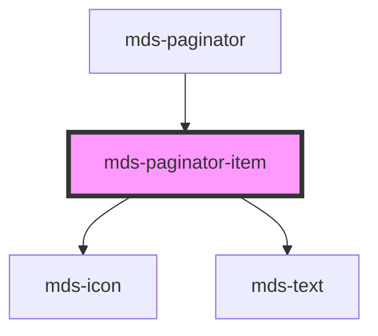

# mds-paginator-item

This is a web-component from Maggioli Design System [Magma](https://magma.maggiolicloud.it), built with StencilJS, TypeScript, Storybook. It's based on the web-component standard and it's designed to be agnostic from the JavaScirpt framework you are using.

<!-- Auto Generated Below -->

## Properties

| Property   | Attribute  | Description                                                                    | Type                   | Default     |
| ---------- | ---------- | ------------------------------------------------------------------------------ | ---------------------- | ----------- |
| `disabled` | `disabled` | Specifies if the item is disabled or not, is handled from the parent paginator | `boolean \| undefined` | `undefined` |
| `icon`     | `icon`     | Specifies the icon used inside the paginator item                              | `string \| undefined`  | `undefined` |
| `selected` | `selected` | Specifies if the item is selected or not, is handled from the parent paginator | `boolean \| undefined` | `undefined` |

## Slots

| Slot        | Description                                                                            |
| ----------- | -------------------------------------------------------------------------------------- |
| `"default"` | Add `text string` to this slot, **avoid** to add `HTML elements` or `components` here. |

## CSS Custom Properties

| Name                                       | Description                                                     |
| ------------------------------------------ | --------------------------------------------------------------- |
| `--mds-paginator-item-background`          | Sets the background-color of the pages area and the item        |
| `--mds-paginator-item-background-disabled` | Sets the background-color of the item when is disabled          |
| `--mds-paginator-item-background-hover`    | Sets the background-color of the item when the mouse is over it |
| `--mds-paginator-item-background-selected` | Sets the background-color of the item when is selected          |
| `--mds-paginator-item-color`               | Sets the text color of the component                            |
| `--mds-paginator-item-color-disabled`      | Sets the color of the item when is disabled                     |
| `--mds-paginator-item-color-hover`         | Sets the text color of the item when the mouse is over it       |
| `--mds-paginator-item-color-selected`      | Sets the text color of the item when is selected                |
| `--mds-paginator-item-radius`              | Sets the border-radius of the component                         |
| `--mds-paginator-item-shadow`              | Sets the box-shadow of the component                            |
| `--mds-paginator-item-shadow-disabled`     | Sets the box-shadow of the item when is disabled                |
| `--mds-paginator-item-shadow-hover`        | Sets the box-shadow of the item when the mouse is over it       |
| `--mds-paginator-item-shadow-selected`     | Sets the box-shadow of the item when is selected                |
| `--mds-paginator-item-size`                | Sets the height and the min-width of the paginator item         |

## Dependencies

### Used by

 - [mds-paginator](../mds-paginator)

### Depends on

- [mds-icon](../mds-icon)
- [mds-text](../mds-text)

### Graph

----------------------------------------------

Built with love @ **Maggioli Informatica / R&D Department**
