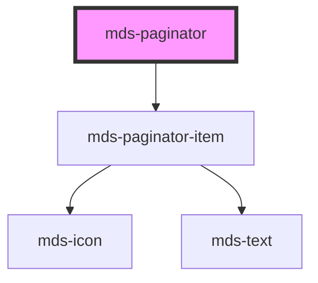

# mds-paginator

This is a web-component from Maggioli Design System [Magma](https://magma.maggiolicloud.it), built with StencilJS, TypeScript, Storybook. It's based on the web-component standard and it's designed to be agnostic from the JavaScirpt framework you are using.

<!-- Auto Generated Below -->

## Properties

| Property      | Attribute      | Description                                          | Type     | Default |
| ------------- | -------------- | ---------------------------------------------------- | -------- | ------- |
| `currentPage` | `current-page` | Specifies the current page selected in the paginator | `number` | `1`     |
| `pages`       | `pages`        | Specifies the number of total pages to be handled    | `number` | `0`     |

## Events

| Event                | Description                  | Type                                   |
| -------------------- | ---------------------------- | -------------------------------------- |
| `mdsPaginatorChange` | Emits when a page is changed | `CustomEvent<MdsPaginatorEventDetail>` |

## Dependencies

### Depends on

- [mds-paginator-item](../mds-paginator-item)

### Graph

----------------------------------------------

Built with love @ [Gruppo Maggioli](https://www.maggioli.com) from [R&D Department](https://www.maggioli.com/it-it/chi-siamo/ricerca-sviluppo)
