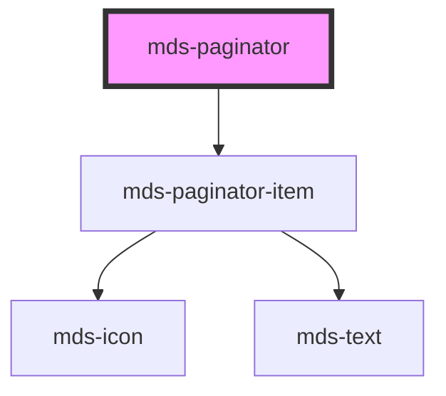

# mds-paginator


This is a web-component from Maggioli Design System [Magma](https://magma.maggiolicloud.it), built with StencilJS, TypeScript, Storybook. It's based on the web-component standard and it's designed to be agnostic from the JavaScript framework you are using.

<!-- Auto Generated Below -->


## Usage

### 1. Description

The `<mds-paginator>` web component is the page-navigation control of the Magma Design System. It renders a horizontal strip of numbered page items framed by previous/next arrows, replacing an ad-hoc set of links or buttons with a single self-managing control.

#### Semantic Behavior

- **Self-rendered children**: The paginator generates its own page items internally from `pages`; authors do not slot the items.
- **Page change event**: Selecting a page (or an arrow) emits `mdsPaginatorChange` with a detail of `{ page, caller }`, where `caller` is the `mds-paginator-item` that triggered the change.
- **Bounds clamping**: Navigation requests below `1` or above `pages` are ignored, so the arrows can never move past the valid range.
- **Arrow disabling**: The back arrow is disabled on the first page and the forward arrow on the last page.
- **Auto-scroll into view**: When `pages` exceeds two, the strip scrolls so the active page is centered; focusing or selecting an item re-centers it. Scroll motion is themeable via `--mds-paginator-scroll-behavior`.
- **Initial sync**: On load the component navigates to the provided `currentPage`, emitting the change event and scrolling the strip to match.

#### Properties & Visual Configurations

- **`pages`** is the total number of pages the control should represent and drives how many items are rendered; with `0` only the arrows appear.
- **`currentPage`** marks which item is selected and which arrows are disabled; set it to control the paginator from outside, or read it back after a `mdsPaginatorChange` to follow user navigation.

This component does not use the shared `variant` / `tone` ladders defined in [`projects/stencil/SPEC.md`](../../../../SPEC.md#tone-and-variant-system); its appearance is tuned only through the CSS custom properties documented in `readme.md`.


### 2. Pattern

Correct and idiomatic ways to use the `<mds-paginator>` component, ordered from most common to most specialized. Patterns assume a working knowledge of the conventions documented in [`docs/COMPONENTS.md`](../../../../../../docs/COMPONENTS.md) and the generic stencil rules in [`projects/stencil/SPEC.md`](../../../../SPEC.md).

#### Basic Paginator

Provide `pages` with the total number of pages. The component renders all items and the previous/next arrows automatically. The `pages` prop is all that is required for a working paginator.

```html
<mds-paginator pages="20"></mds-paginator>
```

#### Starting on a Specific Page

Set `current-page` to pre-select an initial page. On load the component emits `mdsPaginatorChange` and scrolls the strip to center the active item.

```html
<mds-paginator pages="32" current-page="16"></mds-paginator>
```

#### Listening to Page Changes

Listen for `mdsPaginatorChange` to react to navigation. The event detail carries `{ page, caller }` where `page` is the newly selected page number and `caller` is the `mds-paginator-item` that triggered the change.

```html
<mds-paginator id="pager" pages="10"></mds-paginator>

<script>
  document.getElementById('pager').addEventListener('mdsPaginatorChange', (e) => {
    const nuovaPagina = e.detail.page;
    // Aggiorna la tabella o la lista con i dati della nuova pagina
    caricaDati(nuovaPagina);
  });
</script>
```

#### Controlled Navigation from Outside

Write `current-page` programmatically to drive the paginator from application state - for example when a search resets pagination to page 1.

```html
<mds-paginator id="pager" pages="15" current-page="1"></mds-paginator>

<script>
  function resettaPaginazione() {
    document.getElementById('pager').currentPage = 1;
  }
</script>
```

#### Single-Page and Two-Page Edge Cases

When `pages` is `1` only the first/last item and the arrows appear (the scrollable strip is omitted). When `pages` is `2` both the first and last items render without the strip. Both are valid states - pass the real page count without special-casing.

```html
<!-- Una sola pagina: solo gli arrow e la pagina 1 -->
<mds-paginator pages="1"></mds-paginator>

<!-- Due pagine: pagina 1 e pagina 2, nessuna strip -->
<mds-paginator pages="2"></mds-paginator>
```

#### Styling the Page Strip Background

Override `--mds-paginator-background` on the host to change the background of the scrollable pages area. Use a Magma color token wrapped in `rgb(var(...))` so dark mode keeps working.

```css
.mia-tabella mds-paginator {
  --mds-paginator-background: rgb(var(--tone-neutral-08));
}
```

#### Disabling Scroll Animation

Set `--mds-paginator-scroll-behavior` to `auto` to remove the animated scroll when jumping between pages - useful for contexts that already honour `prefers-reduced-motion` at application level.

```css
.stampa mds-paginator {
  --mds-paginator-scroll-behavior: auto;
}
```

#### Styling Individual Items

The child `mds-paginator-item` component exposes its own `--mds-paginator-item-*` custom properties. Set them on the `mds-paginator` host or a parent selector; they cascade into the shadow-rendered items.

```css
.paginatore-compatto mds-paginator {
  --mds-paginator-item-size: 28px;
  --mds-paginator-item-radius: var(--radius-sm);
  --mds-paginator-item-background-selected: rgb(var(--variant-primary-03));
  --mds-paginator-item-color-selected: rgb(var(--tone-kaolin-10));
}
```


### 3. Antipattern

Common incorrect uses of `<mds-paginator>`. Each entry pairs the wrong form with the right one and a one-line reason. System-wide rules (boolean-as-string, shadow piercing, Tailwind color utilities, raw native event listening) live in [`docs/COMPONENTS.md`](../../../../../../docs/COMPONENTS.md#system-level-anti-patterns) - they apply here too but are not repeated.

#### Do Not Slot `mds-paginator-item` Manually

`<mds-paginator>` generates all its child items from the `pages` prop and accepts no slots. Manually adding `<mds-paginator-item>` children has no effect and produces duplicate or broken controls.

```html
<!-- 🚫 INCORRECT -->
<mds-paginator pages="5">
  <mds-paginator-item selected>3</mds-paginator-item>
</mds-paginator>

<!-- ✅ CORRECT -->
<mds-paginator pages="5" current-page="3"></mds-paginator>
```

#### Do Not Use `mds-paginator-item` Outside `mds-paginator`

`<mds-paginator-item>` is an internal sub-part. Its `disabled`, `selected`, and `icon` props are managed exclusively by the parent. Using it standalone produces unstyled, non-functional controls.

```html
<!-- 🚫 INCORRECT -->
<mds-paginator-item>1</mds-paginator-item>
<mds-paginator-item selected>2</mds-paginator-item>

<!-- ✅ CORRECT -->
<mds-paginator pages="5" current-page="2"></mds-paginator>
```

#### Do Not Set `pages` to Zero to "Hide" the Paginator

When `pages` is `0` only the two arrows render, which is visually incomplete and confusing. To conditionally hide the paginator, remove it from the DOM entirely or set `display: none` on the host.

```html
<!-- 🚫 INCORRECT -->
<mds-paginator pages="0"></mds-paginator>

<!-- ✅ CORRECT -->
<mds-paginator v-if="totalePagine > 0" :pages="totalePagine"></mds-paginator>
```

#### Do Not Listen for Native `click` to Detect Page Changes

The native `click` event fires on the internal shadow items and may not bubble as expected. Use the documented `mdsPaginatorChange` event instead, which carries the selected page number in `event.detail.page`.

```html
<!-- 🚫 INCORRECT -->
<mds-paginator id="pager" pages="10"></mds-paginator>
<script>
  document.getElementById('pager').addEventListener('click', (e) => {
    // detail.page is undefined - this is the wrong event
    console.log(e.detail?.page);
  });
</script>

<!-- ✅ CORRECT -->
<mds-paginator id="pager" pages="10"></mds-paginator>
<script>
  document.getElementById('pager').addEventListener('mdsPaginatorChange', (e) => {
    console.log(e.detail.page);
  });
</script>
```

#### Do Not Set `current-page` to a String

`current-page` is a numeric prop. Passing a quoted string (common in plain HTML attribute authoring) forces a type coercion that can produce unexpected scroll and selection behavior.

```html
<!-- 🚫 INCORRECT -->
<mds-paginator pages="20" current-page="5"></mds-paginator>
<!-- The attribute form is fine; the anti-pattern is framework bindings that pass a string -->

<!-- 🚫 INCORRECT (framework binding passing a string, not a number) -->
<!-- <mds-paginator :pages="20" :current-page="'5'"></mds-paginator> -->

<!-- ✅ CORRECT (bind the number directly) -->
<!-- <mds-paginator :pages="20" :current-page="5"></mds-paginator> -->
```

#### Do Not Pierce Shadow DOM to Style Items

Internal `mds-paginator-item` elements live in shadow DOM. Targeting them with `>>>`, `/deep/`, or unrecognised `::part()` names breaks on any release. Use the documented `--mds-paginator-*` and `--mds-paginator-item-*` CSS custom properties on the host instead.

```css
/* 🚫 INCORRECT */
mds-paginator >>> mds-paginator-item {
  border-radius: 4px;
}

/* ✅ CORRECT */
mds-paginator {
  --mds-paginator-item-radius: var(--radius-sm);
  --mds-paginator-item-background-selected: rgb(var(--variant-primary-03));
}
```


## Properties

| Property      | Attribute      | Description                                          | Type     | Default |
| ------------- | -------------- | ---------------------------------------------------- | -------- | ------- |
| `currentPage` | `current-page` | Specifies the current page selected in the paginator | `number` | `1`     |
| `pages`       | `pages`        | Specifies the number of total pages to be handled    | `number` | `0`     |


## Events

| Event                | Description                  | Type                                   |
| -------------------- | ---------------------------- | -------------------------------------- |
| `mdsPaginatorChange` | Emits when a page is changed | `CustomEvent<MdsPaginatorEventDetail>` |


## Dependencies

### Depends on

- [mds-paginator-item](../mds-paginator-item)

### Graph


----------------------------------------------

Built with love @ [Gruppo Maggioli](https://www.maggioli.com) from [R&D Department](https://www.maggioli.com/it-it/chi-siamo/ricerca-sviluppo)
