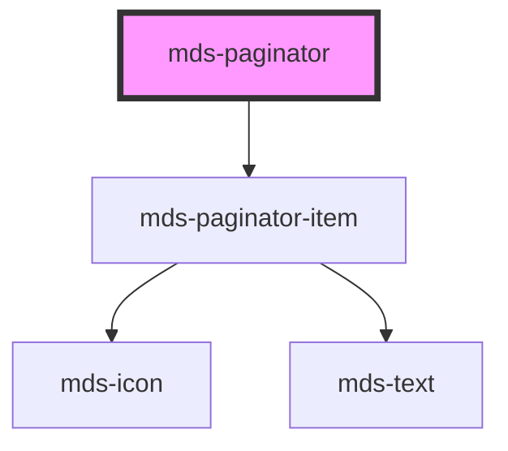

# mds-paginator

<!-- Auto Generated Below -->

## Properties

| Property      | Attribute      | Description                                          | Type     | Default |
| ------------- | -------------- | ---------------------------------------------------- | -------- | ------- |
| `currentPage` | `current-page` | Specifies the current page selected in the paginator | `number` | `1`     |
| `pages`       | `pages`        | Specifies the number of total pages to be handled    | `number` | `0`     |

## Events

| Event                | Description                  | Type                  |
| -------------------- | ---------------------------- | --------------------- |
| `mdsPaginatorChange` | Emits when a page is changed | `CustomEvent<number>` |

## CSS Custom Properties

| Name                         | Description                                              |
| ---------------------------- | -------------------------------------------------------- |
| `--mds-paginator-background` | Sets the background-color of the pages area and the item |

## Dependencies

### Depends on

- [mds-paginator-item](../mds-paginator-item)

### Graph

----------------------------------------------

Built with love @ **Maggioli Informatica / R&D Department**
