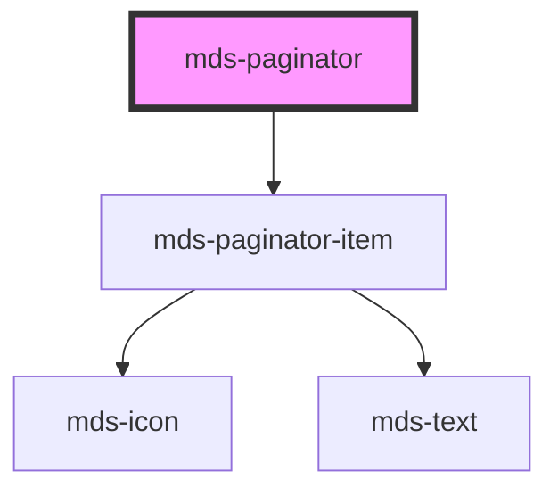

# mds-paginator


This is a web-component from Maggioli Design System [Magma](https://magma.maggiolicloud.it), built with StencilJS, TypeScript, Storybook. It's based on the web-component standard and it's designed to be agnostic from the JavaScript framework you are using.

<!-- Auto Generated Below -->


## Usage

### 1. Description

The `<mds-paginator>` web component is the page-navigation control of the Magma Design System. It renders a horizontal strip of numbered page items framed by previous/next arrows, replacing an ad-hoc set of links or buttons with a single self-managing control.

#### Semantic Behavior

- **Self-rendered children**: The paginator generates its own page items internally from `pages`; authors do not slot the items.
- **Page change event**: Selecting a page (or an arrow) emits `mdsPaginatorChange` with a detail of `{ page, caller }`, where `caller` is the `mds-paginator-item` that triggered the change.
- **Bounds clamping**: Navigation requests below `1` or above `pages` are ignored, so the arrows can never move past the valid range.
- **Arrow disabling**: The back arrow is disabled on the first page and the forward arrow on the last page.
- **Auto-scroll into view**: When `pages` exceeds two, the strip scrolls so the active page is centered; selecting an item re-centers it, and so does focusing an item from the keyboard (tabbing through the pages). Pointer interaction never scrolls the strip before the click lands, so the clicked page is always the one selected. Scroll motion is themeable via `--mds-paginator-scroll-behavior`.
- **Initial sync**: On load the component navigates to the provided `currentPage`, emitting the change event and scrolling the strip to match.

#### Properties & Visual Configurations

- **`pages`** is the total number of pages the control should represent and drives how many items are rendered; with `0` only the arrows appear.
- **`currentPage`** marks which item is selected and which arrows are disabled; set it to control the paginator from outside, or read it back after a `mdsPaginatorChange` to follow user navigation.

This component does not use the shared `variant` / `tone` ladders defined in [`docs/agents/variants.md`](../../../../../../docs/agents/variants.md); its appearance is tuned only through the CSS custom properties documented in [`readme.md`](../readme.md).


### 2. Pattern

Correct and idiomatic ways to use the `<mds-paginator>` component, ordered from most common to most specialized. Patterns assume a working knowledge of the shared component rules in [`docs/agents/conventions.md`](../../../../../../docs/agents/conventions.md).

#### Basic Paginator

Provide `pages` with the total number of pages. The component renders all items and the previous/next arrows automatically. The `pages` prop is all that is required for a working paginator.

```html
<mds-paginator pages="20"></mds-paginator>
```

#### Starting on a Specific Page

Set `current-page` to pre-select an initial page. On load the component emits `mdsPaginatorChange` and scrolls the strip to center the active item.

```html
<mds-paginator pages="32" current-page="16"></mds-paginator>
```

#### Listening to Page Changes

Listen for `mdsPaginatorChange` to react to navigation. The event detail carries `{ page, caller }` where `page` is the newly selected page number and `caller` is the `mds-paginator-item` that triggered the change.

```html
<mds-paginator id="pager" pages="10"></mds-paginator>

<script>
  document.getElementById('pager').addEventListener('mdsPaginatorChange', (e) => {
    const nuovaPagina = e.detail.page;
    // Aggiorna la tabella o la lista con i dati della nuova pagina
    caricaDati(nuovaPagina);
  });
</script>
```

#### Controlled Navigation from Outside

Write `current-page` programmatically to drive the paginator from application state - for example when a search resets pagination to page 1.

```html
<mds-paginator id="pager" pages="15" current-page="1"></mds-paginator>

<script>
  function resettaPaginazione() {
    document.getElementById('pager').currentPage = 1;
  }
</script>
```

#### Single-Page and Two-Page Edge Cases

When `pages` is `1` only the first/last item and the arrows appear (the scrollable strip is omitted). When `pages` is `2` both the first and last items render without the strip. Both are valid states - pass the real page count without special-casing.

```html
<!-- Una sola pagina: solo gli arrow e la pagina 1 -->
<mds-paginator pages="1"></mds-paginator>

<!-- Due pagine: pagina 1 e pagina 2, nessuna strip -->
<mds-paginator pages="2"></mds-paginator>
```

#### Styling the Page Strip Background

Override `--mds-paginator-background` on the host to change the background of the scrollable pages area. Use a Magma color token wrapped in `rgb(var(...))` so dark mode keeps working.

```css
.mia-tabella mds-paginator {
  --mds-paginator-background: rgb(var(--magma-wash-strong));
}
```

#### Disabling Scroll Animation

Set `--mds-paginator-scroll-behavior` to `auto` to remove the animated scroll when jumping between pages - useful for contexts that already honour `prefers-reduced-motion` at application level.

```css
.stampa mds-paginator {
  --mds-paginator-scroll-behavior: auto;
}
```

#### Styling Individual Items

The items cannot be restyled from outside. The child `mds-paginator-item` declares its `--mds-paginator-item-*` custom properties on its own host, so a value set on the `mds-paginator` host or a parent selector does not reach the shadow-rendered items, and the paginator exposes no shadow parts. Customize the paginator through `--mds-paginator-background` and `--mds-paginator-scroll-behavior` only (see the two patterns above).


### 3. Antipattern

Common incorrect uses of `<mds-paginator>`. Each entry pairs the wrong form with the right one and a one-line reason. System-wide rules (boolean-as-string, shadow piercing, Tailwind color utilities, raw native event listening) live in [`docs/agents/anti-patterns.md`](../../../../../../docs/agents/anti-patterns.md) - they apply here too but are not repeated.

#### Do Not Slot `mds-paginator-item` Manually

`<mds-paginator>` generates all its child items from the `pages` prop and accepts no slots. Manually added `<mds-paginator-item>` children are never rendered, so they have no effect.

```html
<!-- INCORRECT -->
<mds-paginator pages="5">
  <mds-paginator-item selected>3</mds-paginator-item>
</mds-paginator>

<!-- CORRECT -->
<mds-paginator pages="5" current-page="3"></mds-paginator>
```

#### Do Not Use `mds-paginator-item` Outside `mds-paginator`

`<mds-paginator-item>` is an internal sub-part. Its `disabled`, `selected`, and `icon` props are managed exclusively by the parent. Using it standalone produces controls that look like page items but do nothing: the page logic lives in the parent.

```html
<!-- INCORRECT -->
<mds-paginator-item>1</mds-paginator-item>
<mds-paginator-item selected>2</mds-paginator-item>

<!-- CORRECT -->
<mds-paginator pages="5" current-page="2"></mds-paginator>
```

#### Do Not Set `pages` to Zero to "Hide" the Paginator

When `pages` is `0` only the two arrows render, which is visually incomplete and confusing. To conditionally hide the paginator, remove it from the DOM entirely or set `display: none` on the host.

```html
<!-- INCORRECT -->
<mds-paginator pages="0"></mds-paginator>

<!-- CORRECT: create the paginator only when there are pages -->
<div id="paginazione"></div>
<script>
  if (totalePagine > 0) {
    const pager = document.createElement('mds-paginator');
    pager.pages = totalePagine;
    document.getElementById('paginazione').append(pager);
  }
</script>
```

#### Do Not Listen for Native `click` to Detect Page Changes

A native `click` bubbles out of the shadow DOM for any click on the control, but it carries no page number. Use the documented `mdsPaginatorChange` event instead, which carries the selected page number in `event.detail.page`.

```html
<!-- INCORRECT -->
<mds-paginator id="pager" pages="10"></mds-paginator>
<script>
  document.getElementById('pager').addEventListener('click', (e) => {
    // detail.page is undefined - this is the wrong event
    console.log(e.detail?.page);
  });
</script>

<!-- CORRECT -->
<mds-paginator id="pager" pages="10"></mds-paginator>
<script>
  document.getElementById('pager').addEventListener('mdsPaginatorChange', (e) => {
    console.log(e.detail.page);
  });
</script>
```

#### Do Not Pierce Shadow DOM to Style Items

Internal `mds-paginator-item` elements live in shadow DOM. Targeting them with `>>>`, `/deep/`, or unrecognised `::part()` names breaks on any release. Use the documented `--mds-paginator-*` CSS custom properties on the host instead; the items themselves take no customization from outside (their `--mds-paginator-item-*` values are declared on each item).

```css
/* INCORRECT */
mds-paginator >>> mds-paginator-item {
  border-radius: 4px;
}

/* CORRECT */
mds-paginator {
  --mds-paginator-background: rgb(var(--magma-wash-strong));
}
```


## Properties

| Property      | Attribute      | Description                                          | Type     | Default |
| ------------- | -------------- | ---------------------------------------------------- | -------- | ------- |
| `currentPage` | `current-page` | Specifies the current page selected in the paginator | `number` | `1`     |
| `pages`       | `pages`        | Specifies the number of total pages to be handled    | `number` | `0`     |


## Events

| Event                | Description                  | Type                                   |
| -------------------- | ---------------------------- | -------------------------------------- |
| `mdsPaginatorChange` | Emits when a page is changed | `CustomEvent<MdsPaginatorEventDetail>` |


## CSS Custom Properties

| Name                              | Description                                              |
| --------------------------------- | -------------------------------------------------------- |
| `--mds-paginator-background`      | Sets the background-color of the pages area and the item |
| `--mds-paginator-scroll-behavior` | Sets the scroll-behavior animation                       |


## Dependencies

### Depends on

- [mds-paginator-item](../mds-paginator-item)

### Graph

```mermaid
graph TD;
  mds-paginator --> mds-paginator-item
  mds-paginator-item --> mds-icon
  mds-paginator-item --> mds-text
  style mds-paginator fill:#f9f,stroke:#333,stroke-width:4px
```

----------------------------------------------

Built with love @ [Gruppo Maggioli](https://www.maggioli.com) from [R&D Department](https://www.maggioli.com/it-it/chi-siamo/ricerca-sviluppo)
