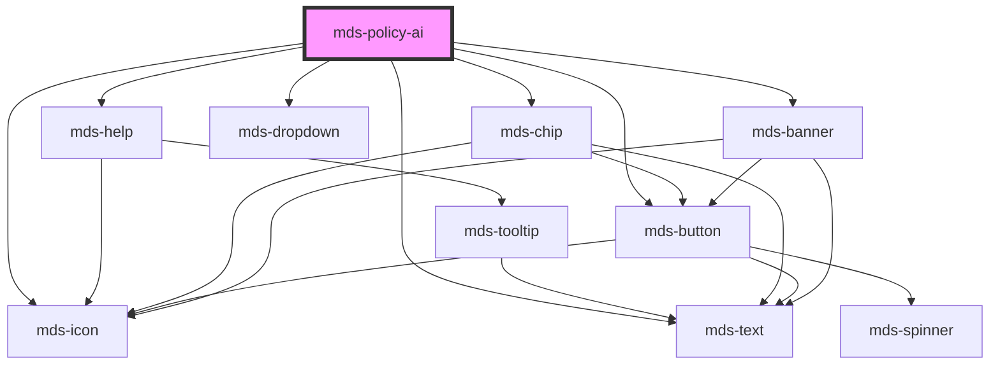

# mds-policy-ai

<!-- Auto Generated Below -->

## Properties

| Property      | Attribute     | Description                                        | Type                                                  | Default                                                                                      |
| ------------- | ------------- | -------------------------------------------------- | ----------------------------------------------------- | -------------------------------------------------------------------------------------------- |
| `description` | `description` | Sets the description to custom component long text | `string \| undefined`                                 | `undefined`                                                                                  |
| `headline`    | `headline`    | Sets the headline to custom component text         | `string \| undefined`                                 | `undefined`                                                                                  |
| `href`        | `href`        | Sets the pointing URL of the component             | `string \| undefined`                                 | `'https://www.maggiolieditore.it/il-regolamento-europeo-sull-intelligenza-artificiale.html'` |
| `variant`     | `variant`     | Sets the variant type of the component             | `"banner" \| "card" \| "chip" \| "icon" \| undefined` | `'chip'`                                                                                     |

## Methods

### `updateLang() => Promise<void>`

#### Returns

Type: `Promise<void>`

## Shadow Parts

| Part       | Description                                                                                                        |
| ---------- | ------------------------------------------------------------------------------------------------------------------ |
| `"banner"` | Selects the `banner` component wrapped in shadowDOM, will be found only if attirbute `variant` is set to `banner`. |
| `"card"`   | Selects the `card` component wrapped in shadowDOM, will be found only if attirbute `variant` is set to `card`.     |
| `"chip"`   | Selects the `chip` component wrapped in shadowDOM, will be found only if attirbute `variant` is set to `chip`.     |
| `"icon"`   | Selects the `icon` component wrapped in shadowDOM, will be found only if attirbute `variant` is set to `icon`.     |

## Dependencies

### Depends on

- [mds-help](../mds-help)
- [mds-text](../mds-text)
- [mds-chip](../mds-chip)
- [mds-dropdown](../mds-dropdown)
- [mds-button](../mds-button)
- [mds-icon](../mds-icon)
- [mds-banner](../mds-banner)

### Graph

----------------------------------------------

Built with love @ [Gruppo Maggioli](https://www.maggioli.com) from [R&D Department](https://www.maggioli.com/it-it/chi-siamo/ricerca-sviluppo)
