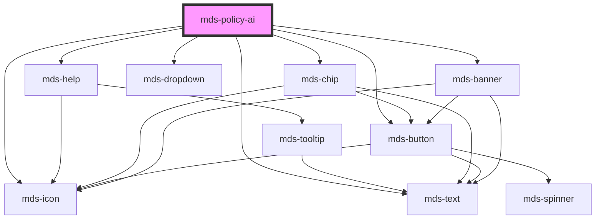

# mds-policy-ai


<!-- Auto Generated Below -->


## Usage

### 1. Description

The `<mds-policy-ai>` web component is the Magma Design System disclosure marker that flags AI-generated content as produced by MIA (Maggioli's artificial intelligence) and links to the official AI usage policy. It is a presentational compound component with no native HTML primitive, rendering one of four interchangeable surfaces (icon, chip, card, banner).

#### Semantic Behavior

- **Variant-exclusive rendering**: Exactly one surface is mounted per the `variant` value, exposed through the matching shadow part (`icon`, `chip`, `card`, `banner`).
- **Localization**: Supplies all default copy (headline, description, link labels) in `el`, `en`, `es`, `it`, resolved from the host language.
- **Policy navigation**: Every variant routes the user to the policy `href` - the `icon` variant opens it in a new tab on click, while the other variants embed a button link to it.
- **Content fallbacks**: `headline` and `description` override the localized defaults where the active variant uses them; otherwise the built-in MIA disclosure text is shown.

#### Properties & Visual Configurations

- **`variant`** selects the disclosure surface and is the primary configuration knob. Each value carries a distinct placement intent:
  - **`'chip'`** (default): a compact "Generated with MIA" chip with a hover dropdown holding the disclaimer and policy link - for inline placement next to generated text.
  - **`'icon'`**: a minimal help glyph with a tooltip - for the most space-constrained contexts.
  - **`'card'`**: a small card pairing the disclaimer with a policy button - for sidebars or standalone blocks.
  - **`'banner'`**: a full-width banner with title, description, and action - for prominent page-level notices.
- **`headline`** sets the short title used by the `chip`, `icon`, and `banner` surfaces; **`description`** sets the longer disclaimer body shown across the variants that expose it.
- **`href`** points to the AI policy page and defaults to the Maggioli EU AI-regulation article; override it to target a tenant-specific policy.

The internal surfaces are fixed to `variant="ai"` / `tone="weak"` of their underlying Magma components and are not configurable from this component; the shared variant/tone ladder is documented in [`projects/stencil/SPEC.md`](../../../../SPEC.md#tone-and-variant-system).


### 2. Pattern

Correct and idiomatic ways to use the `<mds-policy-ai>` component, ordered from most common to most specialized. Patterns assume a working knowledge of the component catalogue documented in [`docs/COMPONENTS.md`](../../../../../../docs/COMPONENTS.md) and the generic stencil rules in [`projects/stencil/SPEC.md`](../../../../SPEC.md).

#### Default Chip - Inline Disclosure Next to Generated Text

The default form. Drop the component directly after AI-generated content with no additional attributes. The built-in "Generato con MIA" chip appears with a hover dropdown linking to the policy page.

```html
<mds-text typography="paragraph">
  Il presente estratto e' stato generato automaticamente dall'intelligenza artificiale MIA.
</mds-text>
<mds-policy-ai></mds-policy-ai>
```

#### Explicit Chip Variant

Declare `variant="chip"` explicitly when component selection is driven by configuration or template logic. Behavior is identical to the default.

```html
<mds-policy-ai variant="chip"></mds-policy-ai>
```

#### Custom Headline and Description on the Chip

Override the localized defaults with `headline` and `description` when the tenant's disclosure copy differs from the built-in MIA text. Both attributes reflect on the host element and are safe to drive from CSS attribute selectors.

```html
<mds-policy-ai
  variant="chip"
  headline="Estratto generato con AI"
  description="L'estratto che stai leggendo e' stato generato tramite i nostri servizi di intelligenza artificiale e potrebbe contenere inesattezze."
></mds-policy-ai>
```

#### Icon Variant - Space-Constrained Placement

Use `variant="icon"` when available space is too narrow for a chip - for example, overlaid on a thumbnail image. The icon opens the policy URL in a new tab on click and shows a tooltip with the disclosure text on hover.

```html
<div class="relative">
  <mds-policy-ai variant="icon" class="absolute bottom-200 right-200 z-10"></mds-policy-ai>
  <mds-img src="./copertina-documento.webp" class="rounded-md shadow-sm"></mds-img>
</div>
```

#### Card Variant - Sidebar or Standalone Block

Use `variant="card"` when the disclosure needs more visual weight than a chip but is not a page-level notice. A compact card renders the disclaimer text and a policy button. Supply `description` to replace the default body copy.

```html
<mds-policy-ai
  variant="card"
  description="Le FAQ che stai leggendo sono generate tramite i nostri servizi di intelligenza artificiale e potrebbero contenere inesattezze."
></mds-policy-ai>
```

#### Banner Variant - Page-Level Notice

Use `variant="banner"` at the top or bottom of AI-heavy pages where a prominent notice is required. The banner renders a full-width tile with headline, description, and a policy action button. Override both props to match the page context.

```html
<mds-policy-ai
  variant="banner"
  headline="Contenuto generato con intelligenza artificiale"
  description="Questo testo e' stato generato automaticamente tramite MIA e potrebbe contenere inesattezze. Ti invitiamo a verificarne l'accuratezza e a consultare fonti ufficiali."
></mds-policy-ai>
```

#### Custom Policy URL via `href`

The default `href` points to the Maggioli EU AI-regulation article. Override it to link to a tenant-specific policy page. All four variants route the user to the same `href`.

```html
<mds-policy-ai
  variant="banner"
  href="https://example.com/informativa-intelligenza-artificiale"
></mds-policy-ai>
```

#### Styling via Shadow Parts

Each variant exposes one named `::part()` that targets the root of the inner Magma component (`chip`, `icon`, `card`, `banner`). Use these only when the documented CSS custom properties of the inner component are insufficient.

```css
/* Increase the border radius of the chip surface */
mds-policy-ai::part(chip) {
  --mds-chip-radius: var(--radius-xl);
}

/* Adjust banner background to match a dark section */
mds-policy-ai::part(banner) {
  --mds-banner-cockade-background: rgb(var(--variant-ai-07));
}
```


### 3. Antipattern

Common incorrect uses of `<mds-policy-ai>`. Each entry pairs the wrong form with the right one and a one-line reason. System-wide rules (boolean-as-string, shadow piercing, Tailwind color utilities, raw native event listening) live in [`docs/COMPONENTS.md`](../../../../../../docs/COMPONENTS.md#system-level-anti-patterns) - they apply here too but are not repeated.

#### Do Not Slot Custom Content Into the Component

`<mds-policy-ai>` has no public slots. All customization is done through the `headline`, `description`, and `href` props. Placing children inside the element has no effect - the shadow DOM ignores them entirely.

```html
<!-- 🚫 INCORRECT -->
<mds-policy-ai>
  <p>Contenuto generato con intelligenza artificiale.</p>
</mds-policy-ai>

<!-- ✅ CORRECT -->
<mds-policy-ai
  description="Contenuto generato con intelligenza artificiale."
></mds-policy-ai>
```

#### Do Not Use `variant` to Choose a Color - Use It to Choose a Surface

`variant` is not a color knob. It selects the entire rendering surface (`icon`, `chip`, `card`, `banner`), each carrying a distinct placement intent. Choosing a value because it looks lighter or darker will produce the wrong layout for the context.

```html
<!-- 🚫 INCORRECT - choosing "icon" because the space is small while also expecting a full description -->
<mds-policy-ai
  variant="icon"
  description="Questo testo e' stato generato con AI e potrebbe contenere inesattezze. Verifica le informazioni."
></mds-policy-ai>

<!-- ✅ CORRECT - "card" renders the description body as intended in compact contexts -->
<mds-policy-ai
  variant="card"
  description="Questo testo e' stato generato con AI e potrebbe contenere inesattezze. Verifica le informazioni."
></mds-policy-ai>
```

#### Do Not Pierce the Shadow DOM to Restyle Inner Components

The shadow parts `chip`, `icon`, `card`, and `banner` are the documented customization surface. Reaching into undocumented internals with `>>>`, `/deep/`, or class selectors will break on any minor release.

```css
/* 🚫 INCORRECT */
mds-policy-ai >>> mds-chip {
  background-color: red;
}

/* ✅ CORRECT - target the part and set the inner component's own CSS custom property */
mds-policy-ai::part(chip) {
  --mds-chip-radius: var(--radius-xl);
}
```

#### Do Not Wrap in a Native `<a>` to Override the Policy Link

The component manages its own `href` routing on every variant. Nesting it inside an `<a>` creates overlapping interactive controls, breaks keyboard navigation, and does not override the internal link - it adds a second, outer link on top.

```html
<!-- 🚫 INCORRECT -->
<a href="https://example.com/policy-ai">
  <mds-policy-ai variant="chip"></mds-policy-ai>
</a>

<!-- ✅ CORRECT - override the href prop to point to the tenant-specific page -->
<mds-policy-ai
  variant="chip"
  href="https://example.com/policy-ai"
></mds-policy-ai>
```

#### Do Not Use `headline` on the Card Variant - It Has No Effect There

The `card` variant does not render a headline - only `description` is shown. Passing `headline` to a card is silently ignored. Use `variant="banner"` when both a title and a body are required.

```html
<!-- 🚫 INCORRECT - headline is ignored by variant="card" -->
<mds-policy-ai
  variant="card"
  headline="Contenuto generato con AI"
  description="Questo estratto e' stato generato automaticamente."
></mds-policy-ai>

<!-- ✅ CORRECT - use banner when both headline and description must appear -->
<mds-policy-ai
  variant="banner"
  headline="Contenuto generato con AI"
  description="Questo estratto e' stato generato automaticamente."
></mds-policy-ai>
```


## Properties

| Property      | Attribute     | Description                                        | Type                                                  | Default                                                                                      |
| ------------- | ------------- | -------------------------------------------------- | ----------------------------------------------------- | -------------------------------------------------------------------------------------------- |
| `description` | `description` | Sets the description to custom component long text | `string \| undefined`                                 | `undefined`                                                                                  |
| `headline`    | `headline`    | Sets the headline to custom component text         | `string \| undefined`                                 | `undefined`                                                                                  |
| `href`        | `href`        | Sets the pointing URL of the component             | `string \| undefined`                                 | `'https://www.maggiolieditore.it/il-regolamento-europeo-sull-intelligenza-artificiale.html'` |
| `variant`     | `variant`     | Sets the variant type of the component             | `"banner" \| "card" \| "chip" \| "icon" \| undefined` | `'chip'`                                                                                     |


## Methods

### `updateLang() => Promise<void>`

Updates the component's texts to the locale currently set on the host element.

#### Returns

Type: `Promise<void>`


## Shadow Parts

| Part       | Description                                                                                                        |
| ---------- | ------------------------------------------------------------------------------------------------------------------ |
| `"banner"` | Selects the `banner` component wrapped in shadowDOM, will be found only if attirbute `variant` is set to `banner`. |
| `"card"`   | Selects the `card` component wrapped in shadowDOM, will be found only if attirbute `variant` is set to `card`.     |
| `"chip"`   | Selects the `chip` component wrapped in shadowDOM, will be found only if attirbute `variant` is set to `chip`.     |
| `"icon"`   | Selects the `icon` component wrapped in shadowDOM, will be found only if attirbute `variant` is set to `icon`.     |


## Dependencies

### Depends on

- [mds-help](../mds-help)
- [mds-text](../mds-text)
- [mds-chip](../mds-chip)
- [mds-dropdown](../mds-dropdown)
- [mds-button](../mds-button)
- [mds-icon](../mds-icon)
- [mds-banner](../mds-banner)

### Graph


----------------------------------------------

Built with love @ [Gruppo Maggioli](https://www.maggioli.com) from [R&D Department](https://www.maggioli.com/it-it/chi-siamo/ricerca-sviluppo)
