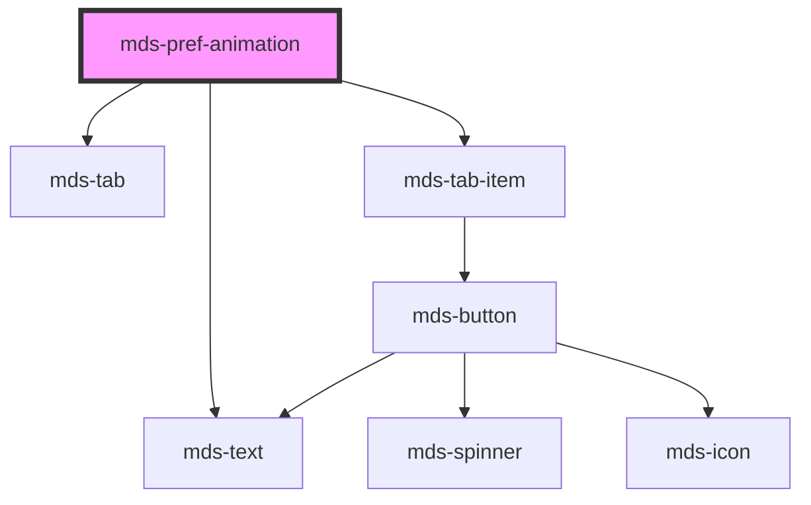

# mds-pref-animation


<!-- Auto Generated Below -->


## Usage

### 1. Description

The `<mds-pref-animation>` web component is a preference control that lets users choose how animations are presented (reduced, system-driven, or fully enabled). It is a compound child of [`<mds-pref>`](../../mds-pref) and renders a labelled three-option tab group rather than any native HTML primitive.

#### Semantic Behavior

- **Compound child constraint**: Must be placed as a direct default-slot child of `<mds-pref>`; it is not used standalone or mixed into other containers.
- **Tab-group selection**: Renders three options (reduce / system / no-preference); the active one is driven by the `mode` value, and clicking an option sets that mode.
- **Applies the preference globally**: Choosing a mode applies it across the whole document and persists the choice, so it is restored on later visits.
- **Initial mode resolution**: The effective mode is resolved in order from the `mode` prop, then the persisted value, then the `system` default.
- **Change event**: `mdsPrefChange` (detail `{ preference: 'animation' }`) fires on every selection; the parent `<mds-pref>` listens for this to coordinate cross-preference behavior such as the reload-required hint.

#### Properties & Visual Configurations

- **`mode`**: Sets which animation preference is active - `reduce` to suppress motion, `no-preference` to fully enable animations, or `system` to defer to the user's OS setting. Leave unset to fall back to the persisted or default (`system`) value.
- **`size`**: Sizes the nested tab items (`sm` or `md`). It is normally not set directly; the parent `<mds-pref>` propagates its own `size` down to every `mds-pref-*` child, so set it on the parent for a consistent group.


### 2. Pattern

Correct and idiomatic ways to use the `<mds-pref-animation>` component, ordered from most common to most specialized. Patterns assume a working knowledge of the conventions documented in [`docs/COMPONENTS.md`](../../../../../../docs/COMPONENTS.md) and the generic stencil rules in [`projects/stencil/SPEC.md`](../../../../SPEC.md).

#### Default Usage Inside `mds-pref`

The standard form. Place `<mds-pref-animation>` as a direct slot child of [`<mds-pref>`](../../mds-pref). No `mode` or `size` is required - the component restores the last persisted choice and defaults to `system` on a first visit.

```html
<mds-pref>
  <mds-pref-animation></mds-pref-animation>
</mds-pref>
```

#### Combined Preferences Panel

Place multiple `mds-pref-*` children inside the same `<mds-pref>`. The parent propagates `size` and coordinates the reload hint.

```html
<mds-pref>
  <mds-pref-animation></mds-pref-animation>
  <mds-pref-contrast></mds-pref-contrast>
  <mds-pref-theme></mds-pref-theme>
  <mds-pref-consumption></mds-pref-consumption>
</mds-pref>
```

#### Pre-selecting a Mode via `mode`

Pass `mode` to override the persisted value and start from a known state - for example, a first-run onboarding screen that starts with reduced motion.

```html
<mds-pref>
  <mds-pref-animation mode="reduce"></mds-pref-animation>
</mds-pref>
```

#### Listening for Changes

Handle `mdsPrefChange` when the host application needs to react - for example, to announce the new setting or trigger a soft refresh.

```html
<mds-pref id="prefs">
  <mds-pref-animation></mds-pref-animation>
</mds-pref>

<script>
  document.getElementById('prefs').addEventListener('mdsPrefChange', (event) => {
    // event.detail.preference === 'animation'
    console.log('Preferenza animazioni aggiornata', event.detail);
  });
</script>
```

#### Compact Size

Set `size="sm"` on the parent `<mds-pref>` to shrink the tab items of every `mds-pref-*` child consistently. Set `size` directly on `<mds-pref-animation>` only when the component appears outside the standard panel.

```html
<!-- Preferred: set once on the parent -->
<mds-pref size="sm">
  <mds-pref-animation></mds-pref-animation>
  <mds-pref-contrast></mds-pref-contrast>
</mds-pref>

<!-- Acceptable when used standalone -->
<mds-pref-animation size="sm"></mds-pref-animation>
```

#### Silent Controller (Hidden Preference Sync)

When a `<mds-pref controller>` element is placed in the DOM, it applies preferences silently without rendering any UI. `<mds-pref-animation>` inside it restores the persisted animation class on `<html>` on load without showing the tab group.

```html
<!-- Place once, near the root - no UI is rendered -->
<mds-pref controller>
  <mds-pref-animation></mds-pref-animation>
</mds-pref>
```


### 3. Antipattern

Common incorrect uses of `<mds-pref-animation>`. Each entry pairs the wrong form with the right one and a one-line reason. System-wide rules (boolean-as-string, shadow piercing, Tailwind color utilities, raw native event listening) live in [`docs/COMPONENTS.md`](../../../../../../docs/COMPONENTS.md#system-level-anti-patterns) - they apply here too but are not repeated.

#### Do Not Use the Component Outside `mds-pref`

`<mds-pref-animation>` is a compound child of [`<mds-pref>`](../../mds-pref). Without the parent, the `size` prop is not propagated and the parent's reload-hint coordination does not fire.

```html
<!-- 🚫 INCORRECT -->
<mds-pref-animation></mds-pref-animation>

<!-- ✅ CORRECT -->
<mds-pref>
  <mds-pref-animation></mds-pref-animation>
</mds-pref>
```

#### Do Not Turn Off with `mode="false"` or Remove the Attribute to Reset

`mode` is a string union (`reduce | system | no-preference`), not a boolean. Removing it or setting it to an arbitrary string does not disable the component - it silently falls back to `system`, which may differ from the user's intent.

```html
<!-- 🚫 INCORRECT - not a valid mode value -->
<mds-pref-animation mode="false"></mds-pref-animation>
<mds-pref-animation mode="none"></mds-pref-animation>

<!-- ✅ CORRECT - use an explicit valid mode -->
<mds-pref-animation mode="system"></mds-pref-animation>
```

#### Do Not Set `size` on Each Child Individually When Using the Panel

The parent `<mds-pref>` propagates `size` to all `mds-pref-*` children automatically when the `size` prop changes. Setting it on each child creates an inconsistent group if the parent's size ever changes.

```html
<!-- 🚫 INCORRECT - size set redundantly on each child -->
<mds-pref>
  <mds-pref-animation size="sm"></mds-pref-animation>
  <mds-pref-contrast size="sm"></mds-pref-contrast>
</mds-pref>

<!-- ✅ CORRECT - set once on the parent -->
<mds-pref size="sm">
  <mds-pref-animation></mds-pref-animation>
  <mds-pref-contrast></mds-pref-contrast>
</mds-pref>
```

#### Do Not Listen to Raw `change` Events

`<mds-pref-animation>` emits `mdsPrefChange`, not the native `change` event. The native event does not bubble out of the shadow DOM reliably.

```html
<!-- 🚫 INCORRECT -->
<mds-pref id="prefs">
  <mds-pref-animation></mds-pref-animation>
</mds-pref>

<script>
  document.getElementById('prefs').addEventListener('change', handler);
</script>

<!-- ✅ CORRECT -->
<script>
  document.getElementById('prefs').addEventListener('mdsPrefChange', handler);
</script>
```

#### Do Not Hand-Roll Animation Preference Handling on `<html>`

The component already applies `pref-animation-reduce`, `pref-animation-system`, or `pref-animation-no-preference` to `<html>` and persists the choice in `localStorage`. Duplicating this logic conflicts with the component's state and causes double-writes.

```css
/* 🚫 INCORRECT - duplicates the component's own logic */
html.custom-reduce-motion * {
  animation: none !important;
}
```

```html
<!-- ✅ CORRECT - rely on the class the component sets -->
<!-- The component sets pref-animation-reduce on <html>;
     target that class in your own CSS if needed -->
```

```css
/* Extend, do not replace */
html.pref-animation-reduce .my-widget {
  transition: none;
}
```


## Properties

| Property | Attribute | Description                                           | Type                                                   | Default     |
| -------- | --------- | ----------------------------------------------------- | ------------------------------------------------------ | ----------- |
| `mode`   | `mode`    | Specifies the preference mode                         | `"no-preference" \| "reduce" \| "system" \| undefined` | `undefined` |
| `size`   | `size`    | Sets the size of the component items nested inside it | `"md" \| "sm" \| undefined`                            | `undefined` |


## Events

| Event           | Description                           | Type                                    |
| --------------- | ------------------------------------- | --------------------------------------- |
| `mdsPrefChange` | Emits when the component is triggered | `CustomEvent<MdsPrefChangeEventDetail>` |


## Methods

### `updateLang() => Promise<void>`

Updates the component's texts to the locale currently set on the host element.

#### Returns

Type: `Promise<void>`


## Dependencies

### Depends on

- [mds-text](../mds-text)
- [mds-tab](../mds-tab)
- [mds-tab-item](../mds-tab-item)

### Graph


----------------------------------------------

Built with love @ [Gruppo Maggioli](https://www.maggioli.com) from [R&D Department](https://www.maggioli.com/it-it/chi-siamo/ricerca-sviluppo)
