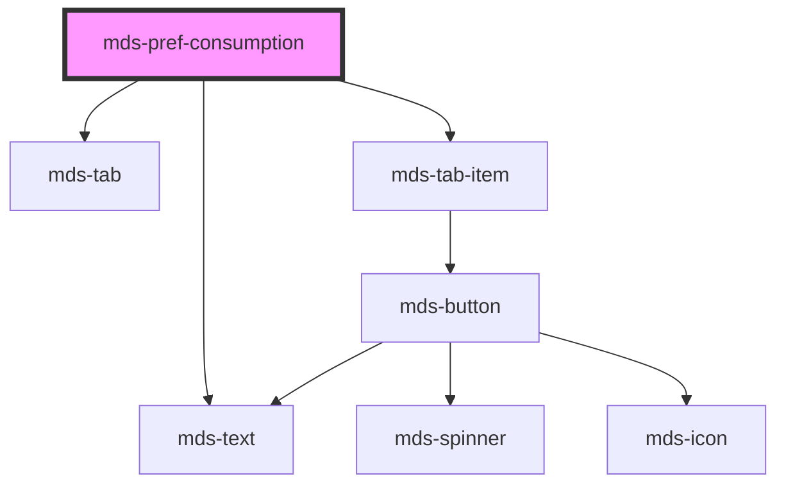

# mds-pref-consumption


<!-- Auto Generated Below -->


## Usage

### 1. Description

The `<mds-pref-consumption>` web component is a preference control of the Magma Design System that lets the user pick an energy-consumption mode (`low`, `medium`, `high`); it is a compound child of [`<mds-pref>`](../../mds-pref) and renders as a tab group with one option per mode, so it has no native HTML primitive equivalent.

#### Semantic Behavior

- **Compound child constraint**: Must be placed as a direct slot child of `<mds-pref>`, alongside the other `mds-pref-*` controls; it is not used standalone or mixed with unrelated child types.
- **Mode resolution on render**: The active mode is resolved in priority order - the `mode` prop, then the persisted value, then the `high` default - so the control restores the last user choice across reloads.
- **Applies the preference globally**: Selecting a mode applies it across the whole document and persists the choice.
- **Change event**: Each change emits `mdsPrefChange` with `{ preference: 'consumption' }`. Because `consumption` requires a reload to fully apply, the parent `<mds-pref>` surfaces its "reload required" notice.

#### Properties & Visual Configurations

- **`mode`**: The selected consumption preference (`low` / `medium` / `high`). Leave it unset to let the component restore the persisted value or fall back to `high`; set it explicitly only to force an initial mode.
- **`size`**: Sizes the nested tab items (`sm` / `md`). In normal use you do not set this directly - the parent `<mds-pref>` propagates its own `size` down to every `mds-pref-*` child, keeping the whole preference group visually consistent.


### 2. Pattern

Correct and idiomatic ways to use the `<mds-pref-consumption>` component, ordered from most common to most specialized. Patterns assume a working knowledge of the preference system documented in [`docs/COMPONENTS.md`](../../../../../../docs/COMPONENTS.md) and the generic stencil rules in [`projects/stencil/SPEC.md`](../../../../SPEC.md).

#### Default Use Inside `mds-pref`

The canonical form. Place `<mds-pref-consumption>` as a direct slot child of [`<mds-pref>`](../../mds-pref). Omit `mode` so the component restores the persisted user choice automatically; the parent propagates its own `size` down to every `mds-pref-*` child.

```html
<mds-pref>
  <mds-pref-consumption></mds-pref-consumption>
</mds-pref>
```

#### Forcing an Initial Mode

Set `mode` explicitly only when the application needs to override the persisted value - for example, when seeding preferences from a server-side profile. All three accepted values are `"low"`, `"medium"`, and `"high"`.

```html
<mds-pref>
  <mds-pref-consumption mode="low"></mds-pref-consumption>
</mds-pref>
```

#### Controlling Size

Use the `size` prop when you embed the control outside `<mds-pref>` and cannot rely on the parent to propagate a size. Accepted values are `"sm"` and `"md"`.

```html
<mds-pref-consumption size="sm"></mds-pref-consumption>
```

#### Reacting to Mode Changes

Listen for the `mdsPrefChange` event to detect when the user picks a new consumption level. The event detail always carries `{ preference: "consumption" }`.

```html
<mds-pref-consumption id="consumption-pref"></mds-pref-consumption>

<script>
  document
    .querySelector('#consumption-pref')
    .addEventListener('mdsPrefChange', (event) => {
      console.log('Preferenza consumo cambiata:', event.detail.preference);
    });
</script>
```

#### Reading the Active Mode After a Change

The `mode` prop is mutable and reflected as an attribute. After the user interacts, read the current value directly from the element's reflected attribute or prop.

```html
<mds-pref-consumption id="consumption-pref"></mds-pref-consumption>

<script>
  const pref = document.querySelector('#consumption-pref');
  pref.addEventListener('mdsPrefChange', () => {
    // mode is reflected - read it back from the element
    console.log('Modalita attiva:', pref.mode);
  });
</script>
```


### 3. Antipattern

Common incorrect uses of `<mds-pref-consumption>`. Each entry pairs the wrong form with the right one and a one-line reason. System-wide rules (boolean-as-string, shadow piercing, Tailwind color utilities, raw native event listening) live in [`docs/COMPONENTS.md`](../../../../../../docs/COMPONENTS.md#system-level-anti-patterns) - they apply here too but are not repeated.

#### Do Not Use Outside `mds-pref` Without Acknowledging the Side Effects

`<mds-pref-consumption>` applies its mode globally by adding a class to `<html>` and writing to `localStorage`, even when used standalone. Using it in an isolated context (a test harness, a settings widget separate from the preference panel) without a containing [`<mds-pref>`](../../mds-pref) still triggers the full document-level side effect - this is expected only inside a proper preferences flow.

```html
<!-- 🚫 INCORRECT - bare use in an arbitrary widget with no intent to change global doc state -->
<div class="settings-widget">
  <mds-pref-consumption></mds-pref-consumption>
</div>

<!-- ✅ CORRECT - wrap in mds-pref so the full preference flow is in place -->
<mds-pref>
  <mds-pref-consumption></mds-pref-consumption>
</mds-pref>
```

#### Do Not Pass an Invalid `mode` Value

`mode` is typed as `"low" | "medium" | "high"`. Passing any other string silently writes an unrecognised class to `<html>` and does not activate a valid consumption level.

```html
<!-- 🚫 INCORRECT -->
<mds-pref-consumption mode="auto"></mds-pref-consumption>
<mds-pref-consumption mode="none"></mds-pref-consumption>

<!-- ✅ CORRECT -->
<mds-pref-consumption mode="low"></mds-pref-consumption>
<mds-pref-consumption mode="medium"></mds-pref-consumption>
<mds-pref-consumption mode="high"></mds-pref-consumption>
```

#### Do Not Disable the Mode by Setting `mode="false"` or `mode=""`

The `mode` prop is not boolean. Setting it to an empty string or to the literal `"false"` does not clear or unset the preference - it corrupts the stored value. To defer mode resolution to the persisted value, leave the attribute absent entirely.

```html
<!-- 🚫 INCORRECT -->
<mds-pref-consumption mode="false"></mds-pref-consumption>
<mds-pref-consumption mode=""></mds-pref-consumption>

<!-- ✅ CORRECT - omit the attribute to restore the persisted value or fall back to "high" -->
<mds-pref-consumption></mds-pref-consumption>
```

#### Do Not Listen for Native `change` or `input` Events

`<mds-pref-consumption>` does not emit `change` or `input`. The documented event is `mdsPrefChange`. Native events do not bubble out of the shadow DOM as expected.

```html
<!-- 🚫 INCORRECT -->
<mds-pref-consumption id="pref"></mds-pref-consumption>
<script>
  document.querySelector('#pref').addEventListener('change', handler);
</script>

<!-- ✅ CORRECT -->
<mds-pref-consumption id="pref"></mds-pref-consumption>
<script>
  document.querySelector('#pref').addEventListener('mdsPrefChange', handler);
</script>
```

#### Do Not Override Size via CSS Width or Height

The `size` prop controls the dimensions of the nested tab items. Overriding them with inline styles or external CSS breaks the internal layout and visual consistency of the preference group.

```html
<!-- 🚫 INCORRECT -->
<mds-pref-consumption style="width: 300px;"></mds-pref-consumption>

<!-- ✅ CORRECT -->
<mds-pref-consumption size="sm"></mds-pref-consumption>
```


## Properties

| Property | Attribute | Description                                           | Type                                       | Default     |
| -------- | --------- | ----------------------------------------------------- | ------------------------------------------ | ----------- |
| `mode`   | `mode`    | Specifies the preference mode                         | `"high" \| "low" \| "medium" \| undefined` | `undefined` |
| `size`   | `size`    | Sets the size of the component items nested inside it | `"md" \| "sm" \| undefined`                | `undefined` |


## Events

| Event           | Description                           | Type                                    |
| --------------- | ------------------------------------- | --------------------------------------- |
| `mdsPrefChange` | Emits when the component is triggered | `CustomEvent<MdsPrefChangeEventDetail>` |


## Methods

### `updateLang() => Promise<void>`


#### Returns

Type: `Promise<void>`


## Dependencies

### Depends on

- [mds-text](../mds-text)
- [mds-tab](../mds-tab)
- [mds-tab-item](../mds-tab-item)

### Graph


----------------------------------------------

Built with love @ [Gruppo Maggioli](https://www.maggioli.com) from [R&D Department](https://www.maggioli.com/it-it/chi-siamo/ricerca-sviluppo)
