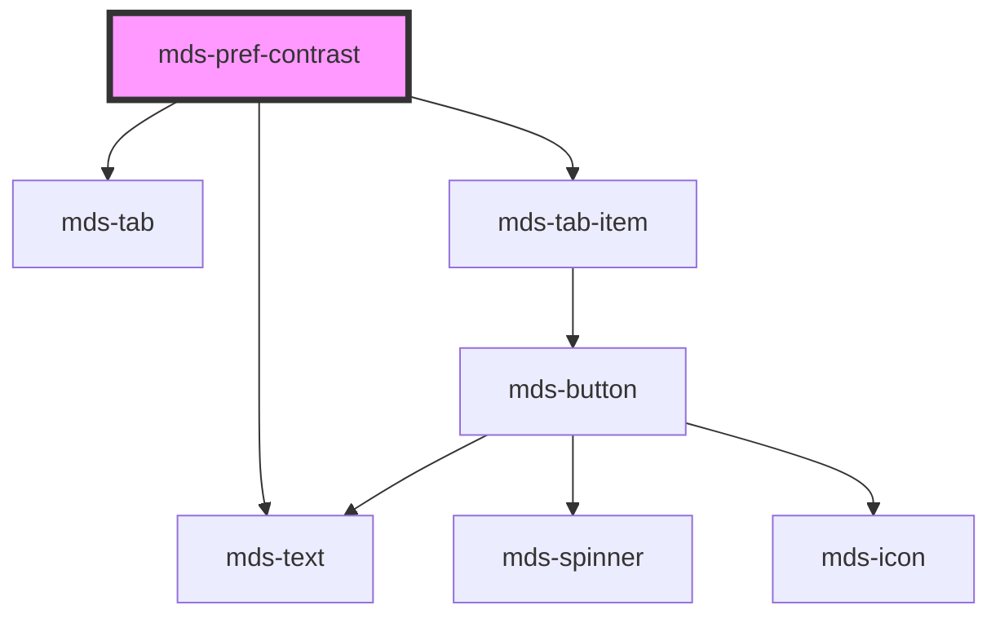

# mds-pref-contrast


<!-- Auto Generated Below -->


## Usage

### 1. Description

The `<mds-pref-contrast>` web component is a preference control that lets users switch the application's contrast mode (`more`, `system`, or `no-preference`). It is a compound child of the [`<mds-pref>`](../../mds-pref) panel and renders as a segmented tab of icon options rather than any single native HTML primitive.

#### Semantic Behavior

- **Compound child only**: It is designed to be placed as a direct slot child of `<mds-pref>` alongside the other preference children (`mds-pref-animation`, `mds-pref-consumption`, `mds-pref-language`, `mds-pref-theme`); it is not meant to be used standalone or mixed with unrelated element types.
- **Mode resolution on render**: The active mode is resolved in order from the `mode` prop, the persisted value, then the `system` default, and applied immediately - so it acts on the document even before any user interaction.
- **Applies the preference globally**: Selecting a mode applies it across the whole document and persists the choice.
- **System resolution**: When the host environment exposes a `prefers-contrast` media query, that value is consulted to map the OS-level preference onto the design system's contrast tokens.
- **Change event**: Every mode change emits `mdsPrefChange` with `{ preference: 'contrast' }`; `<mds-pref>` listens for this to coordinate cross-preference behavior such as the reload-required notice.

#### Properties & Visual Configurations

- **`mode`** - the active contrast preference. Leave it unset to let the component restore the last persisted choice or fall back to `system`; set it explicitly (`more`, `system`, `no-preference`) only when the host wants to force a contrast level. Pick `more` for high-contrast output, `no-preference` for the default theme, and `system` to defer to the OS `prefers-contrast` setting.
- **`size`** - sizes the nested tab items (`sm` / `md`). In practice this is propagated automatically by the parent `<mds-pref>`, which fans its own `size` down to every `mds-pref-*` child, so it rarely needs to be set directly on this component.

The component does not use the shared `variant` / `tone` ladders documented in [`projects/stencil/SPEC.md`](../../../../SPEC.md#tone-and-variant-system); its visual states are driven entirely by the resolved `mode`.


### 2. Pattern

Correct and idiomatic ways to use the `<mds-pref-contrast>` component, ordered from most common to most specialized. Patterns assume a working knowledge of the variant / tone ladders documented in [`docs/COMPONENTS.md`](../../../../../../docs/COMPONENTS.md) and the generic stencil rules in [`projects/stencil/SPEC.md`](../../../../SPEC.md).

#### Inside the Full Preferences Panel

The canonical form. Slot `<mds-pref-contrast>` directly inside [`<mds-pref>`](../../mds-pref) alongside the other preference controls. The parent panel propagates `size`, coordinates the reload notice, and handles cross-preference communication automatically.

```html
<mds-pref>
  <mds-pref-theme></mds-pref-theme>
  <mds-pref-contrast></mds-pref-contrast>
  <mds-pref-animation></mds-pref-animation>
  <mds-pref-consumption></mds-pref-consumption>
</mds-pref>
```

#### Accessibility-Only Panel

When an application exposes only accessibility controls, slot `<mds-pref-contrast>` together with [`<mds-pref-animation>`](../../mds-pref-animation) inside a minimal `<mds-pref>`. Omitted preference controls are simply absent - no extra configuration is required.

```html
<mds-pref>
  <mds-pref-contrast></mds-pref-contrast>
  <mds-pref-animation></mds-pref-animation>
</mds-pref>
```

#### Forcing a Contrast Level Programmatically

Set the `mode` prop explicitly when the host application needs to impose a contrast level regardless of the user's last persisted choice. Valid values are `more` (high contrast), `system` (defers to OS `prefers-contrast`), and `no-preference` (design-system default).

```html
<!-- Force high contrast for a section of the app that requires it -->
<mds-pref-contrast mode="more"></mds-pref-contrast>
```

#### Reacting to Contrast Changes

Listen for `mdsPrefChange` to act whenever the user switches the contrast mode. The event detail carries `{ preference: 'contrast' }` so a single handler can distinguish between the different preference controls.

```html
<mds-pref-contrast id="contrast-ctrl"></mds-pref-contrast>

<script>
  document
    .getElementById('contrast-ctrl')
    .addEventListener('mdsPrefChange', (event) => {
      if (event.detail.preference === 'contrast') {
        console.log('Preferenza contrasto aggiornata');
      }
    });
</script>
```

#### Controlling Size

Use the `size` prop when rendering `<mds-pref-contrast>` outside `<mds-pref>` and a specific tab-item size is required. Inside `<mds-pref>`, the parent propagates its own `size` automatically - setting it on this child is unnecessary.

```html
<!-- Compact size for a toolbar or narrow panel -->
<mds-pref-contrast size="sm"></mds-pref-contrast>

<!-- Default (medium) size - equivalent to omitting the prop -->
<mds-pref-contrast size="md"></mds-pref-contrast>
```

#### Restoring the Last Persisted Choice on Page Load

Leave `mode` unset. On every render the component reads `localStorage` for the key `mdsPrefContrast` set during a previous session, falls back to `system` when nothing is stored, and applies the resolved class to `<html>` immediately - no application bootstrap code is needed.

```html
<!-- mode is intentionally absent: the component self-restores -->
<mds-pref-contrast></mds-pref-contrast>
```


### 3. Antipattern

Common incorrect uses of `<mds-pref-contrast>`. Each entry pairs the wrong form with the right one and a one-line reason. System-wide rules (boolean-as-string, shadow piercing, Tailwind color utilities, raw native event listening) live in [`docs/COMPONENTS.md`](../../../../../../docs/COMPONENTS.md#system-level-anti-patterns) - they apply here too but are not repeated.

#### Do Not Use Outside Its Parent `<mds-pref>`

`<mds-pref-contrast>` is a compound child designed for direct slot placement inside [`<mds-pref>`](../../mds-pref). Using it standalone in page content bypasses the parent's coordination logic (size propagation, reload notice, cross-preference sequencing).

```html
<!-- 🚫 INCORRECT -->
<div class="settings-section">
  <mds-pref-contrast></mds-pref-contrast>
</div>

<!-- ✅ CORRECT -->
<mds-pref>
  <mds-pref-contrast></mds-pref-contrast>
</mds-pref>
```

#### Do Not Set `size` Directly When Inside `<mds-pref>`

The parent `<mds-pref>` fans its `size` prop down to every `mds-pref-*` child automatically. Overriding `size` on the child creates a mismatch between sibling controls.

```html
<!-- 🚫 INCORRECT -->
<mds-pref size="md">
  <mds-pref-contrast size="sm"></mds-pref-contrast>
  <mds-pref-animation></mds-pref-animation>
</mds-pref>

<!-- ✅ CORRECT -->
<mds-pref size="sm">
  <mds-pref-contrast></mds-pref-contrast>
  <mds-pref-animation></mds-pref-animation>
</mds-pref>
```

#### Do Not Pass an Invalid `mode` Value

`mode` accepts only `"more"`, `"system"`, or `"no-preference"`. Passing any other string (e.g. a legacy name or a boolean) silently fails to match any contrast entry and can throw a runtime error when the component tries to apply the CSS class.

```html
<!-- 🚫 INCORRECT (not a valid ContrastModeType) -->
<mds-pref-contrast mode="high"></mds-pref-contrast>
<mds-pref-contrast mode="true"></mds-pref-contrast>

<!-- ✅ CORRECT -->
<mds-pref-contrast mode="more"></mds-pref-contrast>
```

#### Do Not Listen for the Native `change` Event

The component emits the documented `mdsPrefChange` event; there is no native `change` event bubbling out of the shadow DOM. Listening for `change` on the host element will never fire.

```html
<!-- 🚫 INCORRECT -->
<mds-pref-contrast id="cp"></mds-pref-contrast>
<script>
  document.getElementById('cp').addEventListener('change', handler);
</script>

<!-- ✅ CORRECT -->
<mds-pref-contrast id="cp"></mds-pref-contrast>
<script>
  document.getElementById('cp').addEventListener('mdsPrefChange', handler);
</script>
```

#### Do Not Write `@media (prefers-contrast: more)` Overrides in App Code

The design system manages high-contrast tokens automatically through the `pref-contrast-more` class applied to `<html>` by `<mds-pref-contrast>`. Hand-rolling media query overrides duplicates that logic and breaks when the user picks `system` (OS-driven) vs. `more` (explicit choice), because the two code paths diverge.

```css
/* 🚫 INCORRECT */
@media (prefers-contrast: more) {
  .my-card {
    border: 2px solid black;
  }
}

/* ✅ CORRECT - target the class the component applies */
:root.pref-contrast-more .my-card,
:root.pref-contrast-system .my-card {
  border: 2px solid black;
}
```

#### Do Not Set `mode="false"` to Reset the Preference

Boolean idioms do not apply here. `mode` is a string union - setting it to `"false"` is not a valid value and will not clear the preference. Remove the `mode` attribute entirely (or set the prop to `undefined`) to let the component fall back to the last persisted value.

```html
<!-- 🚫 INCORRECT -->
<mds-pref-contrast mode="false"></mds-pref-contrast>

<!-- ✅ CORRECT (omit mode or unset it programmatically) -->
<mds-pref-contrast></mds-pref-contrast>
```


## Properties

| Property | Attribute | Description                                           | Type                                                 | Default     |
| -------- | --------- | ----------------------------------------------------- | ---------------------------------------------------- | ----------- |
| `mode`   | `mode`    | Specifies the preference mode                         | `"more" \| "no-preference" \| "system" \| undefined` | `undefined` |
| `size`   | `size`    | Sets the size of the component items nested inside it | `"md" \| "sm" \| undefined`                          | `undefined` |


## Events

| Event           | Description                           | Type                                    |
| --------------- | ------------------------------------- | --------------------------------------- |
| `mdsPrefChange` | Emits when the component is triggered | `CustomEvent<MdsPrefChangeEventDetail>` |


## Methods

### `updateLang() => Promise<void>`

Updates the component's texts to the locale currently set on the host element.

#### Returns

Type: `Promise<void>`


## Dependencies

### Depends on

- [mds-text](../mds-text)
- [mds-tab](../mds-tab)
- [mds-tab-item](../mds-tab-item)

### Graph


----------------------------------------------

Built with love @ [Gruppo Maggioli](https://www.maggioli.com) from [R&D Department](https://www.maggioli.com/it-it/chi-siamo/ricerca-sviluppo)
