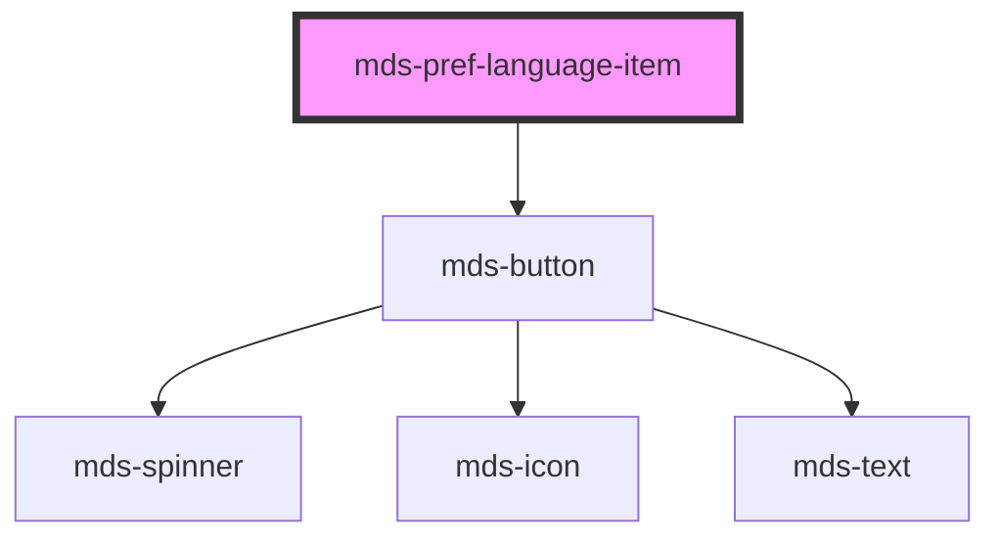

# mds-pref-language-item


<!-- Auto Generated Below -->


## Usage

### 1. Description

The `<mds-pref-language-item>` web component represents a single selectable language option inside the language-preference picker [`<mds-pref-language>`](../../mds-pref-language). It renders one row of the parent's dropdown and reports the user's choice up to the parent rather than changing the page language itself.

#### Semantic Behavior

- **Compound child only**: Must be placed as a direct default-slot child of `<mds-pref-language>`; it is not used standalone or mixed with other child types.
- **Code validation**: `code` must match an entry in the bundled language dictionary; an unknown `code` throws `Language code not found: <code>`. When `code` is empty the item renders an error-toned fallback button instead of a language label.
- **Label is derived, not authored**: The visible language name is looked up from `code` (e.g. `it` to `Italiano`), so consumers supply only the code, not the display text.
- **Selection is parent-driven**: The `selected` prop is owned and toggled by `<mds-pref-language>`, which clears every sibling and sets only the active item.
- **Click emits, does not commit**: Clicking the item emits the bubbling `mdsPrefLanguageItemSelect` event carrying `{ language: code }`. The parent updates selection state, persists the preference, applies the document language, and emits its own `mdsPrefLanguageChange` - this child performs none of that.

#### Properties & Visual Configurations

The only meaningful prop is `code`: the BCP 47 / RFC 5646 language tag (such as `it`, `en`, `es`) that both keys the label lookup and is the payload emitted on selection. The set of accepted codes is defined by the bundled dictionary in `meta/locale.json`.

`selected` is a state flag managed by the parent rather than a configuration choice. Sizing and styling are fixed by the parent's layout, so this item exposes no `variant` / `tone` of its own; the shared ladders in [`projects/stencil/SPEC.md`](../../../../SPEC.md#tone-and-variant-system) are applied internally and are not configurable from the host.


### 2. Pattern

Correct and idiomatic ways to use the `<mds-pref-language-item>` component, ordered from most common to most specialized. Patterns assume a working knowledge of compound-component rules documented in [`docs/COMPONENTS.md`](../../../../../../docs/COMPONENTS.md) and the generic stencil rules in [`projects/stencil/SPEC.md`](../../../../SPEC.md).

#### Basic Language List Inside the Parent

The canonical form. Place one `<mds-pref-language-item>` per supported language as a direct child of [`<mds-pref-language>`](../../mds-pref-language). Set `code` to a BCP 47 tag that exists in the bundled dictionary; the component resolves the display name automatically.

```html
<mds-pref-language>
  <mds-pref-language-item code="it"></mds-pref-language-item>
  <mds-pref-language-item code="en"></mds-pref-language-item>
  <mds-pref-language-item code="fr"></mds-pref-language-item>
</mds-pref-language>
```

#### Pre-selecting the Active Language

The `selected` prop is normally managed by the parent, but you can set it declaratively when you know the initial active language at render time. The parent will take over selection management after the first user interaction.

```html
<mds-pref-language set="it">
  <mds-pref-language-item code="it" selected></mds-pref-language-item>
  <mds-pref-language-item code="en"></mds-pref-language-item>
  <mds-pref-language-item code="de"></mds-pref-language-item>
</mds-pref-language>
```

#### Listening for a Language Selection

The item emits `mdsPrefLanguageItemSelect` with `{ language: code }` when clicked. In most cases you should listen on the parent (`mdsPrefLanguageChange`) rather than on individual items - but listening on the item directly is valid when you need fine-grained control.

```html
<mds-pref-language>
  <mds-pref-language-item code="it" id="lang-it"></mds-pref-language-item>
  <mds-pref-language-item code="en" id="lang-en"></mds-pref-language-item>
</mds-pref-language>

<script>
  document.querySelectorAll('mds-pref-language-item').forEach((item) => {
    item.addEventListener('mdsPrefLanguageItemSelect', (e) => {
      console.log('Lingua scelta:', e.detail.language);
    });
  });
</script>
```

#### Offering a Large Language Set

Add as many items as needed - the parent wraps them in a scrollable dropdown. Each item only needs a `code`; the visible label is derived automatically.

```html
<mds-pref-language>
  <mds-pref-language-item code="it"></mds-pref-language-item>
  <mds-pref-language-item code="en"></mds-pref-language-item>
  <mds-pref-language-item code="es"></mds-pref-language-item>
  <mds-pref-language-item code="fr"></mds-pref-language-item>
  <mds-pref-language-item code="de"></mds-pref-language-item>
  <mds-pref-language-item code="pt"></mds-pref-language-item>
  <mds-pref-language-item code="zh"></mds-pref-language-item>
  <mds-pref-language-item code="ar"></mds-pref-language-item>
</mds-pref-language>
```

#### Inside a Full Preferences Panel

`<mds-pref-language>` and its items compose inside [`<mds-pref>`](../../mds-pref) alongside the other preference controls. Place them as direct children of `<mds-pref>`.

```html
<mds-pref>
  <mds-pref-theme></mds-pref-theme>
  <mds-pref-contrast></mds-pref-contrast>
  <mds-pref-language>
    <mds-pref-language-item code="it"></mds-pref-language-item>
    <mds-pref-language-item code="en"></mds-pref-language-item>
  </mds-pref-language>
</mds-pref>
```


### 3. Antipattern

Common incorrect uses of `<mds-pref-language-item>`. Each entry pairs the wrong form with the right one and a one-line reason. System-wide rules (boolean-as-string, shadow piercing, Tailwind color utilities, raw native event listening) live in [`docs/COMPONENTS.md`](../../../../../../docs/COMPONENTS.md#system-level-anti-patterns) - they apply here too but are not repeated.

#### Do Not Use the Item Outside Its Parent

`<mds-pref-language-item>` is a compound child and relies on `<mds-pref-language>` for selection management, dropdown layout, and language persistence. Using it standalone leaves the click handler dangling and the selection state unmanaged.

```html
<!-- 🚫 INCORRECT -->
<mds-pref-language-item code="it"></mds-pref-language-item>

<!-- ✅ CORRECT -->
<mds-pref-language>
  <mds-pref-language-item code="it"></mds-pref-language-item>
</mds-pref-language>
```

#### Do Not Set the Display Label Manually

The item derives its label from the `code` prop via the bundled dictionary. Attempting to pass display text in the default slot or as an attribute is not supported and will be ignored by the render function.

```html
<!-- 🚫 INCORRECT -->
<mds-pref-language-item code="it">Italiano</mds-pref-language-item>

<!-- ✅ CORRECT -->
<mds-pref-language-item code="it"></mds-pref-language-item>
```

#### Do Not Use an Undocumented or Misspelled Language Code

`code` must exactly match a key in the bundled dictionary (e.g. `"it"`, `"en"`, `"fr"`). An unknown code throws `Language code not found: <code>` at render time. Use the two-letter BCP 47 tag, not a locale variant like `"it-IT"`.

```html
<!-- 🚫 INCORRECT -->
<mds-pref-language-item code="it-IT"></mds-pref-language-item>
<mds-pref-language-item code="italian"></mds-pref-language-item>

<!-- ✅ CORRECT -->
<mds-pref-language-item code="it"></mds-pref-language-item>
```

#### Do Not Manage the `selected` Prop by Hand Across Items

The parent clears every sibling and marks only the active item. If you toggle `selected` yourself on multiple items, the visual state will desync from the stored preference after the first user interaction.

```html
<!-- 🚫 INCORRECT -->
<mds-pref-language>
  <mds-pref-language-item code="it" selected></mds-pref-language-item>
  <mds-pref-language-item code="en" selected></mds-pref-language-item>
</mds-pref-language>

<!-- ✅ CORRECT -->
<mds-pref-language set="it">
  <mds-pref-language-item code="it"></mds-pref-language-item>
  <mds-pref-language-item code="en"></mds-pref-language-item>
</mds-pref-language>
```

#### Do Not Listen for Native `click` to Detect Language Selection

The component emits `mdsPrefLanguageItemSelect` (or the parent emits `mdsPrefLanguageChange`). Native `click` may not propagate reliably out of shadow DOM and skips the event payload that carries the selected language code.

```html
<!-- 🚫 INCORRECT -->
<script>
  document.querySelector('mds-pref-language-item').addEventListener('click', () => {
    // no language code available here
  });
</script>

<!-- ✅ CORRECT -->
<script>
  document.querySelector('mds-pref-language').addEventListener('mdsPrefLanguageChange', (e) => {
    console.log('Lingua selezionata:', e.detail.language);
  });
</script>
```

#### Do Not Set `selected="false"` to Deselect

`selected` is a boolean attribute. The string `"false"` is truthy in HTML and will keep the item visually selected. Remove the attribute or set the prop to `undefined` to deselect programmatically.

```html
<!-- 🚫 INCORRECT -->
<mds-pref-language-item code="it" selected="false"></mds-pref-language-item>

<!-- ✅ CORRECT -->
<mds-pref-language-item code="it"></mds-pref-language-item>
```


## Properties

| Property   | Attribute  | Description                                                | Type                   | Default     |
| ---------- | ---------- | ---------------------------------------------------------- | ---------------------- | ----------- |
| `code`     | `code`     | Specifies the language code based on HTML `lang` attribute | `string`               | `undefined` |
| `selected` | `selected` | Specifies if the element is selected                       | `boolean \| undefined` | `false`     |


## Events

| Event                       | Description                                   | Type                                      |
| --------------------------- | --------------------------------------------- | ----------------------------------------- |
| `mdsPrefLanguageItemSelect` | Emits when the component trigger the language | `CustomEvent<MdsPrefLanguageEventDetail>` |


## Methods

### `updateLang() => Promise<void>`

Updates the component's texts to the locale currently set on the host element.

#### Returns

Type: `Promise<void>`


## Dependencies

### Depends on

- [mds-button](../mds-button)

### Graph


----------------------------------------------

Built with love @ [Gruppo Maggioli](https://www.maggioli.com) from [R&D Department](https://www.maggioli.com/it-it/chi-siamo/ricerca-sviluppo)
