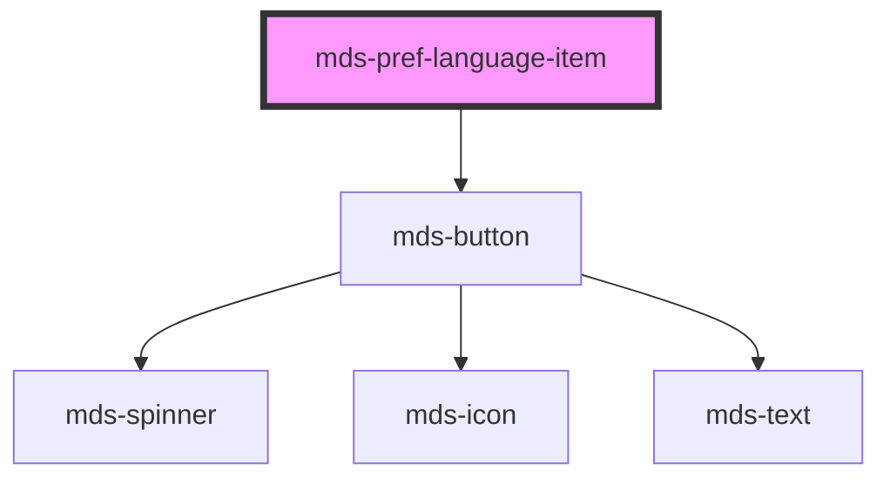

# mds-pref-language-item

<!-- Auto Generated Below -->

## Properties

| Property   | Attribute  | Description                          | Type                                                                                                                        | Default     |
| ---------- | ---------- | ------------------------------------ | --------------------------------------------------------------------------------------------------------------------------- | ----------- |
| `code`     | `code`     | Specifies the language code          | ``${Lowercase<string>}${Lowercase<string>}${Lowercase<string>}` \| `${Lowercase<string>}${Lowercase<string>}` \| undefined` | `undefined` |
| `selected` | `selected` | Specifies if the element is selected | `boolean \| undefined`                                                                                                      | `false`     |

## Events

| Event                       | Description                                   | Type                                         |
| --------------------------- | --------------------------------------------- | -------------------------------------------- |
| `mdsPrefLanguageItemSelect` | Emits when the component trigger the language | `CustomEvent<MdsPrefLanguageNavEventDetail>` |

## Dependencies

### Depends on

- [mds-button](../mds-button)

### Graph

----------------------------------------------

Built with love @ [Gruppo Maggioli](https://www.maggioli.com) from [R&D Department](https://www.maggioli.com/it-it/chi-siamo/ricerca-sviluppo)
