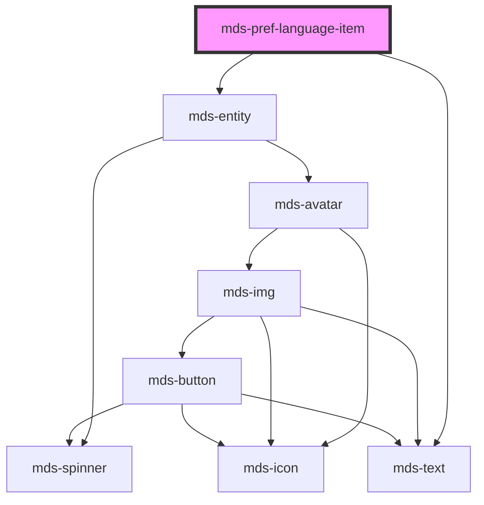

# mds-pref-language-item

<!-- Auto Generated Below -->

## Properties

| Property | Attribute | Description | Type                                                                                                                        | Default     |
| -------- | --------- | ----------- | --------------------------------------------------------------------------------------------------------------------------- | ----------- |
| `code`   | `code`    |             | ``${Lowercase<string>}${Lowercase<string>}${Lowercase<string>}` \| `${Lowercase<string>}${Lowercase<string>}` \| undefined` | `undefined` |

## Dependencies

### Depends on

- [mds-entity](../mds-entity)
- [mds-text](../mds-text)

### Graph

----------------------------------------------

Built with love @ [Gruppo Maggioli](https://www.maggioli.com) from [R&D Department](https://www.maggioli.com/it-it/chi-siamo/ricerca-sviluppo)
