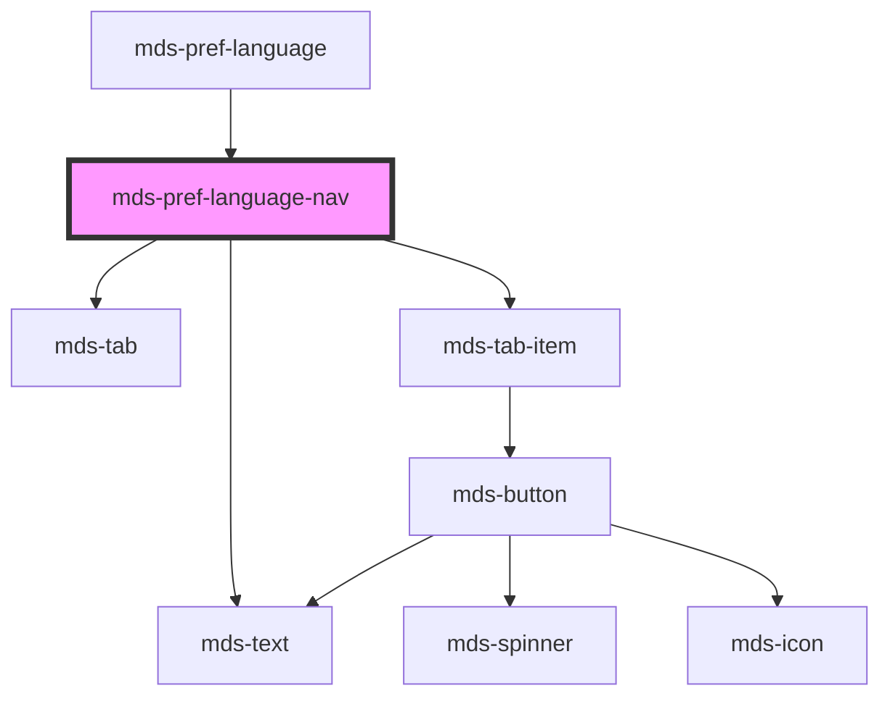

# mds-pref-language-nav

<!-- Auto Generated Below -->

## Properties

| Property | Attribute | Description                                                | Type                                                                                                                        | Default     |
| -------- | --------- | ---------------------------------------------------------- | --------------------------------------------------------------------------------------------------------------------------- | ----------- |
| `active` | `active`  | Specifies if the element is active or not                  | `boolean`                                                                                                                   | `false`     |
| `set`    | `set`     | Specifies the language code based on HTML `lang` attribute | ``${Lowercase<string>}${Lowercase<string>}${Lowercase<string>}` \| `${Lowercase<string>}${Lowercase<string>}` \| undefined` | `undefined` |

## Events

| Event                      | Description                                                     | Type                                      |
| -------------------------- | --------------------------------------------------------------- | ----------------------------------------- |
| `mdsPrefLanguageNavSelect` | Emits when the component trigger the language selector dropdown | `CustomEvent<MdsPrefLanguageEventDetail>` |

## Dependencies

### Used by

 - [mds-pref-language](../mds-pref-language)

### Depends on

- [mds-text](../mds-text)
- [mds-tab](../mds-tab)
- [mds-tab-item](../mds-tab-item)

### Graph

----------------------------------------------

Built with love @ [Gruppo Maggioli](https://www.maggioli.com) from [R&D Department](https://www.maggioli.com/it-it/chi-siamo/ricerca-sviluppo)
