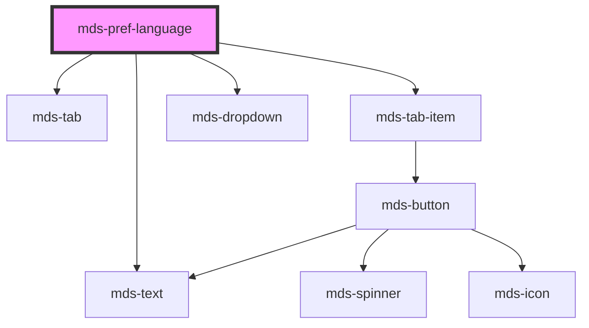

# mds-pref-language


<!-- Auto Generated Below -->


## Usage

### 1. Description

The `<mds-pref-language>` web component is the language-preference control of the Magma Design System, designed to be slotted inside [`<mds-pref>`](../../mds-pref) alongside the other preference children. It renders a labelled tab trigger that opens a dropdown of `<mds-pref-language-item>` entries, letting users switch the active document language and persisting that choice.

#### Semantic Behavior

- **Compound child constraint**: Must be placed as a direct slot child of `<mds-pref>`. In turn it acts as the host for its own `<mds-pref-language-item>` children, supplied via its default slot.
- **Default slot hosts the items**: The default slot accepts one or more `<mds-pref-language-item>` elements; the item whose `code` matches `set` is marked selected.
- **Selection orchestration**: Selecting an item clears the others, closes the dropdown, and resolves the new language - the children report up to this component, which centralizes the single-selection state.
- **Language resolution & persistence**: When `set` is `auto` the active language is resolved in priority order from the persisted value, then the `<html lang>` attribute, then `navigator.language`. The resolved value is persisted and applied to the document, and locale-aware strings on the page are refreshed.
- **Events bubbled to the parent**: Emits `mdsPrefLanguageChange` (detail carries the selected `language` code) and `mdsPrefChange` (detail `{ preference: 'language' }`). The latter is consumed by `<mds-pref>` to show its "reload required" notice, since language is a reload-sensitive preference.
- **Invalid codes throw**: A `set` value that is neither `auto` nor a valid `xx` / `xx-XX` BCP 47 short form raises an error rather than failing silently.
- **Default-language hint**: When the resolved language differs from the built-in default (`en`), a caption noting the default language is rendered.

#### Properties & Visual Configurations

- **`set`**: The desired language as a BCP 47 short tag (e.g. `it`, `en`, `es-ES`); the special value `auto` (default) defers to the persisted/page/system resolution chain described above. Region subtags are sanitized down to the two-letter language. Set an explicit value only to force a starting language regardless of the user's environment. Supported display languages are Italiano, English, Español and ελληνικά.
- **`size`**: Sizes the nested tab trigger (`sm` / `md`). Prefer setting `size` on the parent `<mds-pref>` so the whole preference group stays visually consistent; set it here only when this child must deviate.


### 2. Pattern

Correct and idiomatic ways to use the `<mds-pref-language>` component, ordered from most common to most specialized. Patterns assume a working knowledge of the variant / tone ladders documented in [`docs/COMPONENTS.md`](../../../../../../docs/COMPONENTS.md) and the generic stencil rules in [`projects/stencil/SPEC.md`](../../../../SPEC.md).

#### Basic Language Selector Inside `mds-pref`

The canonical usage. Nest `<mds-pref-language>` as a direct child of [`<mds-pref>`](../../mds-pref) and populate its default slot with one [`<mds-pref-language-item>`](../../mds-pref-language-item) per supported locale. The `code` attribute on each item must be a valid BCP 47 short tag.

```html
<mds-pref>
  <mds-pref-language>
    <mds-pref-language-item code="it"></mds-pref-language-item>
    <mds-pref-language-item code="en"></mds-pref-language-item>
    <mds-pref-language-item code="el"></mds-pref-language-item>
  </mds-pref-language>
</mds-pref>
```

#### Forcing a Starting Language with `set`

Pass an explicit BCP 47 tag to `set` to override the automatic resolution chain. Use this when the application dictates an initial language regardless of the user's browser setting or persisted preference.

```html
<mds-pref>
  <mds-pref-language set="it">
    <mds-pref-language-item code="it"></mds-pref-language-item>
    <mds-pref-language-item code="en"></mds-pref-language-item>
    <mds-pref-language-item code="es"></mds-pref-language-item>
  </mds-pref-language>
</mds-pref>
```

#### Automatic Language Resolution (default)

Omit `set` (or pass `set="auto"`) to let the component resolve the active language in priority order: persisted user choice, then the page `<html lang>` attribute, then `navigator.language`. This is the right choice for most applications.

```html
<mds-pref>
  <mds-pref-language>
    <mds-pref-language-item code="it"></mds-pref-language-item>
    <mds-pref-language-item code="en"></mds-pref-language-item>
  </mds-pref-language>
</mds-pref>
```

#### Sizing via `size`

Use the `size` prop when this control must differ from the rest of the preference group. Prefer setting `size` on the parent [`<mds-pref>`](../../mds-pref) so all preference children stay visually consistent; set it here only when this child must deviate.

```html
<!-- Preferred: size set once on the parent -->
<mds-pref size="sm">
  <mds-pref-language>
    <mds-pref-language-item code="it"></mds-pref-language-item>
    <mds-pref-language-item code="en"></mds-pref-language-item>
  </mds-pref-language>
</mds-pref>

<!-- Acceptable: size set directly on the language control when it must deviate -->
<mds-pref>
  <mds-pref-language size="sm">
    <mds-pref-language-item code="it"></mds-pref-language-item>
    <mds-pref-language-item code="en"></mds-pref-language-item>
  </mds-pref-language>
</mds-pref>
```

#### Listening for Language Changes

Listen to `mdsPrefLanguageChange` to react when the user picks a new language (for example, to reload the page or re-fetch translated content). The event detail carries the selected `language` code string.

```html
<mds-pref>
  <mds-pref-language id="lang-selector">
    <mds-pref-language-item code="it"></mds-pref-language-item>
    <mds-pref-language-item code="en"></mds-pref-language-item>
  </mds-pref-language>
</mds-pref>

<script>
  document.querySelector('#lang-selector').addEventListener('mdsPrefLanguageChange', (e) => {
    console.log('Nuova lingua selezionata:', e.detail.language);
    // e.g. reload the page to apply the new locale
    window.location.reload();
  });
</script>
```

#### Full Preference Panel with Language

`<mds-pref-language>` is one of several preference children accepted by [`<mds-pref>`](../../mds-pref). Compose it alongside the other controls to offer a complete preferences UI.

```html
<mds-pref>
  <mds-pref-theme></mds-pref-theme>
  <mds-pref-contrast></mds-pref-contrast>
  <mds-pref-animation></mds-pref-animation>
  <mds-pref-consumption></mds-pref-consumption>
  <mds-pref-language>
    <mds-pref-language-item code="it"></mds-pref-language-item>
    <mds-pref-language-item code="en"></mds-pref-language-item>
    <mds-pref-language-item code="es"></mds-pref-language-item>
    <mds-pref-language-item code="el"></mds-pref-language-item>
  </mds-pref-language>
</mds-pref>
```


### 3. Antipattern

Common incorrect uses of `<mds-pref-language>`. Each entry pairs the wrong form with the right one and a one-line reason. System-wide rules (boolean-as-string, shadow piercing, Tailwind color utilities, raw native event listening) live in [`docs/COMPONENTS.md`](../../../../../../docs/COMPONENTS.md#system-level-anti-patterns) - they apply here too but are not repeated.

#### Do Not Use Outside `mds-pref`

`<mds-pref-language>` is a compound child designed to live inside [`<mds-pref>`](../../mds-pref). Using it as a standalone widget breaks parent-child communication and prevents the reload-required notice from appearing.

```html
<!-- 🚫 INCORRECT -->
<mds-pref-language>
  <mds-pref-language-item code="it"></mds-pref-language-item>
  <mds-pref-language-item code="en"></mds-pref-language-item>
</mds-pref-language>

<!-- ✅ CORRECT -->
<mds-pref>
  <mds-pref-language>
    <mds-pref-language-item code="it"></mds-pref-language-item>
    <mds-pref-language-item code="en"></mds-pref-language-item>
  </mds-pref-language>
</mds-pref>
```

#### Do Not Slot Arbitrary HTML Instead of `mds-pref-language-item`

The default slot accepts only `<mds-pref-language-item>` elements. Slotting raw `<button>`, `<li>`, or other elements bypasses the selection orchestration and event wiring the parent depends on.

```html
<!-- 🚫 INCORRECT -->
<mds-pref>
  <mds-pref-language>
    <button>Italiano</button>
    <button>English</button>
  </mds-pref-language>
</mds-pref>

<!-- ✅ CORRECT -->
<mds-pref>
  <mds-pref-language>
    <mds-pref-language-item code="it"></mds-pref-language-item>
    <mds-pref-language-item code="en"></mds-pref-language-item>
  </mds-pref-language>
</mds-pref>
```

#### Do Not Pass an Unrecognized Language Code to `set`

The `set` prop must be either `"auto"` or a valid two-letter BCP 47 tag (`xx` or `xx-XX`). Any other value - including full locale strings like `"italiano"`, ISO 639-2 three-letter codes, or malformed strings - throws an error at runtime.

```html
<!-- 🚫 INCORRECT -->
<mds-pref-language set="italiano">...</mds-pref-language>
<mds-pref-language set="en_US">...</mds-pref-language>

<!-- ✅ CORRECT -->
<mds-pref-language set="it">...</mds-pref-language>
<mds-pref-language set="en">...</mds-pref-language>
<mds-pref-language set="es-ES">...</mds-pref-language>
```

#### Do Not Set `selected` Manually on `mds-pref-language-item`

The parent `<mds-pref-language>` manages the `selected` state of each item automatically based on the active language. Setting `selected` by hand causes a mismatch between the visual selection and the internal state, and will be overwritten on the next render cycle.

```html
<!-- 🚫 INCORRECT -->
<mds-pref>
  <mds-pref-language set="it">
    <mds-pref-language-item code="it" selected></mds-pref-language-item>
    <mds-pref-language-item code="en"></mds-pref-language-item>
  </mds-pref-language>
</mds-pref>

<!-- ✅ CORRECT - the parent derives selection from `set` -->
<mds-pref>
  <mds-pref-language set="it">
    <mds-pref-language-item code="it"></mds-pref-language-item>
    <mds-pref-language-item code="en"></mds-pref-language-item>
  </mds-pref-language>
</mds-pref>
```

#### Do Not Listen to `mdsPrefLanguageItemSelect` Instead of `mdsPrefLanguageChange`

`mdsPrefLanguageItemSelect` is the internal event emitted by `<mds-pref-language-item>` and consumed by its parent. Application code should listen to `mdsPrefLanguageChange` on `<mds-pref-language>`, which fires only after the selection has been committed and the language has been applied.

```html
<!-- 🚫 INCORRECT -->
<script>
  document.querySelector('mds-pref-language-item').addEventListener('mdsPrefLanguageItemSelect', (e) => {
    console.log(e.detail.language);
  });
</script>

<!-- ✅ CORRECT -->
<script>
  document.querySelector('mds-pref-language').addEventListener('mdsPrefLanguageChange', (e) => {
    console.log(e.detail.language);
  });
</script>
```

#### Do Not Set Size via CSS Instead of the `size` Prop

The `size` prop is the only supported way to resize the internal tab trigger. Overriding dimensions with inline styles or CSS custom properties not listed in the component's documented surface couples your code to internal implementation details.

```css
/* 🚫 INCORRECT */
mds-pref-language mds-tab-item {
  font-size: 10px;
}
```

```html
<!-- ✅ CORRECT -->
<mds-pref size="sm">
  <mds-pref-language>
    <mds-pref-language-item code="it"></mds-pref-language-item>
    <mds-pref-language-item code="en"></mds-pref-language-item>
  </mds-pref-language>
</mds-pref>
```


## Properties

| Property | Attribute | Description                                                                                                                                                                                                                                                                                                                                                                                       | Type                        | Default     |
| -------- | --------- | ------------------------------------------------------------------------------------------------------------------------------------------------------------------------------------------------------------------------------------------------------------------------------------------------------------------------------------------------------------------------------------------------- | --------------------------- | ----------- |
| `set`    | `set`     | Specifies the language code based on HTML `lang` attribute  A string representing the language version as defined in {@link https://datatracker.ietf.org/doc/html/rfc5646 RFC 5646: Tags for Identifying Languages (also known as BCP 47)}.  `Examples of valid language codes include "en", "en-US", "fr", "fr-FR", "es-ES", etc.`  Supported languages are Italiano, English, Español, ελληνικά | `string`                    | `'auto'`    |
| `size`   | `size`    | Sets the size of the component items nested inside it                                                                                                                                                                                                                                                                                                                                             | `"md" \| "sm" \| undefined` | `undefined` |


## Events

| Event                   | Description                                                                                           | Type                                      |
| ----------------------- | ----------------------------------------------------------------------------------------------------- | ----------------------------------------- |
| `mdsPrefChange`         | Emits when the component is triggered                                                                 | `CustomEvent<MdsPrefChangeEventDetail>`   |
| `mdsPrefLanguageChange` | Emits when the component changes the language selected from the click event of the dropdown list item | `CustomEvent<MdsPrefLanguageEventDetail>` |


## Methods

### `updateLang() => Promise<void>`


#### Returns

Type: `Promise<void>`


## Slots

| Slot        | Description                             |
| ----------- | --------------------------------------- |
| `"default"` | Add `mds-pref-language-item` element/s. |


## Dependencies

### Depends on

- [mds-text](../mds-text)
- [mds-tab](../mds-tab)
- [mds-tab-item](../mds-tab-item)
- [mds-dropdown](../mds-dropdown)

### Graph


----------------------------------------------

Built with love @ [Gruppo Maggioli](https://www.maggioli.com) from [R&D Department](https://www.maggioli.com/it-it/chi-siamo/ricerca-sviluppo)
