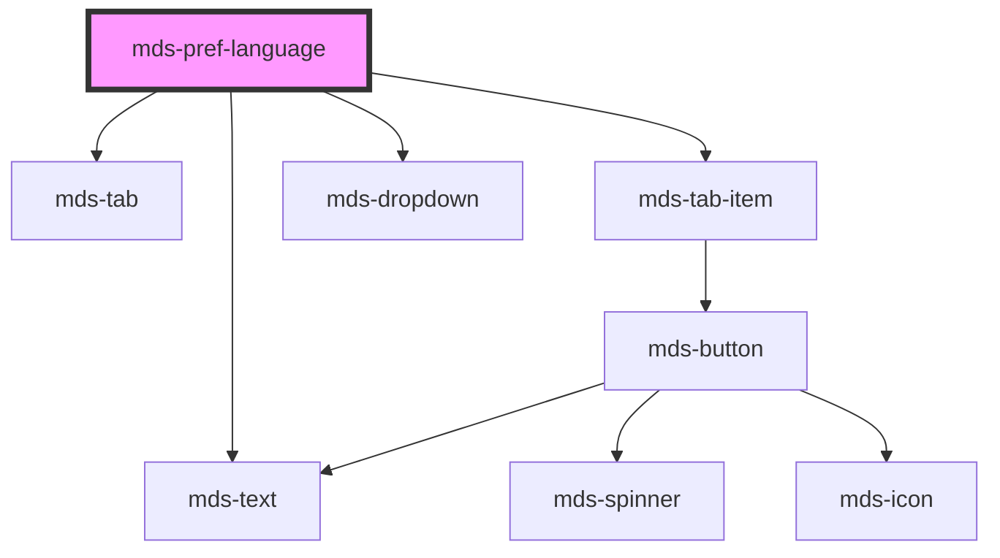

# mds-pref-language

<!-- Auto Generated Below -->

## Properties

| Property | Attribute | Description                                                                                                                                                                                                                                                                                                                                                                                       | Type     | Default  |
| -------- | --------- | ------------------------------------------------------------------------------------------------------------------------------------------------------------------------------------------------------------------------------------------------------------------------------------------------------------------------------------------------------------------------------------------------- | -------- | -------- |
| `set`    | `set`     | Specifies the language code based on HTML `lang` attribute  A string representing the language version as defined in {@link https://datatracker.ietf.org/doc/html/rfc5646 RFC 5646: Tags for Identifying Languages (also known as BCP 47)}.  `Examples of valid language codes include "en", "en-US", "fr", "fr-FR", "es-ES", etc.`  Supported languages are Italiano, English, Español, ελληνικά | `string` | `'auto'` |

## Events

| Event                   | Description                                                                                           | Type                                      |
| ----------------------- | ----------------------------------------------------------------------------------------------------- | ----------------------------------------- |
| `mdsPrefChange`         | Emits when the component is triggered                                                                 | `CustomEvent<MdsPrefChangeEventDetail>`   |
| `mdsPrefLanguageChange` | Emits when the component changes the language selected from the click event of the dropdown list item | `CustomEvent<MdsPrefLanguageEventDetail>` |

## Methods

### `updateLang() => Promise<void>`

#### Returns

Type: `Promise<void>`

## Slots

| Slot        | Description                             |
| ----------- | --------------------------------------- |
| `"default"` | Add `mds-pref-language-item` element/s. |

## Dependencies

### Depends on

- [mds-text](../mds-text)
- [mds-tab](../mds-tab)
- [mds-tab-item](../mds-tab-item)
- [mds-dropdown](../mds-dropdown)

### Graph

----------------------------------------------

Built with love @ [Gruppo Maggioli](https://www.maggioli.com) from [R&D Department](https://www.maggioli.com/it-it/chi-siamo/ricerca-sviluppo)
