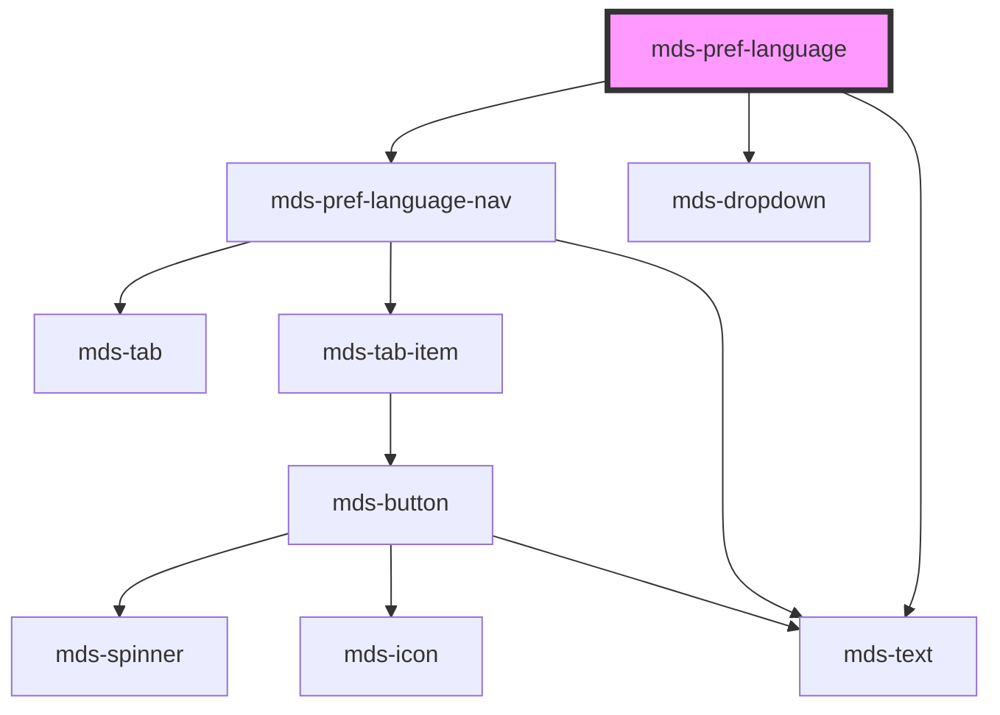

# mds-pref-language

<!-- Auto Generated Below -->

## Properties

| Property | Attribute | Description                                                       | Type                                                                                                           | Default  |
| -------- | --------- | ----------------------------------------------------------------- | -------------------------------------------------------------------------------------------------------------- | -------- |
| `set`    | `set`     |  /**   Specifies the language code based on HTML `lang` attribute | ``${Lowercase<string>}${Lowercase<string>}${Lowercase<string>}` \| `${Lowercase<string>}${Lowercase<string>}`` | `'auto'` |

## Events

| Event                   | Description                                                                                           | Type                                      |
| ----------------------- | ----------------------------------------------------------------------------------------------------- | ----------------------------------------- |
| `mdsPrefChange`         | Emits when the component is triggered                                                                 | `CustomEvent<MdsPrefChangeEventDetail>`   |
| `mdsPrefLanguageChange` | Emits when the component changes the language selected from the click event of the dropdown list item | `CustomEvent<MdsPrefLanguageEventDetail>` |

## Slots

| Slot        | Description                             |
| ----------- | --------------------------------------- |
| `"default"` | Add `mds-pref-language-item` element/s. |

## Dependencies

### Depends on

- [mds-pref-language-nav](../mds-pref-language-nav)
- [mds-dropdown](../mds-dropdown)
- [mds-text](../mds-text)

### Graph

----------------------------------------------

Built with love @ [Gruppo Maggioli](https://www.maggioli.com) from [R&D Department](https://www.maggioli.com/it-it/chi-siamo/ricerca-sviluppo)
