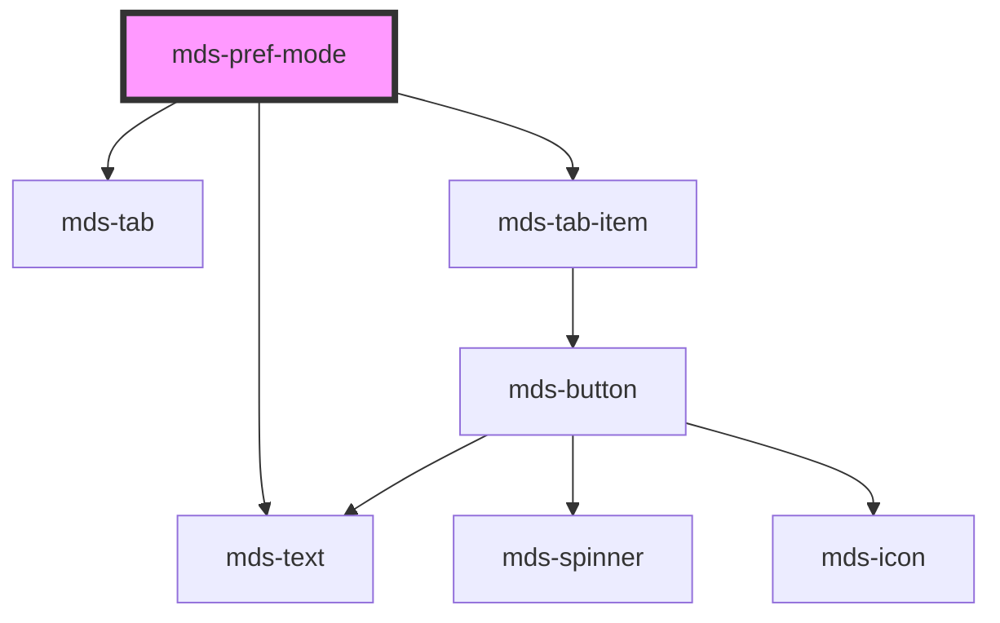

# mds-pref-mode


<!-- Auto Generated Below -->


## Usage

### 1. Description

The `<mds-pref-mode>` web component is the mode preference control of the Magma Design System, designed to live as a direct child of [`<mds-pref>`](../../mds-pref). It renders a labelled three-way tab (light / system / dark) that lets the user pick a color-scheme mode and applies it globally to the document.

#### Semantic Behavior

- **Compound child only**: It is meant to be placed directly in the default slot of `<mds-pref>` alongside the other `mds-pref-*` preference children; it is not used standalone or mixed with unrelated child types.
- **Selection follows `mode`**: The active tab reflects whichever mode is currently applied, driven by the `mode` prop.
- **Global mode application**: Selecting a mode applies it document-wide and persists the choice.
- **Persistence on load**: The applied mode resolves from `mode` -> the stored value -> the `system` default, so a previously chosen mode is restored without an explicit prop.
- **`mdsPrefChange` event**: Emits `mdsPrefChange` with `{ preference: 'mode' }` every time the mode is applied: on load and on each pick, so one pick can emit it more than once. It bubbles up to `<mds-pref>`; a mode change needs no reload, so it raises no reload notice.
- **Instances stay in sync**: Instances mounted together (a hidden `<mds-pref controller>` and a visible settings panel) share the applied mode: a pick in one is mirrored by the others, which neither apply it again nor emit `mdsPrefChange`. A `pref-mode-*` class written on `<html>` by other code is mirrored the same way.
- **Safari fallback**: On Safari the control disables itself and forces `mode` to `light`, since the transition overlay technique is unsupported there.
- **System mode**: The `system` choice follows the OS `prefers-color-scheme` media query to resolve the effective light/dark scheme.

#### Properties & Visual Configurations

- **`mode`**: Sets and reflects the active mode (`light`, `dark`, `system`). Leave it unset to inherit the persisted/default mode; set it explicitly to force a starting mode.
- **`transition`**: Controls the visual switch between schemes. Use `smooth` (default) for a fading neutral overlay that flips the mode mid-fade, `flash` for an instant switch with a brief overlay pulse, or `none` to apply the new mode with no overlay animation. The overlay timing and z-index are tunable through `--mds-pref-mode-overlay-*` CSS custom properties.
- **`size`**: Sizes the nested tab items (`sm` / `md`). The parent `<mds-pref>` forwards its own `size` to every `mds-pref-*` child only when that prop changes after load, not from the initial markup: in markup, set it here (with the same value on the sibling preferences, so the group stays visually consistent).


### 2. Pattern

Correct and idiomatic ways to use the `<mds-pref-mode>` component, ordered from most common to most specialized. Patterns assume a working knowledge of the shared preference system documented in [`docs/agents/theming.md`](../../../../../../docs/agents/theming.md) and the shared component rules in [`docs/agents/conventions.md`](../../../../../../docs/agents/conventions.md).

#### Default Usage Inside `mds-pref`

The canonical form. Slot `<mds-pref-mode>` as a direct child of [`<mds-pref>`](../../mds-pref) with no extra props. The component restores the user's previously persisted mode automatically on load.

```html
<mds-pref>
  <mds-pref-mode></mds-pref-mode>
</mds-pref>
```

#### Setting an Initial Mode

Pass `mode` to force the selector to start on a specific mode rather than reading from `localStorage`. Useful when the host application controls preference state centrally. The forced mode is also written to `localStorage` on every load, replacing the user's last choice.

```html
<mds-pref>
  <mds-pref-mode mode="dark"></mds-pref-mode>
</mds-pref>
```

#### Using `system` Mode for OS-Aware Default

`mode="system"` resolves to light or dark based on the OS `prefers-color-scheme` media query. Use this as the explicit starting point when you want the app to follow the OS without the user having to choose.

```html
<mds-pref>
  <mds-pref-mode mode="system"></mds-pref-mode>
</mds-pref>
```

#### Choosing a Transition Style

`transition` controls the visual effect when switching between schemes. Use `smooth` (default) for a mid-fade overlay that hides the color flip, `flash` for an instant switch with a brief full-screen pulse, or `none` for a hard switch with no animation.

```html
<!-- Smooth fade (default) -->
<mds-pref-mode transition="smooth"></mds-pref-mode>

<!-- Instant flash pulse -->
<mds-pref-mode transition="flash"></mds-pref-mode>

<!-- No animation -->
<mds-pref-mode transition="none"></mds-pref-mode>
```

#### Listening for Mode Changes

The component emits `mdsPrefChange` with `{ preference: 'mode' }` each time the mode is applied, on load and on each pick, so expect repeats with the same mode; another instance that mirrors the pick does not emit it. Listen for this event to react in application code - for example to sync a preference state store - and read the current value from the `mode` prop.

```html
<mds-pref>
  <mds-pref-mode id="mode-selector"></mds-pref-mode>
</mds-pref>

<script>
  document.getElementById('mode-selector').addEventListener('mdsPrefChange', (e) => {
    console.log('Modalita tema cambiata:', e.detail.preference);
  });
</script>
```

#### Controlling Size via the Parent

`size` is forwarded to the internal tab items. [`<mds-pref>`](../../mds-pref) forwards its own `size` to every `mds-pref-*` child only when that prop changes after load, not from the initial markup: in markup, set the same `size` on every preference control to keep the panel at one tab size.

```html
<mds-pref>
  <mds-pref-mode size="sm"></mds-pref-mode>
  <mds-pref-contrast size="sm"></mds-pref-contrast>
</mds-pref>
```

#### Customizing the Transition Overlay

Tune the overlay timing and stacking order via the documented `--mds-pref-mode-overlay-*` CSS custom properties. Set them on the host or a parent selector. Use Magma time tokens where available so animations stay in sync with the design system.

```css
mds-pref-mode {
  --mds-pref-mode-overlay-show-duration: 400ms;
  --mds-pref-mode-overlay-fadeout-duration: 250ms;
  --mds-pref-mode-overlay-z-index: 9000;
}
```


### 3. Antipattern

Common incorrect uses of `<mds-pref-mode>`. Each entry pairs the wrong form with the right one and a one-line reason. System-wide rules (boolean-as-string, shadow piercing, Tailwind color utilities, raw native event listening) live in [`docs/agents/anti-patterns.md`](../../../../../../docs/agents/anti-patterns.md) - they apply here too but are not repeated.

#### Do Not Use `<mds-pref-mode>` Outside `<mds-pref>`

`<mds-pref-mode>` is a compound child: `<mds-pref>` forwards `size` changes to it and locks the mode item that a scheme-constrained `<mds-pref-theme>` forbids (it sets `lockedScheme`). As a standalone widget it still applies and persists the mode, but nothing coordinates it with the theme.

```html
<!-- INCORRECT -->
<mds-pref-mode></mds-pref-mode>

<!-- CORRECT -->
<mds-pref>
  <mds-pref-mode></mds-pref-mode>
</mds-pref>
```

#### Do Not Set `transition="false"` to Disable the Overlay

`transition` is a string enum, not a boolean. `"false"` is not a valid value: it only happens to fall through to the no-overlay branch, with no guarantee across releases. Use `transition="none"` to opt out of the overlay animation.

```html
<!-- INCORRECT -->
<mds-pref-mode transition="false"></mds-pref-mode>

<!-- CORRECT -->
<mds-pref-mode transition="none"></mds-pref-mode>
```

#### Do Not Listen for Native `change` Events Instead of `mdsPrefChange`

The component does not emit or bubble native `change` events out of the shadow DOM. Always listen for the documented `mdsPrefChange` custom event.

```html
<!-- INCORRECT -->
<script>
  document.querySelector('mds-pref-mode').addEventListener('change', handler);
</script>

<!-- CORRECT -->
<script>
  document.querySelector('mds-pref-mode').addEventListener('mdsPrefChange', handler);
</script>
```

#### Do Not Override Mode Classes on `<html>` Directly

The component manages `pref-mode-light`, `pref-mode-dark`, and `pref-mode-system` classes on `<html>` itself. Adding or removing these by hand races with the component and will be overwritten on the next mode change. Drive the mode exclusively through the `mode` prop.

```html
<!-- INCORRECT -->
<script>
  document.documentElement.classList.add('pref-mode-dark');
</script>

<!-- CORRECT -->
<mds-pref>
  <mds-pref-mode mode="dark"></mds-pref-mode>
</mds-pref>
```

#### Do Not Size Only One Child of the Panel

`<mds-pref>` forwards its own `size` to its preference children only when that prop changes after load, not from the initial markup, so in markup each child carries its own `size`. Setting it on `<mds-pref-mode>` alone when siblings exist produces inconsistent tab sizes across the panel.

```html
<!-- INCORRECT -->
<mds-pref>
  <mds-pref-mode size="sm"></mds-pref-mode>
  <mds-pref-contrast></mds-pref-contrast>
</mds-pref>

<!-- CORRECT -->
<mds-pref>
  <mds-pref-mode size="sm"></mds-pref-mode>
  <mds-pref-contrast size="sm"></mds-pref-contrast>
</mds-pref>
```

#### Do Not Target the Injected Overlay to Customize It

The overlay element is injected into `document.body` at runtime with inline styles, which win over a class selector anyway. Do not target it by class name or adjust its properties through JavaScript. Use the documented `--mds-pref-mode-overlay-*` CSS custom properties instead.

```css
/* INCORRECT */
.mds-pref-mode-overlay {
  background-color: black;
  z-index: 99999;
}

/* CORRECT */
mds-pref-mode {
  --mds-pref-mode-overlay-show-duration: 400ms;
  --mds-pref-mode-overlay-z-index: 9000;
}
```


## Properties

| Property       | Attribute       | Description                                                                                                                                                                                                                                                                                                                                                     | Type                                         | Default     |
| -------------- | --------------- | --------------------------------------------------------------------------------------------------------------------------------------------------------------------------------------------------------------------------------------------------------------------------------------------------------------------------------------------------------------- | -------------------------------------------- | ----------- |
| `lockedScheme` | `locked-scheme` | Locks the mode items forbidden by a scheme-constrained theme, without touching the stored preference: `light` disables the explicit `dark` item, `dark` disables the explicit `light` item, `all` (or unset) locks nothing; the `system` item is never locked. Set by the `mds-pref` controller from the active theme's `scheme`; not meant to be set directly. | `"all" \| "dark" \| "light" \| undefined`    | `undefined` |
| `mode`         | `mode`          | Specifies the preference mode                                                                                                                                                                                                                                                                                                                                   | `"dark" \| "light" \| "system" \| undefined` | `undefined` |
| `size`         | `size`          | Sets the size of the component items nested inside it                                                                                                                                                                                                                                                                                                           | `"md" \| "sm" \| undefined`                  | `undefined` |
| `transition`   | `transition`    | Specifies the transition of switching from a mode to another one                                                                                                                                                                                                                                                                                                | `"flash" \| "none" \| "smooth"`              | `'smooth'`  |


## Events

| Event           | Description                           | Type                                    |
| --------------- | ------------------------------------- | --------------------------------------- |
| `mdsPrefChange` | Emits when the component is triggered | `CustomEvent<MdsPrefChangeEventDetail>` |


## Dependencies

### Depends on

- [mds-text](../mds-text)
- [mds-tab](../mds-tab)
- [mds-tab-item](../mds-tab-item)

### Graph


----------------------------------------------

Built with love @ [Gruppo Maggioli](https://www.maggioli.com) from [R&D Department](https://www.maggioli.com/it-it/chi-siamo/ricerca-sviluppo)
