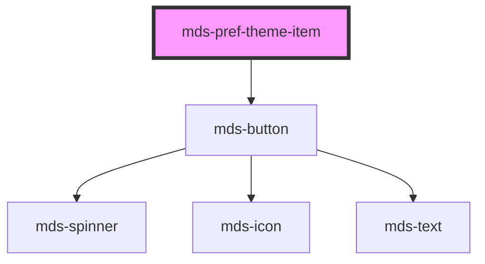

# mds-pref-theme-item


<!-- Auto Generated Below -->


## Usage

### 1. Description

The `<mds-pref-theme-item>` web component is a single selectable theme entry inside the [`<mds-pref-theme>`](../../mds-pref-theme) preference picker. It renders as a borderless button that pairs a color-swatch preview of the theme with its label.

#### Semantic Behavior

- **Compound child only**: Must be placed as a direct default-slot child of `<mds-pref-theme>`; it is not used standalone or mixed with other child component types.
- **Selection is parent-driven**: On click each item emits `mdsPrefThemeItemSelect` (carrying `{ name, scheme }`), and the parent responds by clearing the siblings and selecting the clicked one. Setting `selected` directly on a single item does not coordinate the others.
- **Click bubbles up**: The emitted event is what the parent listens to in order to apply the theme to the document and persist the choice.
- **Auto-derived label**: If `label` is omitted, it is generated from `name` by capitalizing the first letter and replacing hyphens with spaces (e.g. `maggioli-editore` becomes `Maggioli editore`).
- **Static color preview**: The four swatches (primary, success, warning, error) and the preview background are painted by the `--mds-pref-theme-item-*` CSS custom properties, not by props. Their defaults are the page's current roles (accent, the status emphases, `wash-base`), so every item shows the same swatches until you set the properties per item.

#### Properties & Visual Configurations

- **`name`**: The theme identifier reported to the parent and matched against the parent's active `name` to compute initial selection. Use a simple or kebab-case string; the named themes are `cool` and `warm`, and `default` is the base theme ([`docs/agents/theming.md`](../../../../../../docs/agents/theming.md)). The parent validates the lowercase/kebab format and throws on invalid names.
- **`scheme`**: Declares which color schemes the theme supports - `all` (default, both light and dark), or `light` / `dark` to force a single mode. This value travels with the selection event and is applied by the parent when the item is chosen.
- **`selected`**: Reflects whether this item is the active theme. The parent sets it on every item when it loads and on each pick, so a value set by hand is overwritten.


### 2. Pattern

Correct and idiomatic ways to use the `<mds-pref-theme-item>` component, ordered from most common to most specialized. Patterns assume a working knowledge of the shared component rules in [`docs/agents/conventions.md`](../../../../../../docs/agents/conventions.md).

#### Basic Usage Inside the Parent

`<mds-pref-theme-item>` must always be a direct child of [`<mds-pref-theme>`](../../mds-pref-theme). Each item represents one selectable colour theme; the parent manages selection state so all siblings stay in sync.

```html
<mds-pref-theme name="default" scheme="all">
  <mds-pref-theme-item name="default" label="Predefinito" scheme="all"></mds-pref-theme-item>
  <mds-pref-theme-item name="cool" label="Freddo" scheme="all"></mds-pref-theme-item>
  <mds-pref-theme-item name="warm" label="Caldo" scheme="all"></mds-pref-theme-item>
</mds-pref-theme>
```

#### Auto-Derived Label

Omit `label` and let the component generate it from `name`: the first letter is capitalised and hyphens are replaced with spaces. Use this shorthand when the theme name is already human-readable.

```html
<mds-pref-theme name="default" scheme="all">
  <!-- renders "Default", "Cool", "Warm" without explicit label props -->
  <mds-pref-theme-item name="default" scheme="all"></mds-pref-theme-item>
  <mds-pref-theme-item name="cool" scheme="all"></mds-pref-theme-item>
  <mds-pref-theme-item name="warm" scheme="all"></mds-pref-theme-item>
</mds-pref-theme>
```

#### Scheme-Specific Themes

Set `scheme` to `"light"` or `"dark"` when a theme must be offered in a single colour mode only. The parent applies the forced mode when the item is selected.

```html
<mds-pref-theme name="default" scheme="all">
  <!-- this theme works in both modes -->
  <mds-pref-theme-item name="default" label="Predefinito" scheme="all"></mds-pref-theme-item>

  <!-- offered light-only; selecting it locks the UI in light mode -->
  <mds-pref-theme-item name="cool" label="Freddo chiaro" scheme="light"></mds-pref-theme-item>

  <!-- offered dark-only; selecting it locks the UI in dark mode -->
  <mds-pref-theme-item name="warm" label="Caldo scuro" scheme="dark"></mds-pref-theme-item>
</mds-pref-theme>
```

#### Listening to the Selection Event

Attach a listener for `mdsPrefThemeItemSelect` when you need to react to a selection at the item level - for example to log analytics. The detail carries `{ name, scheme }`. Normally the parent handles theme application automatically; only listen at this level for side-effects.

```html
<mds-pref-theme name="default" scheme="all">
  <mds-pref-theme-item name="default" label="Predefinito" scheme="all"></mds-pref-theme-item>
  <mds-pref-theme-item name="cool" label="Freddo" scheme="all"></mds-pref-theme-item>
</mds-pref-theme>

<script>
  document.querySelectorAll('mds-pref-theme-item').forEach((item) => {
    item.addEventListener('mdsPrefThemeItemSelect', (e) => {
      console.log('Tema selezionato:', e.detail.name, 'schema:', e.detail.scheme);
    });
  });
</script>
```

#### Setting the Initially Selected Item

Declare it on the parent, not with `selected`: when it loads, `<mds-pref-theme>` marks the item whose `name` matches the active theme (the stored choice, or its own `name` on a first visit) and overwrites any `selected` written in the markup.

```html
<mds-pref-theme name="cool" scheme="all">
  <mds-pref-theme-item name="default" label="Predefinito" scheme="all"></mds-pref-theme-item>
  <mds-pref-theme-item name="cool" label="Freddo" scheme="all"></mds-pref-theme-item>
  <mds-pref-theme-item name="warm" label="Caldo" scheme="all"></mds-pref-theme-item>
</mds-pref-theme>
```

#### CSS Customization via Documented Properties

Override the swatch colours only through the documented `--mds-pref-theme-item-*` CSS custom properties. Set them on the host element or a parent selector and name a semantic role for the colour values, `rgb(var(--magma-<role>))` ([`docs/agents/color.md`](../../../../../../docs/agents/color.md)), so mode, theme and contrast keep working.

```css
/* override the colour preview dots of one theme item */
mds-pref-theme-item[name="warm"] {
  --mds-pref-theme-item-color-variant-primary: rgb(var(--magma-accent-emphasis-hover));
  --mds-pref-theme-item-color-status-success: rgb(var(--magma-success-emphasis));
  --mds-pref-theme-item-color-status-warning: rgb(var(--magma-warning-emphasis));
  --mds-pref-theme-item-color-status-error: rgb(var(--magma-danger-emphasis));
  --mds-pref-theme-item-color-background: rgb(var(--magma-wash-strong));
}
```


### 3. Antipattern

Common incorrect uses of `<mds-pref-theme-item>`. Each entry pairs the wrong form with the right one and a one-line reason. System-wide rules (boolean-as-string, shadow piercing, Tailwind color utilities, raw native event listening) live in [`docs/agents/anti-patterns.md`](../../../../../../docs/agents/anti-patterns.md) - they apply here too but are not repeated.

#### Do Not Use the Item Outside Its Parent

`<mds-pref-theme-item>` is a compound child that must be a direct slot child of [`<mds-pref-theme>`](../../mds-pref-theme). Used standalone it emits selection events that are never handled, and it never receives coordinated deselection of siblings.

```html
<!-- INCORRECT -->
<mds-pref-theme-item name="cool" label="Freddo" scheme="all"></mds-pref-theme-item>

<!-- CORRECT -->
<mds-pref-theme name="default" scheme="all">
  <mds-pref-theme-item name="cool" label="Freddo" scheme="all"></mds-pref-theme-item>
</mds-pref-theme>
```

#### Do Not Set `selected` Manually to Coordinate Multi-Item State

Setting `selected` on one item does not deselect the others - the parent is the only actor that can coordinate the whole group. When it loads it marks only the item matching the active theme, overwriting the `selected` in the markup; a value set later from script leaves several items marked. Drive initial selection through the parent's `name` prop or by letting the user click.

```html
<!-- INCORRECT - the parent overwrites both on load and marks "default" -->
<mds-pref-theme name="default" scheme="all">
  <mds-pref-theme-item name="default" label="Predefinito" scheme="all"></mds-pref-theme-item>
  <mds-pref-theme-item name="cool" label="Freddo" scheme="all" selected></mds-pref-theme-item>
  <mds-pref-theme-item name="warm" label="Caldo" scheme="all" selected></mds-pref-theme-item>
</mds-pref-theme>

<!-- CORRECT - set the active theme on the parent; it marks the matching child -->
<mds-pref-theme name="cool" scheme="all">
  <mds-pref-theme-item name="default" label="Predefinito" scheme="all"></mds-pref-theme-item>
  <mds-pref-theme-item name="cool" label="Freddo" scheme="all"></mds-pref-theme-item>
  <mds-pref-theme-item name="warm" label="Caldo" scheme="all"></mds-pref-theme-item>
</mds-pref-theme>
```

#### Do Not Listen for Native `click` Instead of the Component Event

A raw `click` carries no `detail`: you have to read `name` back from the element, and you lose the `scheme`. Listen for the documented `mdsPrefThemeItemSelect` event instead, whose detail carries `{ name, scheme }`.

```html
<!-- INCORRECT -->
<script>
  document.querySelector('mds-pref-theme-item').addEventListener('click', (e) => {
    applyTheme(e.target.getAttribute('name'));
  });
</script>

<!-- CORRECT -->
<script>
  document.querySelector('mds-pref-theme-item').addEventListener('mdsPrefThemeItemSelect', (e) => {
    applyTheme(e.detail.name);
  });
</script>
```

#### Do Not Pierce Shadow DOM to Style the Inner Button

The supported customization surface is the five `--mds-pref-theme-item-*` CSS custom properties. Targeting internal selectors or `::part()` names not present in this component's public API couples your code to the implementation and will break on minor releases.

```css
/* INCORRECT */
mds-pref-theme-item >>> mds-button {
  font-weight: bold;
}
mds-pref-theme-item .theme-preview {
  border: 2px solid red;
}

/* CORRECT */
mds-pref-theme-item[name="warm"] {
  --mds-pref-theme-item-color-variant-primary: rgb(var(--magma-accent-emphasis-hover));
  --mds-pref-theme-item-color-background: rgb(var(--magma-wash-strong));
}
```

#### Do Not Use an Invalid `scheme` Value

`scheme` only accepts `"all"`, `"light"`, or `"dark"`. Other strings are not validated: when the item is picked the parent stores them and writes no `pref-theme-scheme-*` class on `<html>`, so the theme is not constrained to the mode you meant.

```html
<!-- INCORRECT -->
<mds-pref-theme-item name="cool" scheme="light-only"></mds-pref-theme-item>
<mds-pref-theme-item name="warm" scheme="night"></mds-pref-theme-item>

<!-- CORRECT -->
<mds-pref-theme-item name="cool" scheme="light"></mds-pref-theme-item>
<mds-pref-theme-item name="warm" scheme="dark"></mds-pref-theme-item>
```


## Properties

| Property   | Attribute  | Description                                                      | Type                                      | Default     |
| ---------- | ---------- | ---------------------------------------------------------------- | ----------------------------------------- | ----------- |
| `label`    | `label`    | Specifies the theme name                                         | `string \| undefined`                     | `undefined` |
| `name`     | `name`     | Specifies the theme name                                         | `string`                                  | `'default'` |
| `scheme`   | `scheme`   | Specifies the theme scheme which can be 'light', 'dark' or 'all' | `"all" \| "dark" \| "light" \| undefined` | `'all'`     |
| `selected` | `selected` | Specifies if the element is selected                             | `boolean \| undefined`                    | `false`     |


## Events

| Event                    | Description                                   | Type                                   |
| ------------------------ | --------------------------------------------- | -------------------------------------- |
| `mdsPrefThemeItemSelect` | Emits when the component trigger the language | `CustomEvent<MdsPrefThemeEventDetail>` |


## CSS Custom Properties

| Name                                          | Description                                           |
| --------------------------------------------- | ----------------------------------------------------- |
| `--mds-pref-theme-item-color-background`      | Background color of a theme item.                     |
| `--mds-pref-theme-item-color-status-error`    | Color representing an error status for a theme item.  |
| `--mds-pref-theme-item-color-status-success`  | Color representing a success status for a theme item. |
| `--mds-pref-theme-item-color-status-warning`  | Color representing a warning status for a theme item. |
| `--mds-pref-theme-item-color-variant-primary` | Color for the primary variant item.                   |


## Dependencies

### Depends on

- [mds-button](../mds-button)

### Graph


----------------------------------------------

Built with love @ [Gruppo Maggioli](https://www.maggioli.com) from [R&D Department](https://www.maggioli.com/it-it/chi-siamo/ricerca-sviluppo)
