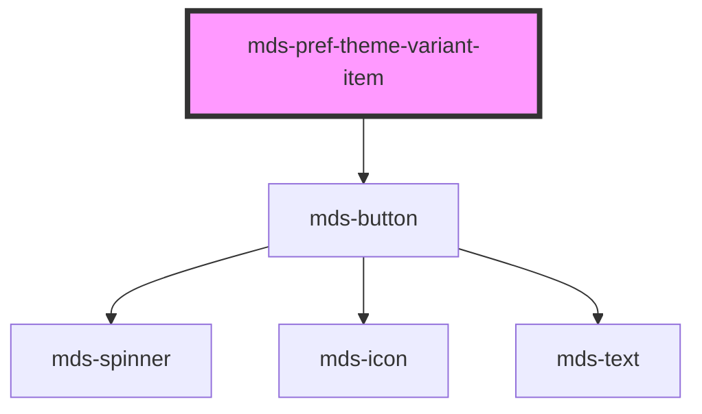

# mds-pref-theme-variant-item

<!-- Auto Generated Below -->

## Properties

| Property   | Attribute  | Description                                                      | Type                                      | Default     |
| ---------- | ---------- | ---------------------------------------------------------------- | ----------------------------------------- | ----------- |
| `label`    | `label`    | Specifies the theme name                                         | `string \| undefined`                     | `undefined` |
| `name`     | `name`     | Specifies the theme name                                         | `string`                                  | `'default'` |
| `scheme`   | `scheme`   | Specifies the theme scheme which can be 'light', 'dark' or 'all' | `"all" \| "dark" \| "light" \| undefined` | `'all'`     |
| `selected` | `selected` | Specifies if the element is selected                             | `boolean \| undefined`                    | `false`     |

## Events

| Event                           | Description                                   | Type                                          |
| ------------------------------- | --------------------------------------------- | --------------------------------------------- |
| `mdsPrefThemeVariantItemSelect` | Emits when the component trigger the language | `CustomEvent<MdsPrefThemeVariantEventDetail>` |

## Methods

### `updateLang() => Promise<void>`

#### Returns

Type: `Promise<void>`

## Dependencies

### Depends on

- [mds-button](../mds-button)

### Graph

----------------------------------------------

Built with love @ [Gruppo Maggioli](https://www.maggioli.com) from [R&D Department](https://www.maggioli.com/it-it/chi-siamo/ricerca-sviluppo)
