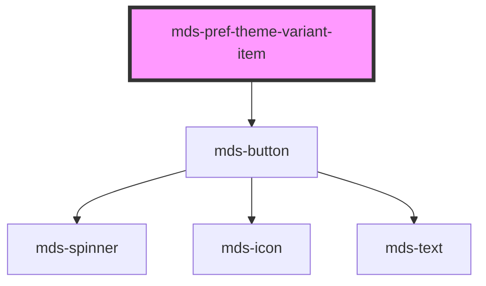

# mds-pref-theme-variant-item


<!-- Auto Generated Below -->


## Usage

### 1. Description

The `<mds-pref-theme-variant-item>` web component is a single selectable theme entry inside the [`<mds-pref-theme-variant>`](../../mds-pref-theme-variant) preference picker. It renders as a borderless button that pairs a color-swatch preview of the theme with its label.

#### Semantic Behavior

- **Compound child only**: Must be placed as a direct default-slot child of `<mds-pref-theme-variant>`; it is not used standalone or mixed with other child component types.
- **Selection is parent-driven**: On click each item emits `mdsPrefThemeVariantItemSelect` (carrying `{ name, scheme }`), and the parent responds by clearing the siblings and selecting the clicked one. Setting `selected` directly on a single item does not coordinate the others.
- **Click bubbles up**: The emitted event is what the parent listens to in order to apply the theme to the document and persist the choice.
- **Auto-derived label**: If `label` is omitted, it is generated from `name` by capitalizing the first letter and replacing hyphens with spaces (e.g. `maggioli-editore` becomes `Maggioli editore`).
- **Static color preview**: The four swatches (primary, success, warning, error) are themed via CSS custom properties; they are not configurable through props.

#### Properties & Visual Configurations

- **`name`**: The theme identifier reported to the parent and matched against the parent's active `name` to compute initial selection. Use a simple or kebab-case string (e.g. `default`, `magma`, `maggioli-editore`); the parent validates the lowercase/kebab format and throws on invalid names.
- **`scheme`**: Declares which color schemes the theme supports - `all` (default, both light and dark), or `light` / `dark` to force a single mode. This value travels with the selection event and is applied by the parent when the item is chosen.
- **`selected`**: Reflects whether this item is the active theme. Prefer letting the parent manage it via selection rather than setting it manually on individual items.


### 2. Pattern

Correct and idiomatic ways to use the `<mds-pref-theme-variant-item>` component, ordered from most common to most specialized. Patterns assume a working knowledge of the variant / tone ladders documented in [`docs/COMPONENTS.md`](../../../../../../docs/COMPONENTS.md) and the generic stencil rules in [`projects/stencil/SPEC.md`](../../../../SPEC.md).

#### Basic Usage Inside the Parent

`<mds-pref-theme-variant-item>` must always be a direct child of [`<mds-pref-theme-variant>`](../../mds-pref-theme-variant). Each item represents one selectable colour theme; the parent manages selection state so all siblings stay in sync.

```html
<mds-pref-theme-variant name="default" scheme="all">
  <mds-pref-theme-variant-item name="default" label="Predefinito" scheme="all"></mds-pref-theme-variant-item>
  <mds-pref-theme-variant-item name="magma" label="Magma" scheme="all"></mds-pref-theme-variant-item>
  <mds-pref-theme-variant-item name="maggioli-editore" label="Maggioli Editore" scheme="all"></mds-pref-theme-variant-item>
</mds-pref-theme-variant>
```

#### Auto-Derived Label

Omit `label` and let the component generate it from `name`: the first letter is capitalised and hyphens are replaced with spaces. Use this shorthand when the theme name is already human-readable.

```html
<mds-pref-theme-variant name="default" scheme="all">
  <!-- renders "Default", "Summer", "Twilight" without explicit label props -->
  <mds-pref-theme-variant-item name="default" scheme="all"></mds-pref-theme-variant-item>
  <mds-pref-theme-variant-item name="summer" scheme="light"></mds-pref-theme-variant-item>
  <mds-pref-theme-variant-item name="twilight" scheme="dark"></mds-pref-theme-variant-item>
</mds-pref-theme-variant>
```

#### Scheme-Specific Themes

Set `scheme` to `"light"` or `"dark"` when a theme is designed for a single colour mode only. The parent applies the forced mode when the item is selected.

```html
<mds-pref-theme-variant name="default" scheme="all">
  <!-- this theme works in both modes -->
  <mds-pref-theme-variant-item name="default" label="Predefinito" scheme="all"></mds-pref-theme-variant-item>

  <!-- this theme is light-only; selecting it locks the UI in light mode -->
  <mds-pref-theme-variant-item name="estate" label="Estate" scheme="light"></mds-pref-theme-variant-item>

  <!-- this theme is dark-only; selecting it locks the UI in dark mode -->
  <mds-pref-theme-variant-item name="notte" label="Notte" scheme="dark"></mds-pref-theme-variant-item>
</mds-pref-theme-variant>
```

#### Listening to the Selection Event

Attach a listener for `mdsPrefThemeVariantItemSelect` when you need to react to a selection at the item level - for example to log analytics. The detail carries `{ name, scheme }`. Normally the parent handles theme application automatically; only listen at this level for side-effects.

```html
<mds-pref-theme-variant name="default" scheme="all">
  <mds-pref-theme-variant-item name="default" label="Predefinito" scheme="all"></mds-pref-theme-variant-item>
  <mds-pref-theme-variant-item name="magma" label="Magma" scheme="all"></mds-pref-theme-variant-item>
</mds-pref-theme-variant>

<script>
  document.querySelectorAll('mds-pref-theme-variant-item').forEach((item) => {
    item.addEventListener('mdsPrefThemeVariantItemSelect', (e) => {
      console.log('Tema selezionato:', e.detail.name, 'schema:', e.detail.scheme);
    });
  });
</script>
```

#### Setting the Initially Selected Item

Set `selected` on the item that matches the user's saved preference before the component renders. The parent will sync the rest of the items automatically once it receives the selection event on first interaction.

```html
<mds-pref-theme-variant name="magma" scheme="all">
  <mds-pref-theme-variant-item name="default" label="Predefinito" scheme="all"></mds-pref-theme-variant-item>
  <mds-pref-theme-variant-item name="magma" label="Magma" scheme="all" selected></mds-pref-theme-variant-item>
  <mds-pref-theme-variant-item name="notte" label="Notte" scheme="dark"></mds-pref-theme-variant-item>
</mds-pref-theme-variant>
```

#### CSS Customization via Documented Properties

Override the swatch colours only through the documented `--mds-pref-theme-variant-item-*` CSS custom properties. Set them on the host element or a parent selector and use Magma token wrappers for colour values so dark mode keeps working.

```css
/* override the colour preview dots for a custom "brand" theme item */
mds-pref-theme-variant-item[name="brand"] {
  --mds-pref-theme-variant-item-color-variant-primary: rgb(var(--variant-secondary-03));
  --mds-pref-theme-variant-item-color-status-success: rgb(var(--status-success-05));
  --mds-pref-theme-variant-item-color-status-warning: rgb(var(--status-warning-05));
  --mds-pref-theme-variant-item-color-status-error: rgb(var(--status-error-05));
  --mds-pref-theme-variant-item-color-background: rgb(var(--tone-neutral-08));
}
```


### 3. Antipattern

Common incorrect uses of `<mds-pref-theme-variant-item>`. Each entry pairs the wrong form with the right one and a one-line reason. System-wide rules (boolean-as-string, shadow piercing, Tailwind color utilities, raw native event listening) live in [`docs/COMPONENTS.md`](../../../../../../docs/COMPONENTS.md#system-level-anti-patterns) - they apply here too but are not repeated.

#### Do Not Use the Item Outside Its Parent

`<mds-pref-theme-variant-item>` is a compound child that must be a direct slot child of [`<mds-pref-theme-variant>`](../../mds-pref-theme-variant). Used standalone it emits selection events that are never handled, and it never receives coordinated deselection of siblings.

```html
<!-- 🚫 INCORRECT -->
<mds-pref-theme-variant-item name="magma" label="Magma" scheme="all"></mds-pref-theme-variant-item>

<!-- ✅ CORRECT -->
<mds-pref-theme-variant name="default" scheme="all">
  <mds-pref-theme-variant-item name="magma" label="Magma" scheme="all"></mds-pref-theme-variant-item>
</mds-pref-theme-variant>
```

#### Do Not Set `selected` Manually to Coordinate Multi-Item State

Setting `selected` on one item does not deselect the others - the parent is the only actor that can coordinate the whole group. Drive initial selection through the parent's `name` prop or by letting the user click.

```html
<!-- 🚫 INCORRECT - only one item will visually appear selected; siblings are unaffected -->
<mds-pref-theme-variant name="default" scheme="all">
  <mds-pref-theme-variant-item name="default" label="Predefinito" scheme="all"></mds-pref-theme-variant-item>
  <mds-pref-theme-variant-item name="magma" label="Magma" scheme="all" selected></mds-pref-theme-variant-item>
  <mds-pref-theme-variant-item name="notte" label="Notte" scheme="dark" selected></mds-pref-theme-variant-item>
</mds-pref-theme-variant>

<!-- ✅ CORRECT - set the active theme on the parent; it marks the matching child -->
<mds-pref-theme-variant name="magma" scheme="all">
  <mds-pref-theme-variant-item name="default" label="Predefinito" scheme="all"></mds-pref-theme-variant-item>
  <mds-pref-theme-variant-item name="magma" label="Magma" scheme="all"></mds-pref-theme-variant-item>
  <mds-pref-theme-variant-item name="notte" label="Notte" scheme="dark"></mds-pref-theme-variant-item>
</mds-pref-theme-variant>
```

#### Do Not Listen for Native `click` Instead of the Component Event

The inner `<mds-button>` is inside shadow DOM and a raw `click` listener on the host may fire in unexpected order or not at all across frameworks. Listen for the documented `mdsPrefThemeVariantItemSelect` event instead.

```html
<!-- 🚫 INCORRECT -->
<script>
  document.querySelector('mds-pref-theme-variant-item').addEventListener('click', (e) => {
    applyTheme(e.target.getAttribute('name'));
  });
</script>

<!-- ✅ CORRECT -->
<script>
  document.querySelector('mds-pref-theme-variant-item').addEventListener('mdsPrefThemeVariantItemSelect', (e) => {
    applyTheme(e.detail.name);
  });
</script>
```

#### Do Not Pierce Shadow DOM to Style the Inner Button

The supported customization surface is the five `--mds-pref-theme-variant-item-*` CSS custom properties. Targeting internal selectors or `::part()` names not present in this component's public API couples your code to the implementation and will break on minor releases.

```css
/* 🚫 INCORRECT */
mds-pref-theme-variant-item >>> mds-button {
  font-weight: bold;
}
mds-pref-theme-variant-item .theme-preview {
  border: 2px solid red;
}

/* ✅ CORRECT */
mds-pref-theme-variant-item[name="brand"] {
  --mds-pref-theme-variant-item-color-variant-primary: rgb(var(--variant-secondary-03));
  --mds-pref-theme-variant-item-color-background: rgb(var(--tone-neutral-08));
}
```

#### Do Not Use an Invalid `scheme` Value

`scheme` only accepts `"all"`, `"light"`, or `"dark"`. Other strings silently fall back and the parent may apply the wrong mode when the item is selected.

```html
<!-- 🚫 INCORRECT -->
<mds-pref-theme-variant-item name="estate" scheme="light-only"></mds-pref-theme-variant-item>
<mds-pref-theme-variant-item name="notte" scheme="night"></mds-pref-theme-variant-item>

<!-- ✅ CORRECT -->
<mds-pref-theme-variant-item name="estate" scheme="light"></mds-pref-theme-variant-item>
<mds-pref-theme-variant-item name="notte" scheme="dark"></mds-pref-theme-variant-item>
```


## Properties

| Property   | Attribute  | Description                                                      | Type                                      | Default     |
| ---------- | ---------- | ---------------------------------------------------------------- | ----------------------------------------- | ----------- |
| `label`    | `label`    | Specifies the theme name                                         | `string \| undefined`                     | `undefined` |
| `name`     | `name`     | Specifies the theme name                                         | `string`                                  | `'default'` |
| `scheme`   | `scheme`   | Specifies the theme scheme which can be 'light', 'dark' or 'all' | `"all" \| "dark" \| "light" \| undefined` | `'all'`     |
| `selected` | `selected` | Specifies if the element is selected                             | `boolean \| undefined`                    | `false`     |


## Events

| Event                           | Description                                   | Type                                          |
| ------------------------------- | --------------------------------------------- | --------------------------------------------- |
| `mdsPrefThemeVariantItemSelect` | Emits when the component trigger the language | `CustomEvent<MdsPrefThemeVariantEventDetail>` |


## Methods

### `updateLang() => Promise<void>`


#### Returns

Type: `Promise<void>`


## Dependencies

### Depends on

- [mds-button](../mds-button)

### Graph


----------------------------------------------

Built with love @ [Gruppo Maggioli](https://www.maggioli.com) from [R&D Department](https://www.maggioli.com/it-it/chi-siamo/ricerca-sviluppo)
