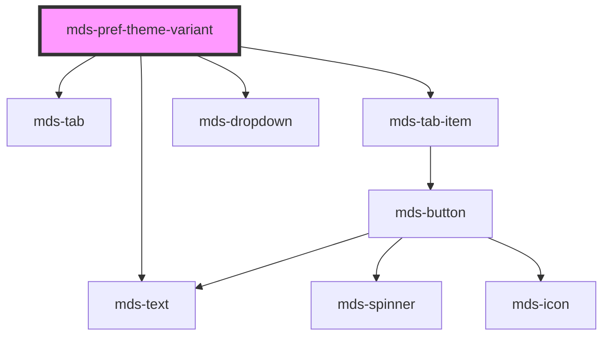

# mds-pref-theme-variant

<!-- Auto Generated Below -->

## Properties

| Property | Attribute | Description                                                                                                                                                                                                                                             | Type                         | Default     |
| -------- | --------- | ------------------------------------------------------------------------------------------------------------------------------------------------------------------------------------------------------------------------------------------------------- | ---------------------------- | ----------- |
| `name`   | `name`    | Specifies the theme name attribute A string representing the theme name, should be a simple string name or kebab kase name. `Examples of valid language codes include "magma", "maggioli-editore", etc.`                                                | `string`                     | `'default'` |
| `scheme` | `scheme`  | Specifies the theme scheme which can be 'light', 'dark' or 'all' Default is 'all' which means this theme supporto both light and dark. If you set 'light' means this theme support only light mode and will be forced and shown light colors mode only. | `"all" \| "dark" \| "light"` | `'all'`     |
| `size`   | `size`    | Sets the size of the component items nested inside it                                                                                                                                                                                                   | `"md" \| "sm" \| undefined`  | `undefined` |

## Events

| Event                       | Description                                                                                           | Type                                          |
| --------------------------- | ----------------------------------------------------------------------------------------------------- | --------------------------------------------- |
| `mdsPrefChange`             | Emits when the component is triggered                                                                 | `CustomEvent<MdsPrefChangeEventDetail>`       |
| `mdsPrefThemeVariantChange` | Emits when the component changes the language selected from the click event of the dropdown list item | `CustomEvent<MdsPrefThemeVariantEventDetail>` |

## Methods

### `updateLang() => Promise<void>`

#### Returns

Type: `Promise<void>`

## Slots

| Slot        | Description                                  |
| ----------- | -------------------------------------------- |
| `"default"` | Add `mds-pref-theme-variant-item` element/s. |

## Dependencies

### Depends on

- [mds-text](../mds-text)
- [mds-tab](../mds-tab)
- [mds-tab-item](../mds-tab-item)
- [mds-dropdown](../mds-dropdown)

### Graph

----------------------------------------------

Built with love @ [Gruppo Maggioli](https://www.maggioli.com) from [R&D Department](https://www.maggioli.com/it-it/chi-siamo/ricerca-sviluppo)
