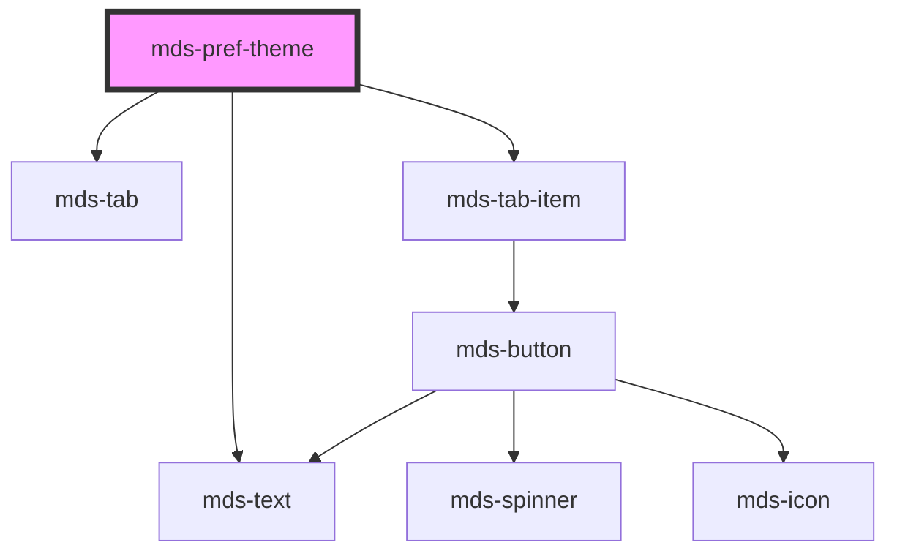

# mds-pref-theme

<!-- Auto Generated Below -->

## Properties

| Property | Attribute | Description                   | Type                                         | Default     |
| -------- | --------- | ----------------------------- | -------------------------------------------- | ----------- |
| `mode`   | `mode`    | Specifies the preference mode | `"dark" \| "light" \| "system" \| undefined` | `undefined` |

## Dependencies

### Depends on

- [mds-text](../mds-text)
- [mds-tab](../mds-tab)
- [mds-tab-item](../mds-tab-item)

### Graph

----------------------------------------------

Built with love @ [Gruppo Maggioli](https://www.maggioli.com) from [R&D Department](https://www.maggioli.com/it-it/chi-siamo/ricerca-sviluppo)
