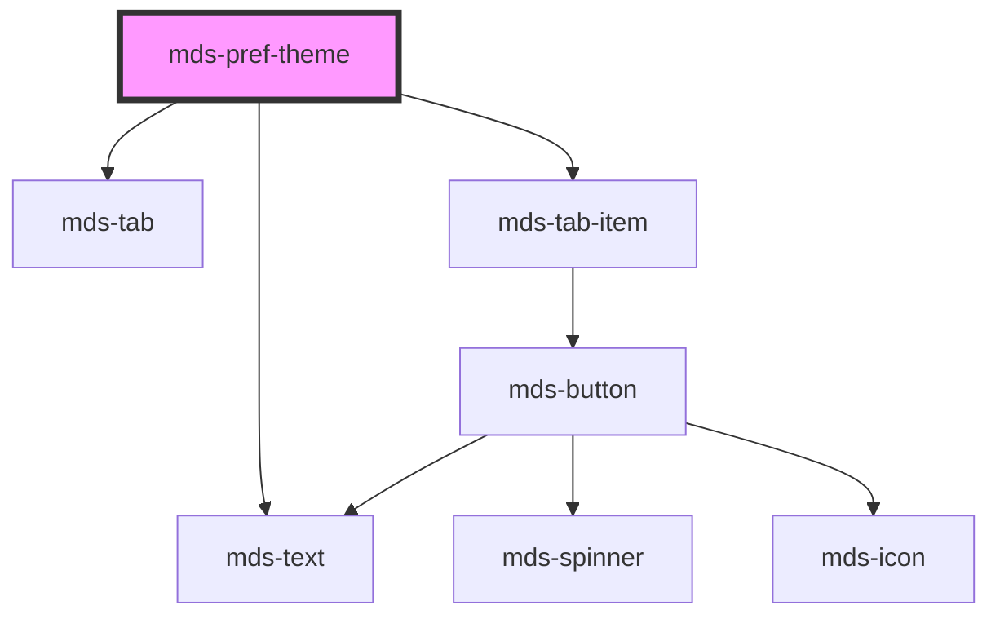

# mds-pref-theme


<!-- Auto Generated Below -->


## Usage

### 1. Description

The `<mds-pref-theme>` web component is the theme-mode preference control of the Magma Design System, designed to live as a direct child of [`<mds-pref>`](../../mds-pref). It renders a labelled three-way tab (light / system / dark) that lets the user pick a color-scheme mode and applies it globally to the document.

#### Semantic Behavior

- **Compound child only**: It is meant to be placed directly in the default slot of `<mds-pref>` alongside the other `mds-pref-*` preference children; it is not used standalone or mixed with unrelated child types.
- **Selection follows `mode`**: The active tab reflects whichever mode is currently applied, driven by the `mode` prop.
- **Global theme application**: Selecting a mode applies it document-wide and persists the choice.
- **Persistence on load**: The applied mode resolves from `mode` → the stored value → the `system` default, so a previously chosen theme is restored without an explicit prop.
- **`mdsPrefChange` event**: Emits `mdsPrefChange` with `{ preference: 'theme-mode' }` whenever the theme is set; this bubbles up to `<mds-pref>`, which coordinates reload prompts across preference children.
- **Safari fallback**: On Safari the control disables itself and forces `mode` to `light`, since the transition overlay technique is unsupported there.
- **System mode**: The `system` choice follows the OS `prefers-color-scheme` media query to resolve the effective light/dark scheme.

#### Properties & Visual Configurations

- **`mode`**: Sets and reflects the active theme mode (`light`, `dark`, `system`). Leave it unset to inherit the persisted/default mode; set it explicitly to force a starting theme.
- **`transition`**: Controls the visual switch between schemes. Use `smooth` (default) for a fading neutral overlay that flips the theme mid-fade, `flash` for an instant switch with a brief overlay pulse, or `none` to apply the new theme with no overlay animation. The overlay timing and z-index are tunable through `--mds-pref-theme-overlay-*` CSS custom properties.
- **`size`**: Sizes the nested tab items (`sm` / `md`); normally inherited from the parent `<mds-pref>` rather than set directly, so all sibling preferences stay visually consistent.


### 2. Pattern

Correct and idiomatic ways to use the `<mds-pref-theme>` component, ordered from most common to most specialized. Patterns assume a working knowledge of the shared preference system documented in [`docs/COMPONENTS.md`](../../../../../../docs/COMPONENTS.md) and the generic stencil rules in [`projects/stencil/SPEC.md`](../../../../SPEC.md).

#### Default Usage Inside `mds-pref`

The canonical form. Slot `<mds-pref-theme>` as a direct child of [`<mds-pref>`](../../mds-pref) with no extra props. The component restores the user's previously persisted mode automatically on load.

```html
<mds-pref>
  <mds-pref-theme></mds-pref-theme>
</mds-pref>
```

#### Setting an Initial Mode

Pass `mode` to force the selector to start on a specific theme rather than reading from `localStorage`. Useful when the host application controls preference state centrally.

```html
<mds-pref>
  <mds-pref-theme mode="dark"></mds-pref-theme>
</mds-pref>
```

#### Using `system` Mode for OS-Aware Default

`mode="system"` resolves to light or dark based on the OS `prefers-color-scheme` media query. Use this as the explicit starting point when you want the app to follow the OS without the user having to choose.

```html
<mds-pref>
  <mds-pref-theme mode="system"></mds-pref-theme>
</mds-pref>
```

#### Choosing a Transition Style

`transition` controls the visual effect when switching between schemes. Use `smooth` (default) for a mid-fade overlay that hides the color flip, `flash` for an instant switch with a brief full-screen pulse, or `none` for a hard switch with no animation.

```html
<!-- Smooth fade (default) -->
<mds-pref-theme transition="smooth"></mds-pref-theme>

<!-- Instant flash pulse -->
<mds-pref-theme transition="flash"></mds-pref-theme>

<!-- No animation -->
<mds-pref-theme transition="none"></mds-pref-theme>
```

#### Listening for Theme Changes

The component emits `mdsPrefChange` with `{ preference: 'theme-mode' }` each time the theme is applied. Listen for this event to react in application code - for example to sync a preference state store.

```html
<mds-pref>
  <mds-pref-theme id="theme-selector"></mds-pref-theme>
</mds-pref>

<script>
  document.getElementById('theme-selector').addEventListener('mdsPrefChange', (e) => {
    console.log('Modalita tema cambiata:', e.detail.preference);
  });
</script>
```

#### Controlling Size via the Parent

`size` is forwarded to the internal tab items. Set it once on [`<mds-pref>`](../../mds-pref) to keep all sibling preference controls at the same tab size. Setting it directly on `<mds-pref-theme>` is valid only when the component is used outside the standard panel - for instance in a compact header toolbar.

```html
<!-- Preferred: size set on the parent cascades down automatically -->
<mds-pref size="sm">
  <mds-pref-theme></mds-pref-theme>
</mds-pref>

<!-- Only set size directly when used standalone -->
<mds-pref-theme size="sm"></mds-pref-theme>
```

#### Customizing the Transition Overlay

Tune the overlay timing and stacking order via the documented `--mds-pref-theme-overlay-*` CSS custom properties. Set them on the host or a parent selector. Use Magma time tokens where available so animations stay in sync with the design system.

```css
mds-pref-theme {
  --mds-pref-theme-overlay-show-duration: 400ms;
  --mds-pref-theme-overlay-fadeout-duration: 250ms;
  --mds-pref-theme-overlay-z-index: 9000;
}
```


### 3. Antipattern

Common incorrect uses of `<mds-pref-theme>`. Each entry pairs the wrong form with the right one and a one-line reason. System-wide rules (boolean-as-string, shadow piercing, Tailwind color utilities, raw native event listening) live in [`docs/COMPONENTS.md`](../../../../../../docs/COMPONENTS.md#system-level-anti-patterns) - they apply here too but are not repeated.

#### Do Not Use `<mds-pref-theme>` Outside `<mds-pref>`

`<mds-pref-theme>` is a compound child; it communicates with the parent via the `mdsPrefChange` event and relies on `<mds-pref>` to propagate `size` and coordinate reload prompts. Using it as a standalone widget breaks those contracts.

```html
<!-- 🚫 INCORRECT -->
<mds-pref-theme></mds-pref-theme>

<!-- ✅ CORRECT -->
<mds-pref>
  <mds-pref-theme></mds-pref-theme>
</mds-pref>
```

#### Do Not Set `transition="false"` to Disable the Overlay

`transition` is a string enum, not a boolean. Setting it to `"false"` is not a valid value and will silently fall back to the default `smooth` behavior. Use `transition="none"` to opt out of the overlay animation.

```html
<!-- 🚫 INCORRECT -->
<mds-pref-theme transition="false"></mds-pref-theme>

<!-- ✅ CORRECT -->
<mds-pref-theme transition="none"></mds-pref-theme>
```

#### Do Not Listen for Native `change` Events Instead of `mdsPrefChange`

The component does not emit or bubble native `change` events out of the shadow DOM. Always listen for the documented `mdsPrefChange` custom event.

```html
<!-- 🚫 INCORRECT -->
<script>
  document.querySelector('mds-pref-theme').addEventListener('change', handler);
</script>

<!-- ✅ CORRECT -->
<script>
  document.querySelector('mds-pref-theme').addEventListener('mdsPrefChange', handler);
</script>
```

#### Do Not Override Theme Classes on `<html>` Directly

The component manages `pref-theme-light`, `pref-theme-dark`, and `pref-theme-system` classes on `<html>` itself. Adding or removing these by hand races with the component and will be overwritten on the next mode change. Drive the theme exclusively through the `mode` prop.

```html
<!-- 🚫 INCORRECT -->
<script>
  document.documentElement.classList.add('pref-theme-dark');
</script>

<!-- ✅ CORRECT -->
<mds-pref>
  <mds-pref-theme mode="dark"></mds-pref-theme>
</mds-pref>
```

#### Do Not Set `size` on Every Child Separately

`size` is designed to cascade from `<mds-pref>` to all its preference children at once. Setting it individually on `<mds-pref-theme>` when siblings exist produces inconsistent tab sizes across the panel.

```html
<!-- 🚫 INCORRECT -->
<mds-pref>
  <mds-pref-theme size="sm"></mds-pref-theme>
  <mds-pref-contrast></mds-pref-contrast>
</mds-pref>

<!-- ✅ CORRECT -->
<mds-pref size="sm">
  <mds-pref-theme></mds-pref-theme>
  <mds-pref-contrast></mds-pref-contrast>
</mds-pref>
```

#### Do Not Pierce the Shadow DOM to Customize Overlay Appearance

The overlay element is injected into `document.body` at runtime with inline styles. Do not target it by class name or adjust its properties through JavaScript. Use the documented `--mds-pref-theme-overlay-*` CSS custom properties instead.

```css
/* 🚫 INCORRECT */
.mds-pref-theme-overlay {
  background-color: black;
  z-index: 99999;
}

/* ✅ CORRECT */
mds-pref-theme {
  --mds-pref-theme-overlay-show-duration: 400ms;
  --mds-pref-theme-overlay-z-index: 9000;
}
```


## Properties

| Property     | Attribute    | Description                                                       | Type                                         | Default     |
| ------------ | ------------ | ----------------------------------------------------------------- | -------------------------------------------- | ----------- |
| `mode`       | `mode`       | Specifies the preference mode                                     | `"dark" \| "light" \| "system" \| undefined` | `undefined` |
| `size`       | `size`       | Sets the size of the component items nested inside it             | `"md" \| "sm" \| undefined`                  | `undefined` |
| `transition` | `transition` | Specifies the transition of switching from a theme to another one | `"flash" \| "none" \| "smooth"`              | `'smooth'`  |


## Events

| Event           | Description                           | Type                                    |
| --------------- | ------------------------------------- | --------------------------------------- |
| `mdsPrefChange` | Emits when the component is triggered | `CustomEvent<MdsPrefChangeEventDetail>` |


## Methods

### `updateLang() => Promise<void>`

Updates the component's texts to the locale currently set on the host element.

#### Returns

Type: `Promise<void>`


## Dependencies

### Depends on

- [mds-text](../mds-text)
- [mds-tab](../mds-tab)
- [mds-tab-item](../mds-tab-item)

### Graph


----------------------------------------------

Built with love @ [Gruppo Maggioli](https://www.maggioli.com) from [R&D Department](https://www.maggioli.com/it-it/chi-siamo/ricerca-sviluppo)
