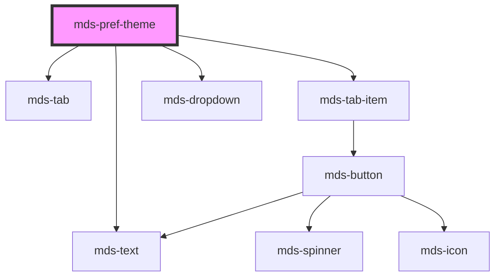

# mds-pref-theme


<!-- Auto Generated Below -->


## Usage

### 1. Description

The `<mds-pref-theme>` web component is the theme-switcher segment of the Magma accessibility preferences panel, designed to live as a direct child of [`<mds-pref>`](../../mds-pref). It renders a labelled tab trigger that opens a dropdown of selectable theme variants and, when a variant is chosen, applies it globally to the document.

#### Semantic Behavior

- **Compound positioning**: It must be a direct slot child of `<mds-pref>` and is not used standalone.
- **Acts as a sub-parent itself**: Its own default slot must contain one or more `mds-pref-theme-item` elements; it drives their selected state so only the active theme is marked selected.
- **Global theme application**: Selecting an item applies the theme document-wide.
- **Persistence and hydration**: The current name and scheme are persisted and restored across reloads regardless of the declared `name` default.
- **Name validation**: An invalid theme name (not lowercase kebab-case matching `^[a-z]+(-[a-z]+)*$`) throws at runtime when the theme is applied. So do the reserved names `light`, `dark` and `system` (they are mode values) and `scheme` or `scheme-*` (they would collide with the `pref-theme-scheme-*` classes).
- **Events bubbled up**: Emits `mdsPrefThemeChange` with the `{ name, scheme }` detail on selection, and `mdsPrefChange` (`preference: 'theme'`) which `<mds-pref>` listens to.
- **Localized label**: The "Theme" heading follows the active interface language.

#### Properties & Visual Configurations

- **`name`**: The active theme name (default `'default'`); it is overridden at runtime by any persisted value. Use it to declare the initial theme when no preference has been stored yet.
- **`scheme`**: Constrains the colour modes of the theme to `'light'`, `'dark'`, or `'all'` (default). Pick `'all'` for themes that ship both light and dark palettes; pick `'light'` or `'dark'` to force a single mode for a variant that only defines one.
- **`size`**: Sets the size (`'sm'` / `'md'`) of the nested tab UI. It is normally not set directly - `<mds-pref>` propagates its own `size` down to every `mds-pref-*` segment so the panel stays visually consistent.


### 2. Pattern

Correct and idiomatic ways to use the `<mds-pref-theme>` component, ordered from most common to most specialized. Patterns assume a working knowledge of the preferences system documented in [`docs/COMPONENTS.md`](../../../../../../docs/COMPONENTS.md) and the generic stencil rules in [`projects/stencil/SPEC.md`](../../../../SPEC.md).

#### Basic Theme Chooser

The canonical form. Place `<mds-pref-theme>` inside [`<mds-pref>`](../../mds-pref) and populate its default slot with one [`<mds-pref-theme-item>`](../../mds-pref-theme-item) per available theme. The first item's `name` must match the `name` prop on the parent so the correct item starts as selected.

```html
<mds-pref>
  <mds-pref-theme name="default" scheme="all">
    <mds-pref-theme-item label="Predefinito" name="default" scheme="all"></mds-pref-theme-item>
    <mds-pref-theme-item label="Estate" name="summer" scheme="light"></mds-pref-theme-item>
    <mds-pref-theme-item label="Crepuscolo" name="twilight" scheme="dark"></mds-pref-theme-item>
  </mds-pref-theme>
</mds-pref>
```

#### Scheme-Constrained Themes

Use `scheme="light"` or `scheme="dark"` on a `<mds-pref-theme-item>` when the theme only defines one colour mode. The parent component propagates the chosen scheme to `<html>` and forces that mode even if the user's OS prefers the opposite.

```html
<mds-pref>
  <mds-pref-theme name="default" scheme="all">
    <mds-pref-theme-item label="Predefinito" name="default" scheme="all"></mds-pref-theme-item>
    <!-- light-only palette - dark mode will not activate for this theme -->
    <mds-pref-theme-item label="Chiaro" name="corporate" scheme="light"></mds-pref-theme-item>
    <!-- dark-only palette -->
    <mds-pref-theme-item label="Notte" name="midnight" scheme="dark"></mds-pref-theme-item>
  </mds-pref-theme>
</mds-pref>
```

#### Listening for the Change Event

React to the user's selection via `mdsPrefThemeChange`. The event detail carries `{ name, scheme }` - use them to update any app-level state that tracks the active theme.

```html
<mds-pref>
  <mds-pref-theme id="theme-chooser" name="default" scheme="all">
    <mds-pref-theme-item label="Predefinito" name="default" scheme="all"></mds-pref-theme-item>
    <mds-pref-theme-item label="Estate" name="summer" scheme="light"></mds-pref-theme-item>
  </mds-pref-theme>
</mds-pref>

<script>
  document.querySelector('#theme-chooser').addEventListener('mdsPrefThemeChange', (e) => {
    console.log('Tema attivo:', e.detail.name, '- Schema:', e.detail.scheme);
  });
</script>
```

#### Declaring the Initial Theme

Use the `name` prop to declare which theme should be active before the user makes a selection. If `localStorage` already holds a persisted value it takes precedence; otherwise the component applies `name` on first render.

```html
<mds-pref>
  <!-- First-visit default is "estate" -->
  <mds-pref-theme name="summer" scheme="light">
    <mds-pref-theme-item label="Predefinito" name="default" scheme="all"></mds-pref-theme-item>
    <mds-pref-theme-item label="Estate" name="summer" scheme="light"></mds-pref-theme-item>
  </mds-pref-theme>
</mds-pref>
```

#### Controlling Item Size

Pass `size="sm"` when the preferences panel must fit a compact layout. Normally `<mds-pref>` propagates its own `size` to every `mds-pref-*` child automatically; set it directly only when using `<mds-pref-theme>` without its parent.

```html
<mds-pref size="sm">
  <mds-pref-theme name="default" scheme="all" size="sm">
    <mds-pref-theme-item label="Predefinito" name="default" scheme="all"></mds-pref-theme-item>
    <mds-pref-theme-item label="Estate" name="summer" scheme="light"></mds-pref-theme-item>
  </mds-pref-theme>
</mds-pref>
```

#### Styling Theme Items

Style theme items only through their documented `--mds-pref-theme-item-*` CSS custom properties. Set them on the item host or on a parent selector; use Magma colour tokens via `rgb(var(--<token>))` to stay compatible with dark mode.

```css
mds-pref-theme-item {
  --mds-pref-theme-item-color-background: rgb(var(--tone-neutral-01));
  --mds-pref-theme-item-color-variant-primary: rgb(var(--variant-primary-05));
}
```


### 3. Antipattern

Common incorrect uses of `<mds-pref-theme>`. Each entry pairs the wrong form with the right one and a one-line reason. System-wide rules (boolean-as-string, shadow piercing, Tailwind colour utilities, raw native event listening) live in [`docs/COMPONENTS.md`](../../../../../../docs/COMPONENTS.md#system-level-anti-patterns) - they apply here too but are not repeated.

#### Do Not Use the Component Outside `<mds-pref>`

`<mds-pref-theme>` is a compound sub-part designed to slot inside [`<mds-pref>`](../../mds-pref). Using it standalone breaks the shared preferences panel layout and removes the size propagation cascade from the parent.

```html
<!-- 🚫 INCORRECT -->
<mds-pref-theme name="default" scheme="all">
  <mds-pref-theme-item label="Predefinito" name="default" scheme="all"></mds-pref-theme-item>
</mds-pref-theme>

<!-- ✅ CORRECT -->
<mds-pref>
  <mds-pref-theme name="default" scheme="all">
    <mds-pref-theme-item label="Predefinito" name="default" scheme="all"></mds-pref-theme-item>
  </mds-pref-theme>
</mds-pref>
```

#### Do Not Put Plain Text or Arbitrary HTML in the Default Slot

The default slot is reserved exclusively for `<mds-pref-theme-item>` elements. Any other content bypasses the component's internal selection management and will not trigger theme application.

```html
<!-- 🚫 INCORRECT -->
<mds-pref>
  <mds-pref-theme name="default" scheme="all">
    <button>Predefinito</button>
    <span>Estate</span>
  </mds-pref-theme>
</mds-pref>

<!-- ✅ CORRECT -->
<mds-pref>
  <mds-pref-theme name="default" scheme="all">
    <mds-pref-theme-item label="Predefinito" name="default" scheme="all"></mds-pref-theme-item>
    <mds-pref-theme-item label="Estate" name="summer" scheme="light"></mds-pref-theme-item>
  </mds-pref-theme>
</mds-pref>
```

#### Do Not Use an Invalid Theme Name

The `name` prop must match the pattern `^[a-z]+(-[a-z]+)*$` (lowercase letters and hyphens only). Any other value - including uppercase, underscores, or spaces - throws a runtime error when the component tries to apply the theme class on `<html>`.

```html
<!-- 🚫 INCORRECT -->
<mds-pref-theme name="My Theme" scheme="all">...</mds-pref-theme>
<mds-pref-theme name="my_theme" scheme="all">...</mds-pref-theme>
<mds-pref-theme name="MyTheme" scheme="all">...</mds-pref-theme>

<!-- ✅ CORRECT -->
<mds-pref-theme name="my-theme" scheme="all">...</mds-pref-theme>
```

#### Do Not Listen for the Native `change` Event

`<mds-pref-theme>` emits `mdsPrefThemeChange` - a documented custom event with a typed `{ name, scheme }` detail. Listening for the native `change` event will not fire because theme selection is handled entirely inside shadow DOM.

```html
<!-- 🚫 INCORRECT -->
<script>
  document.querySelector('mds-pref-theme').addEventListener('change', (e) => {
    console.log(e.target.value); // undefined - wrong event, wrong detail shape
  });
</script>

<!-- ✅ CORRECT -->
<script>
  document.querySelector('mds-pref-theme').addEventListener('mdsPrefThemeChange', (e) => {
    console.log(e.detail.name, e.detail.scheme);
  });
</script>
```

#### Do Not Set `size` Independently When Inside `<mds-pref>`

`<mds-pref>` propagates its own `size` value to all `mds-pref-*` children automatically. Setting `size` directly on `<mds-pref-theme>` while it is inside `<mds-pref>` creates a conflict and the panel may render inconsistently.

```html
<!-- 🚫 INCORRECT -->
<mds-pref size="sm">
  <mds-pref-theme size="md" name="default" scheme="all">
    <mds-pref-theme-item label="Predefinito" name="default" scheme="all"></mds-pref-theme-item>
  </mds-pref-theme>
</mds-pref>

<!-- ✅ CORRECT -->
<mds-pref size="sm">
  <mds-pref-theme name="default" scheme="all">
    <mds-pref-theme-item label="Predefinito" name="default" scheme="all"></mds-pref-theme-item>
  </mds-pref-theme>
</mds-pref>
```


## Properties

| Property      | Attribute      | Description                                                                                                                                                                                                                                                                                                                                                                                                                                                                                                                                                                                                                                    | Type                                                                                           | Default     |
| ------------- | -------------- | ---------------------------------------------------------------------------------------------------------------------------------------------------------------------------------------------------------------------------------------------------------------------------------------------------------------------------------------------------------------------------------------------------------------------------------------------------------------------------------------------------------------------------------------------------------------------------------------------------------------------------------------------- | ---------------------------------------------------------------------------------------------- | ----------- |
| `cornerShape` | `corner-shape` | Specifies the corner geometry of the whole page: one of the `corner-shape` keywords, or `default`.  Corner geometry is theme appearance rather than an accessibility preference, which is why it lives here next to the theme name and scheme instead of in `mds-pref-mode`. Setting it writes `data-corner-shape` on `<html>`, where the generated axis picks both the shape and the radius scale tuned for it.  Leaving it unset touches nothing. Setting it to `default` REMOVES the attribute rather than writing today's default into the page, so a project that never chose keeps following the design system when the default changes. | `"bevel" \| "default" \| "notch" \| "round" \| "scoop" \| "square" \| "squircle" \| undefined` | `undefined` |
| `name`        | `name`         | Specifies the theme name attribute A string representing the theme name, should be a simple string name or kebab kase name. `Examples of valid language codes include "magma", "maggioli-editore", etc.`                                                                                                                                                                                                                                                                                                                                                                                                                                       | `string`                                                                                       | `'default'` |
| `scheme`      | `scheme`       | Specifies the theme scheme which can be 'light', 'dark' or 'all' Default is 'all' which means this theme supporto both light and dark. If you set 'light' means this theme support only light mode and will be forced and shown light colors mode only.                                                                                                                                                                                                                                                                                                                                                                                        | `"all" \| "dark" \| "light"`                                                                   | `'all'`     |
| `size`        | `size`         | Sets the size of the component items nested inside it                                                                                                                                                                                                                                                                                                                                                                                                                                                                                                                                                                                          | `"md" \| "sm" \| undefined`                                                                    | `undefined` |


## Events

| Event                | Description                                                                                           | Type                                    |
| -------------------- | ----------------------------------------------------------------------------------------------------- | --------------------------------------- |
| `mdsPrefChange`      | Emits when the component is triggered                                                                 | `CustomEvent<MdsPrefChangeEventDetail>` |
| `mdsPrefThemeChange` | Emits when the component changes the language selected from the click event of the dropdown list item | `CustomEvent<MdsPrefThemeEventDetail>`  |


## Slots

| Slot | Description                          |
| ---- | ------------------------------------ |
|      | Add `mds-pref-theme-item` element/s. |


## Dependencies

### Depends on

- [mds-text](../mds-text)
- [mds-tab](../mds-tab)
- [mds-tab-item](../mds-tab-item)
- [mds-dropdown](../mds-dropdown)

### Graph

```mermaid
graph TD;
  mds-pref-theme --> mds-text
  mds-pref-theme --> mds-tab
  mds-pref-theme --> mds-tab-item
  mds-pref-theme --> mds-dropdown
  mds-tab-item --> mds-button
  mds-button --> mds-spinner
  mds-button --> mds-icon
  mds-button --> mds-text
  style mds-pref-theme fill:#f9f,stroke:#333,stroke-width:4px
```

----------------------------------------------

Built with love @ [Gruppo Maggioli](https://www.maggioli.com) from [R&D Department](https://www.maggioli.com/it-it/chi-siamo/ricerca-sviluppo)
