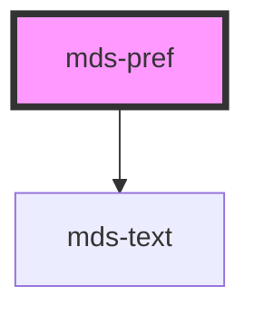

# mds-pref


<!-- Auto Generated Below -->


## Usage

### 1. Description

The `<mds-pref>` web component is the accessibility-preferences panel of the Magma Design System: a compound parent that groups user-facing settings (animation, consumption, contrast, theme, language) so people can tune readability, motion, and language for their session. It acts as the coordinator for the `mds-pref-*` children slotted inside it.

#### Semantic Behavior

- **Compound parent**: Expects `mds-pref-animation`, `mds-pref-consumption`, `mds-pref-contrast`, `mds-pref-theme`, and/or `mds-pref-language` children in its default slot; it owns no preference UI of its own beyond coordination.
- **Size propagation**: Changing `size` cascades the value down to every nested `mds-pref-*` child, keeping the whole panel on one tab size.
- **Reload notice**: Listens for the `mdsPrefChange` event from children and, when the changed preference cannot apply live (`consumption` or `language`), reveals an inline caption prompting the user to refresh the page.
- **Live language sync**: When a `language` change is emitted, the panel re-resolves its own locale so the reload notice is shown in the newly selected language.

#### Properties & Visual Configurations

`size` is one of the shared tab sizes and is forwarded to children rather than styling the host directly - set it once on the parent instead of on each child.

#### Other behavioral props

- **`controller`** switches the component from a visible on-DOM panel into a headless controller that applies and reacts to preferences without rendering UI; in this mode it drives document-level preference state without a visible panel.


### 2. Pattern

Correct and idiomatic ways to use the `<mds-pref>` component, ordered from most common to most specialized. Patterns assume a working knowledge of the variant / tone ladders documented in [`docs/COMPONENTS.md`](../../../../../../docs/COMPONENTS.md) and the generic stencil rules in [`projects/stencil/SPEC.md`](../../../../SPEC.md).

#### Full Preferences Panel

The canonical form: slot every `mds-pref-*` control directly inside `<mds-pref>`. The parent coordinates size propagation and the reload notice automatically - no extra wiring is needed.

```html
<mds-pref>
  <mds-pref-theme></mds-pref-theme>
  <mds-pref-theme-variant>
    <mds-pref-theme-variant-item name="default"></mds-pref-theme-variant-item>
    <mds-pref-theme-variant-item name="magma"></mds-pref-theme-variant-item>
  </mds-pref-theme-variant>
  <mds-pref-contrast></mds-pref-contrast>
  <mds-pref-animation></mds-pref-animation>
  <mds-pref-consumption></mds-pref-consumption>
  <mds-pref-language>
    <mds-pref-language-item code="it"></mds-pref-language-item>
    <mds-pref-language-item code="en"></mds-pref-language-item>
  </mds-pref-language>
</mds-pref>
```

#### Partial Panel - Subset of Controls

Slot only the controls your application needs. `<mds-pref>` renders whatever children are present; omitted controls are simply absent.

```html
<!-- Accessibility-only panel: contrast and animation controls -->
<mds-pref>
  <mds-pref-contrast></mds-pref-contrast>
  <mds-pref-animation></mds-pref-animation>
</mds-pref>
```

#### Controlling Size

Use the `size` prop on the parent to drive all child controls at once. Setting it on each child individually is unnecessary - the parent propagates the value automatically.

```html
<!-- Compact panel for a sidebar or popover -->
<mds-pref size="sm">
  <mds-pref-theme></mds-pref-theme>
  <mds-pref-contrast></mds-pref-contrast>
  <mds-pref-animation></mds-pref-animation>
</mds-pref>
```

#### Headless Controller Mode

Set the `controller` boolean attribute when you need the preference engine to apply saved preferences from `localStorage` on page load without rendering any visible UI. The host is hidden via CSS (`display: none`) and still activates all child preference controls.

```html
<!-- Place in <body>; the panel is invisible but activates stored preferences -->
<mds-pref controller>
  <mds-pref-theme></mds-pref-theme>
  <mds-pref-contrast></mds-pref-contrast>
  <mds-pref-animation></mds-pref-animation>
  <mds-pref-consumption></mds-pref-consumption>
  <mds-pref-language>
    <mds-pref-language-item code="it"></mds-pref-language-item>
    <mds-pref-language-item code="en"></mds-pref-language-item>
  </mds-pref-language>
</mds-pref>
```

#### Language Selector with Multiple Languages

`<mds-pref-language>` requires its child `<mds-pref-language-item>` elements to be present; the items are not self-generating. Pass language codes supported by your application.

```html
<mds-pref>
  <mds-pref-language>
    <mds-pref-language-item code="it"></mds-pref-language-item>
    <mds-pref-language-item code="en"></mds-pref-language-item>
    <mds-pref-language-item code="el"></mds-pref-language-item>
    <mds-pref-language-item code="es"></mds-pref-language-item>
  </mds-pref-language>
</mds-pref>
```

#### Reload Notice Handling

When a user changes `consumption` or `language`, `<mds-pref>` automatically shows an inline caption telling the user to refresh the page - no extra code needed. Verify that your page does not suppress this notice with CSS overrides.

```html
<!-- The reload notice appears automatically inside the shadow root;
     do not try to inject your own reload banner outside the component -->
<mds-pref>
  <mds-pref-consumption></mds-pref-consumption>
  <mds-pref-language>
    <mds-pref-language-item code="it"></mds-pref-language-item>
    <mds-pref-language-item code="en"></mds-pref-language-item>
  </mds-pref-language>
</mds-pref>
```


### 3. Antipattern

Common incorrect uses of `<mds-pref>`. Each entry pairs the wrong form with the right one and a one-line reason. System-wide rules (boolean-as-string, shadow piercing, Tailwind color utilities, raw native event listening) live in [`docs/COMPONENTS.md`](../../../../../../docs/COMPONENTS.md#system-level-anti-patterns) - they apply here too but are not repeated.

#### Do Not Place Non-Pref Children in the Default Slot

The default slot accepts only `mds-pref-animation`, `mds-pref-consumption`, `mds-pref-contrast`, `mds-pref-language`, and `mds-pref-theme` children. Slotting other elements breaks the coordination logic and may not render.

```html
<!-- 🚫 INCORRECT -->
<mds-pref>
  <div class="custom-section">Tema</div>
  <mds-pref-theme></mds-pref-theme>
</mds-pref>

<!-- ✅ CORRECT -->
<mds-pref>
  <mds-pref-theme></mds-pref-theme>
</mds-pref>
```

#### Do Not Use `mds-pref-*` Children Outside `<mds-pref>`

Preference children depend on parent coordination for size propagation and the reload notice. Using them standalone removes that orchestration.

```html
<!-- 🚫 INCORRECT -->
<mds-pref-contrast></mds-pref-contrast>
<mds-pref-animation></mds-pref-animation>

<!-- ✅ CORRECT -->
<mds-pref>
  <mds-pref-contrast></mds-pref-contrast>
  <mds-pref-animation></mds-pref-animation>
</mds-pref>
```

#### Do Not Set `controller="false"` to Turn Off Controller Mode

`controller` is a boolean attribute. Setting it to the string `"false"` still evaluates as truthy in HTML and keeps the panel hidden. Remove the attribute entirely to switch back to visible mode.

```html
<!-- 🚫 INCORRECT -->
<mds-pref controller="false">
  <mds-pref-theme></mds-pref-theme>
</mds-pref>

<!-- ✅ CORRECT -->
<mds-pref>
  <mds-pref-theme></mds-pref-theme>
</mds-pref>
```

#### Do Not Set `size` on Each Child Individually

`<mds-pref>` propagates the `size` prop to all its `mds-pref-*` children automatically via `handleSizeChange`. Setting `size` on every child is redundant and will be overwritten by any later change to the parent prop.

```html
<!-- 🚫 INCORRECT -->
<mds-pref>
  <mds-pref-theme size="sm"></mds-pref-theme>
  <mds-pref-contrast size="sm"></mds-pref-contrast>
  <mds-pref-animation size="sm"></mds-pref-animation>
</mds-pref>

<!-- ✅ CORRECT -->
<mds-pref size="sm">
  <mds-pref-theme></mds-pref-theme>
  <mds-pref-contrast></mds-pref-contrast>
  <mds-pref-animation></mds-pref-animation>
</mds-pref>
```

#### Do Not Listen for the Native `change` Event to Detect Preference Changes

Native events may not bubble out of shadow DOM as expected. Use the documented `mdsPrefChange` event emitted by each `mds-pref-*` child.

```html
<!-- 🚫 INCORRECT -->
<script>
  document.querySelector('mds-pref').addEventListener('change', (e) => {
    console.log(e);
  });
</script>

<!-- ✅ CORRECT -->
<script>
  document.querySelector('mds-pref-theme').addEventListener('mdsPrefChange', (e) => {
    console.log(e.detail.preference);
  });
</script>
```

#### Do Not Add a Custom Reload Banner Alongside the Panel

`<mds-pref>` already renders an inline reload caption in its shadow root when `consumption` or `language` changes. Duplicating this with an external banner leads to double messaging.

```html
<!-- 🚫 INCORRECT -->
<div id="reload-hint" hidden>Ricarica la pagina per applicare le modifiche.</div>
<mds-pref>
  <mds-pref-consumption></mds-pref-consumption>
</mds-pref>
<script>
  document.querySelector('mds-pref-consumption').addEventListener('mdsPrefChange', () => {
    document.getElementById('reload-hint').hidden = false;
  });
</script>

<!-- ✅ CORRECT -->
<mds-pref>
  <mds-pref-consumption></mds-pref-consumption>
</mds-pref>
```


## Properties

| Property     | Attribute    | Description                                                                                        | Type                        | Default     |
| ------------ | ------------ | -------------------------------------------------------------------------------------------------- | --------------------------- | ----------- |
| `controller` | `controller` | Sets if the component works as hidden element controller instead as UI element, visible on the DOM | `boolean \| undefined`      | `undefined` |
| `size`       | `size`       | Sets the size of the component items nested inside it                                              | `"md" \| "sm" \| undefined` | `undefined` |


## Methods

### `updateLang() => Promise<void>`


#### Returns

Type: `Promise<void>`


## Slots

| Slot        | Description                                                                                                                |
| ----------- | -------------------------------------------------------------------------------------------------------------------------- |
| `"default"` | Add `mds-pref-animation`, `mds-pref-consumption`, `mds-pref-contrast`, `mds-pref-language`, or `mds-pref-theme` element/s. |


## Dependencies

### Depends on

- [mds-text](../mds-text)

### Graph


----------------------------------------------

Built with love @ [Gruppo Maggioli](https://www.maggioli.com) from [R&D Department](https://www.maggioli.com/it-it/chi-siamo/ricerca-sviluppo)
