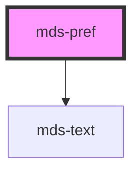

# mds-pref


<!-- Auto Generated Below -->


## Usage

### 1. Description

The `<mds-pref>` web component is the accessibility-preferences panel of the Magma Design System: a compound parent that groups user-facing settings (animation, consumption, contrast, theme, language) so people can tune readability, motion, and language for their session. It acts as the coordinator for the `mds-pref-*` children slotted inside it.

#### Semantic Behavior

- **Compound parent**: Expects `mds-pref-animation`, `mds-pref-consumption`, `mds-pref-contrast`, `mds-pref-mode`, `mds-pref-theme` and/or `mds-pref-language` children in its default slot; it owns no preference UI of its own beyond coordination (a scheme-constrained `mds-pref-theme` locks the matching `mds-pref-mode` item).
- **Size propagation**: A change of `size` after load cascades the value down to every nested `mds-pref-*` child; the initial value is not forwarded (the watcher does not run on load), so for the first render set `size` on each child too.
- **Reload notice**: The panel has an inline caption prompting the user to refresh the page when a preference that cannot apply live (`consumption` or `language`) changes, but it listens for the children's `mdsPrefChange` only in `controller` mode, where the host is hidden: in the visible panel the caption never appears.
- **Live language sync**: When a `language` change is emitted, the panel re-resolves its own locale so the reload notice is shown in the newly selected language.

#### Properties & Visual Configurations

`size` is one of the shared tab sizes and is forwarded to children rather than styling the host directly - a change on the parent reaches every child, but the initial value does not, so set it on the children as well.

#### Other behavioral props

- **`controller`** switches the component from a visible on-DOM panel into a headless controller that applies and reacts to preferences without rendering UI; in this mode it drives document-level preference state without a visible panel.


### 2. Pattern

Correct and idiomatic ways to use the `<mds-pref>` component, ordered from most common to most specialized. Patterns assume a working knowledge of the shared component rules in [`docs/agents/conventions.md`](../../../../../../docs/agents/conventions.md).

#### Full Preferences Panel

The canonical form: slot every `mds-pref-*` control directly inside `<mds-pref>`. The parent coordinates the theme and mode controls automatically (a scheme-constrained theme locks the matching mode item) - no extra wiring is needed.

```html
<mds-pref>
  <mds-pref-mode></mds-pref-mode>
  <mds-pref-theme>
    <mds-pref-theme-item name="default"></mds-pref-theme-item>
    <mds-pref-theme-item name="cool"></mds-pref-theme-item>
  </mds-pref-theme>
  <mds-pref-contrast></mds-pref-contrast>
  <mds-pref-animation></mds-pref-animation>
  <mds-pref-consumption></mds-pref-consumption>
  <mds-pref-language>
    <mds-pref-language-item code="it"></mds-pref-language-item>
    <mds-pref-language-item code="en"></mds-pref-language-item>
  </mds-pref-language>
</mds-pref>
```

#### Partial Panel - Subset of Controls

Slot only the controls your application needs. `<mds-pref>` renders whatever children are present; omitted controls are simply absent.

```html
<!-- Accessibility-only panel: contrast and animation controls -->
<mds-pref>
  <mds-pref-contrast></mds-pref-contrast>
  <mds-pref-animation></mds-pref-animation>
</mds-pref>
```

#### Controlling Size

A later change of the parent's `size` drives all child controls at once, but the initial value is not forwarded (the watcher does not run on load): for the first render set `size` on each child as well.

```html
<!-- Compact panel for a sidebar or popover -->
<mds-pref size="sm">
  <mds-pref-mode size="sm"></mds-pref-mode>
  <mds-pref-contrast size="sm"></mds-pref-contrast>
  <mds-pref-animation size="sm"></mds-pref-animation>
</mds-pref>
```

#### Headless Controller Mode

Set the `controller` boolean attribute when you need the preference engine to apply saved preferences from `localStorage` on page load without rendering any visible UI. The host is hidden via CSS (`display: none`) and still activates all child preference controls.

```html
<!-- Place in <body>; the panel is invisible but activates stored preferences -->
<mds-pref controller>
  <mds-pref-mode></mds-pref-mode>
  <mds-pref-contrast></mds-pref-contrast>
  <mds-pref-animation></mds-pref-animation>
  <mds-pref-consumption></mds-pref-consumption>
  <mds-pref-language>
    <mds-pref-language-item code="it"></mds-pref-language-item>
    <mds-pref-language-item code="en"></mds-pref-language-item>
  </mds-pref-language>
</mds-pref>
```

#### Language Selector with Multiple Languages

`<mds-pref-language>` requires its child `<mds-pref-language-item>` elements to be present; the items are not self-generating. Pass language codes supported by your application.

```html
<mds-pref>
  <mds-pref-language>
    <mds-pref-language-item code="it"></mds-pref-language-item>
    <mds-pref-language-item code="en"></mds-pref-language-item>
    <mds-pref-language-item code="el"></mds-pref-language-item>
    <mds-pref-language-item code="es"></mds-pref-language-item>
  </mds-pref-language>
</mds-pref>
```

#### Reload Notice Handling

`<mds-pref>` has an inline caption telling the user to refresh the page after a `consumption` or `language` change, but today it never shows in a visible panel: the parent listens for the children's `mdsPrefChange` only in `controller` mode, where the host is hidden. If your application needs the hint, provide it yourself, and keep in mind that the children emit `mdsPrefChange` on every render, page load included, not only on a user's choice.


### 3. Antipattern

Common incorrect uses of `<mds-pref>`. Each entry pairs the wrong form with the right one and a one-line reason. System-wide rules (boolean-as-string, shadow piercing, Tailwind color utilities, raw native event listening) live in [`docs/agents/anti-patterns.md`](../../../../../../docs/agents/anti-patterns.md) - they apply here too but are not repeated.

#### Do Not Place Non-Pref Children in the Default Slot

The default slot accepts only `mds-pref-animation`, `mds-pref-consumption`, `mds-pref-contrast`, `mds-pref-language`, `mds-pref-mode` and `mds-pref-theme` children. Other elements are outside the documented content: they render as extra rows of the panel and take part in no coordination.

```html
<!-- INCORRECT -->
<mds-pref>
  <div class="custom-section">Tema</div>
  <mds-pref-mode></mds-pref-mode>
</mds-pref>

<!-- CORRECT -->
<mds-pref>
  <mds-pref-mode></mds-pref-mode>
</mds-pref>
```

#### Do Not Use `mds-pref-*` Children Outside `<mds-pref>`

Each control applies and stores its own preference, but the coordination between the controls of a panel lives in the parent: a scheme-constrained `mds-pref-theme` item locks the matching `mds-pref-mode` item only inside `<mds-pref>`, and only the parent forwards `size` changes. Group the controls of a panel in `<mds-pref>`.

```html
<!-- INCORRECT -->
<mds-pref-mode></mds-pref-mode>
<mds-pref-theme>
  <mds-pref-theme-item name="default"></mds-pref-theme-item>
  <mds-pref-theme-item name="cool"></mds-pref-theme-item>
</mds-pref-theme>

<!-- CORRECT -->
<mds-pref>
  <mds-pref-mode></mds-pref-mode>
  <mds-pref-theme>
    <mds-pref-theme-item name="default"></mds-pref-theme-item>
    <mds-pref-theme-item name="cool"></mds-pref-theme-item>
  </mds-pref-theme>
</mds-pref>
```

#### Do Not Set `controller="false"` to Turn Off Controller Mode

`controller` is a boolean attribute, and a false boolean is an absent attribute ([`docs/agents/conventions.md`](../../../../../../docs/agents/conventions.md)). The runtime parses the string `"false"` as `false`, so the panel shows, but the attribute is still on the element until the first render, so `[controller]` attribute selectors (the one that hides the panel included) and any code that reads the attribute see it set. Remove the attribute entirely to switch back to visible mode.

```html
<!-- INCORRECT -->
<mds-pref controller="false">
  <mds-pref-mode></mds-pref-mode>
</mds-pref>

<!-- CORRECT -->
<mds-pref>
  <mds-pref-mode></mds-pref-mode>
</mds-pref>
```

#### Do Not Listen for the Native `change` Event to Detect Preference Changes

The controls fire no native `change` event. Use the documented `mdsPrefChange` event emitted by each `mds-pref-*` child; note that a child emits it on every render, page load included, with only the `preference` name in `detail`.

```html
<!-- INCORRECT -->
<script>
  document.querySelector('mds-pref').addEventListener('change', (e) => {
    console.log(e);
  });
</script>

<!-- CORRECT -->
<script>
  document.querySelector('mds-pref-mode').addEventListener('mdsPrefChange', (e) => {
    console.log(e.detail.preference);
  });
</script>
```


## Properties

| Property     | Attribute    | Description                                                                                        | Type                        | Default     |
| ------------ | ------------ | -------------------------------------------------------------------------------------------------- | --------------------------- | ----------- |
| `controller` | `controller` | Sets if the component works as hidden element controller instead as UI element, visible on the DOM | `boolean \| undefined`      | `undefined` |
| `size`       | `size`       | Sets the size of the component items nested inside it                                              | `"md" \| "sm" \| undefined` | `undefined` |


## Slots

| Slot | Description                                                                                                               |
| ---- | ------------------------------------------------------------------------------------------------------------------------- |
|      | Add `mds-pref-animation`, `mds-pref-consumption`, `mds-pref-contrast`, `mds-pref-language`, or `mds-pref-mode` element/s. |


## Dependencies

### Depends on

- [mds-text](../mds-text)

### Graph

```mermaid
graph TD;
  mds-pref --> mds-text
  style mds-pref fill:#f9f,stroke:#333,stroke-width:4px
```

----------------------------------------------

Built with love @ [Gruppo Maggioli](https://www.maggioli.com) from [R&D Department](https://www.maggioli.com/it-it/chi-siamo/ricerca-sviluppo)
