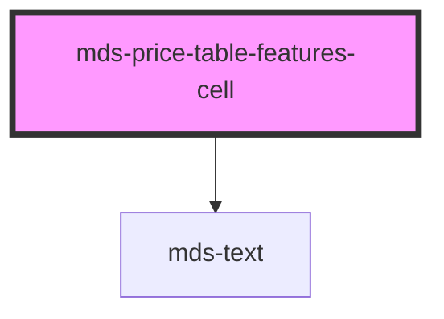

# mds-price-table-features-cell


This is a web-component from Maggioli Design System [Magma](https://magma.maggiolicloud.it), built with StencilJS, TypeScript, Storybook. It's based on the web-component standard and it's designed to be agnostic from the JavaScript framework you are using.

<!-- Auto Generated Below -->


## Usage

### 1. Description

The `<mds-price-table-features-cell>` web component is a single cell within a feature comparison row of the Magma price table, rendering one of several visual representations (a support icon, plain text, a label, or arbitrary custom content) depending on its `type`. It is a compound child of [`<mds-price-table-features-row>`](../../mds-price-table-features-row), which orchestrates a set of cells and conceptually stands in for a table cell within the row.

#### Semantic Behavior

- **Compound child constraint**: Must be used as a direct slot child of `<mds-price-table-features-row>`; it is not standalone and a row is expected to contain only cells of this type.
- **Width is parent-driven**: The cell does not size itself - the parent row distributes equal width across its cells so columns stay aligned across rows.
- **Type-switched rendering**: A single `type` prop drives entirely different output: `supported`/`unsupported` render a check-circle or horizontal-rule icon, `text` wraps the default slot in `detail` typography, while `custom` and `label` pass the default slot straight through with no wrapper.
- **No interactive state**: There is no selected/active/disabled/open state, no emitted events, no form association, and no custom role or ARIA - semantics come from the surrounding table structure.

#### Properties & Visual Configurations

The only configurable prop is `type` (default `text`), which selects what the cell represents rather than just how it looks:

- Use `supported` / `unsupported` for the boolean "feature included / not included" columns - these draw the built-in check-circle and horizontal-rule icons and require no slot content.
- Use `text` for short descriptive values that should adopt the table's `detail` typography automatically.
- Use `label` for the leading row-label cell describing the feature being compared.
- Use `custom` when you need to slot arbitrary HTML or other components without the text wrapper, taking full control of the cell's content.

The full set of accepted values lives in `meta/`; this component does not use the shared `variant` / `tone` ladders defined in [`projects/stencil/SPEC.md`](../../../../SPEC.md#tone-and-variant-system).


### 2. Pattern

Correct and idiomatic ways to use the `<mds-price-table-features-cell>` component, ordered from most common to most specialized. Patterns assume a working knowledge of the conventions in [`docs/COMPONENTS.md`](../../../../../../docs/COMPONENTS.md) and the generic stencil rules in [`projects/stencil/SPEC.md`](../../../../SPEC.md).

#### Supported / Unsupported Icon Cells

The most common use: a boolean "feature included" or "feature not included" column. Use `type="supported"` or `type="unsupported"` and leave the slot empty - the component renders the built-in check-circle or horizontal-rule icon automatically.

```html
<mds-price-table-features-row>
  <mds-price-table-features-cell type="label">Accesso API</mds-price-table-features-cell>
  <mds-price-table-features-cell type="supported"></mds-price-table-features-cell>
  <mds-price-table-features-cell type="unsupported"></mds-price-table-features-cell>
  <mds-price-table-features-cell type="supported"></mds-price-table-features-cell>
</mds-price-table-features-row>
```

#### Label Cell for the Row Feature Name

Place `type="label"` on the first cell of every row to mark it as the feature descriptor. The slot accepts plain text or a combination of text and a help tooltip component.

```html
<mds-price-table-features-row>
  <mds-price-table-features-cell type="label">
    Larghezza di banda
    <mds-help auto-placement="false" placement="top">
      Calcolata per singolo utente attivo al mese.
    </mds-help>
  </mds-price-table-features-cell>
  <mds-price-table-features-cell>10 GB</mds-price-table-features-cell>
  <mds-price-table-features-cell>50 GB</mds-price-table-features-cell>
  <mds-price-table-features-cell>Illimitata</mds-price-table-features-cell>
</mds-price-table-features-row>
```

#### Text Cell for Short Descriptive Values (default)

`type="text"` (the default) wraps slot content in `<mds-text typography="detail">`, applying the table's standard detail typography. Use it for concise values such as storage limits or user counts.

```html
<mds-price-table-features-row>
  <mds-price-table-features-cell type="label">Utenti inclusi</mds-price-table-features-cell>
  <mds-price-table-features-cell type="text">5</mds-price-table-features-cell>
  <mds-price-table-features-cell type="text">25</mds-price-table-features-cell>
  <mds-price-table-features-cell>Illimitati</mds-price-table-features-cell>
</mds-price-table-features-row>
```

#### Icon Cell with an Inline Help Tooltip

Even when the icon speaks for itself, a help tooltip can add context. Slot an `<mds-help>` component alongside the implicit icon - the `custom` slot passthrough is not needed here because the tooltip is decoration, not a content replacement.

```html
<mds-price-table-features-row>
  <mds-price-table-features-cell type="label">Supporto dedicato</mds-price-table-features-cell>
  <mds-price-table-features-cell type="supported">
    <mds-help auto-placement="false" placement="top">
      Disponibile nei giorni feriali dalle 9 alle 18.
    </mds-help>
  </mds-price-table-features-cell>
  <mds-price-table-features-cell type="unsupported">
    <mds-help auto-placement="false" placement="top">
      Non incluso nel piano base.
    </mds-help>
  </mds-price-table-features-cell>
</mds-price-table-features-row>
```

#### Custom Cell for Arbitrary Content

Use `type="custom"` when a plain-text or icon representation is insufficient and you need full control of the cell's content - for example a badge, a rating widget, or a formatted value with a unit.

```html
<mds-price-table-features-row>
  <mds-price-table-features-cell type="label">Assistenza clienti</mds-price-table-features-cell>
  <mds-price-table-features-cell type="custom">
    <mds-chip label="E-mail" variant="info" tone="weak"></mds-chip>
  </mds-price-table-features-cell>
  <mds-price-table-features-cell type="custom">
    <mds-chip label="Chat live" variant="success" tone="weak"></mds-chip>
  </mds-price-table-features-cell>
  <mds-price-table-features-cell type="custom">
    <mds-chip label="Telefono 24/7" variant="primary" tone="strong"></mds-chip>
  </mds-price-table-features-cell>
</mds-price-table-features-row>
```

#### Full Composition Inside the Price Table

Cells must always be children of [`<mds-price-table-features-row>`](../../mds-price-table-features-row), which in turn lives inside [`<mds-price-table-features>`](../../mds-price-table-features) and [`<mds-price-table>`](../../mds-price-table). Do not use the cell outside this hierarchy.

```html
<mds-price-table>
  <mds-price-table-features label="Funzionalita incluse">
    <mds-price-table-features-row>
      <mds-price-table-features-cell type="label">Backup automatico</mds-price-table-features-cell>
      <mds-price-table-features-cell type="unsupported"></mds-price-table-features-cell>
      <mds-price-table-features-cell type="supported"></mds-price-table-features-cell>
      <mds-price-table-features-cell type="supported"></mds-price-table-features-cell>
    </mds-price-table-features-row>
    <mds-price-table-features-row>
      <mds-price-table-features-cell type="label">Spazio di archiviazione</mds-price-table-features-cell>
      <mds-price-table-features-cell>5 GB</mds-price-table-features-cell>
      <mds-price-table-features-cell>20 GB</mds-price-table-features-cell>
      <mds-price-table-features-cell>Illimitato</mds-price-table-features-cell>
    </mds-price-table-features-row>
  </mds-price-table-features>
</mds-price-table>
```

#### Styling Customization

Style the cell only through its documented `--mds-price-table-features-cell-*` CSS custom properties. Set them on the host or a parent selector; use the Magma color tokens via `rgb(var(--<token>))` so dark mode and high-contrast modes keep working.

```css
mds-price-table-features-cell {
  --mds-price-table-features-cell-padding: var(--spacing-400);
  --mds-price-table-features-cell-border-color: rgb(var(--tone-neutral-06));
  --mds-price-table-features-cell-icon-supported-color: rgb(var(--label-green-07));
  --mds-price-table-features-cell-icon-supported-color-hover: rgb(var(--label-green-08));
  --mds-price-table-features-cell-icon-unsupported-color: rgb(var(--tone-neutral-04));
  --mds-price-table-features-cell-icon-unsupported-color-hover: rgb(var(--tone-neutral-05));
}
```


### 3. Antipattern

Common incorrect uses of `<mds-price-table-features-cell>`. Each entry pairs the wrong form with the right one and a one-line reason. System-wide rules (boolean-as-string, shadow piercing, Tailwind color utilities, raw native event listening) live in [`docs/COMPONENTS.md`](../../../../../../docs/COMPONENTS.md#system-level-anti-patterns) - they apply here too but are not repeated.

#### Do Not Use the Cell Outside Its Parent Hierarchy

The cell is a compound subpart and renders as `display: table-cell`. Used outside [`<mds-price-table-features-row>`](../../mds-price-table-features-row) it loses all layout context and column alignment breaks.

```html
<!-- 🚫 INCORRECT -->
<div>
  <mds-price-table-features-cell type="supported"></mds-price-table-features-cell>
  <mds-price-table-features-cell type="text">20 GB</mds-price-table-features-cell>
</div>

<!-- ✅ CORRECT -->
<mds-price-table>
  <mds-price-table-features label="Caratteristiche">
    <mds-price-table-features-row>
      <mds-price-table-features-cell type="supported"></mds-price-table-features-cell>
      <mds-price-table-features-cell type="text">20 GB</mds-price-table-features-cell>
    </mds-price-table-features-row>
  </mds-price-table-features>
</mds-price-table>
```

#### Do Not Slot Content Into `supported` or `unsupported` Cells to Override the Icon

`type="supported"` and `type="unsupported"` always render the built-in icon regardless of slot content; slotting extra markup is ignored or misaligned. Use `type="custom"` if you need a different visual representation.

```html
<!-- 🚫 INCORRECT -->
<mds-price-table-features-cell type="supported">
  <mds-icon name="mi/baseline/star"></mds-icon>
</mds-price-table-features-cell>

<!-- ✅ CORRECT -->
<mds-price-table-features-cell type="custom">
  <mds-icon name="mi/baseline/star"></mds-icon>
</mds-price-table-features-cell>
```

#### Do Not Omit `type="label"` on the Feature-Name Cell

Without `type="label"`, the first cell falls back to `type="text"` and its content is wrapped in `<mds-text typography="detail">`. This produces the wrong typographic weight for a row header and breaks the visual hierarchy.

```html
<!-- 🚫 INCORRECT -->
<mds-price-table-features-row>
  <mds-price-table-features-cell>Numero di utenti</mds-price-table-features-cell>
  <mds-price-table-features-cell type="text">5</mds-price-table-features-cell>
  <mds-price-table-features-cell type="text">25</mds-price-table-features-cell>
</mds-price-table-features-row>

<!-- ✅ CORRECT -->
<mds-price-table-features-row>
  <mds-price-table-features-cell type="label">Numero di utenti</mds-price-table-features-cell>
  <mds-price-table-features-cell type="text">5</mds-price-table-features-cell>
  <mds-price-table-features-cell type="text">25</mds-price-table-features-cell>
</mds-price-table-features-row>
```

#### Do Not Add Rich HTML Into a `text` Cell

`type="text"` wraps content in `<mds-text typography="detail">`; inserting block elements, interactive controls, or multiple children produces unpredictable layout inside that wrapper. Use `type="custom"` for anything more complex than a plain text string.

```html
<!-- 🚫 INCORRECT -->
<mds-price-table-features-cell type="text">
  <strong>20 GB</strong>
  <small> inclusi</small>
</mds-price-table-features-cell>

<!-- ✅ CORRECT -->
<mds-price-table-features-cell type="custom">
  <strong>20 GB</strong>
  <small> inclusi</small>
</mds-price-table-features-cell>
```

#### Do Not Pierce the Shadow DOM to Restyle Icon or Text Parts

The only supported customization surface for this component is `--mds-price-table-features-cell-*` CSS custom properties and the two documented shadow parts (`icon`, `text`). Targeting undocumented internal selectors will break on any minor release.

```css
/* 🚫 INCORRECT */
mds-price-table-features-cell >>> .icon--supported {
  fill: hotpink;
}

/* ✅ CORRECT */
mds-price-table-features-cell {
  --mds-price-table-features-cell-icon-supported-color: rgb(var(--label-pink-06));
}
mds-price-table-features-cell::part(icon) {
  opacity: 0.8;
}
```

#### Do Not Use the `variant` or `tone` Props

`<mds-price-table-features-cell>` does not accept `variant` or `tone` attributes - it does not participate in the shared tone-and-variant system. Passing them has no effect and will produce a warning in strict type-checking builds.

```html
<!-- 🚫 INCORRECT -->
<mds-price-table-features-cell type="supported" variant="success" tone="strong"></mds-price-table-features-cell>

<!-- ✅ CORRECT -->
<mds-price-table-features-cell type="supported"></mds-price-table-features-cell>
```


## Properties

| Property | Attribute | Description                                     | Type                                                                         | Default  |
| -------- | --------- | ----------------------------------------------- | ---------------------------------------------------------------------------- | -------- |
| `type`   | `type`    | Specifies the support type which is represented | `"custom" \| "label" \| "supported" \| "text" \| "unsupported" \| undefined` | `'text'` |


## Slots

| Slot        | Description                                                      |
| ----------- | ---------------------------------------------------------------- |
| `"default"` | Add `text string`, `HTML elements` or `components` to this slot. |


## Shadow Parts

| Part     | Description                                                                                      |
| -------- | ------------------------------------------------------------------------------------------------ |
| `"icon"` | Selects the HTML element of the icon when `type` attribute when is `supported` or `unsupported`. |
| `"text"` | Selects the HTML element wrapper of text when `type` attribute when is `text`.                   |


## CSS Custom Properties

| Name                                                           | Description                                                            |
| -------------------------------------------------------------- | ---------------------------------------------------------------------- |
| `--mds-price-table-features-cell-border-color`                 | Border color of individual feature cells.                              |
| `--mds-price-table-features-cell-icon-supported-color`         | Default color of the supported feature icon.                           |
| `--mds-price-table-features-cell-icon-supported-color-hover`   | Color of the supported feature icon on hover.                          |
| `--mds-price-table-features-cell-icon-unsupported-color`       | Default color of the unsupported feature icon.                         |
| `--mds-price-table-features-cell-icon-unsupported-color-hover` | Color of the unsupported feature icon on hover.                        |
| `--mds-price-table-features-cell-padding`                      | Padding applied to each feature cell, defaults to the section padding. |


## Dependencies

### Depends on

- [mds-text](../mds-text)

### Graph


----------------------------------------------

Built with love @ [Gruppo Maggioli](https://www.maggioli.com) from [R&D Department](https://www.maggioli.com/it-it/chi-siamo/ricerca-sviluppo)
