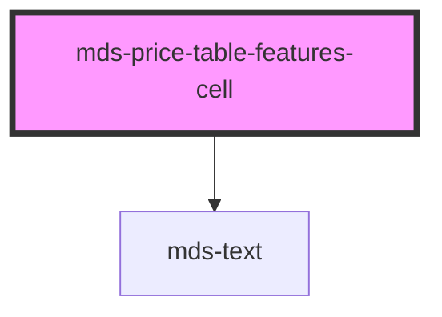

# mds-price-table-features-cell

This is a web-component from Maggioli Design System [Magma](https://magma.maggiolicloud.it), built with StencilJS, TypeScript, Storybook. It's based on the web-component standard and it's designed to be agnostic from the JavaScirpt framework you are using.

<!-- Auto Generated Below -->

## Properties

| Property | Attribute | Description                                     | Type                                                                         | Default  |
| -------- | --------- | ----------------------------------------------- | ---------------------------------------------------------------------------- | -------- |
| `type`   | `type`    | Specifies the support type which is represented | `"custom" \| "label" \| "supported" \| "text" \| "unsupported" \| undefined` | `'text'` |

## Slots

| Slot        | Description                                                      |
| ----------- | ---------------------------------------------------------------- |
| `"default"` | Add `text string`, `HTML elements` or `components` to this slot. |

## Shadow Parts

| Part     | Description                                                                                      |
| -------- | ------------------------------------------------------------------------------------------------ |
| `"icon"` | Selects the HTML element of the icon when `type` attribute when is `supported` or `unsupported`. |
| `"text"` | Selects the HTML element wrapper of text when `type` attribute when is `text`.                   |

## CSS Custom Properties

| Name                                                     | Description                                              |
| -------------------------------------------------------- | -------------------------------------------------------- |
| `--mds-price-table-features-cell-icon-supported-color`   | Sets the border-color of the component                   |
| `--mds-price-table-features-cell-icon-unsupported-color` | Sets the border-width of the separators of the component |
| `--mds-price-table-features-cell-padding`                | Sets the cell padding of the component                   |

## Dependencies

### Depends on

- [mds-text](../mds-text)

### Graph

----------------------------------------------

Built with love @ [Gruppo Maggioli](https://www.maggioli.com) from [R&D Department](https://www.maggioli.com/it-it/chi-siamo/ricerca-sviluppo)
