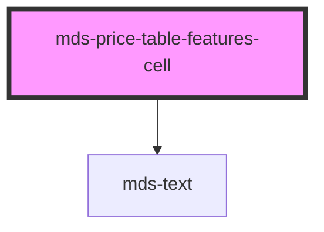

# mds-price-table-features-cell

<!-- Auto Generated Below -->

## Properties

| Property | Attribute | Description                                     | Type                                                                         | Default  |
| -------- | --------- | ----------------------------------------------- | ---------------------------------------------------------------------------- | -------- |
| `type`   | `type`    | Specifies the support type which is represented | `"custom" \| "label" \| "supported" \| "text" \| "unsupported" \| undefined` | `'text'` |

## Slots

| Slot        | Description                                                      |
| ----------- | ---------------------------------------------------------------- |
| `"default"` | Add `text string`, `HTML elements` or `components` to this slot. |

## Shadow Parts

| Part     | Description                                                                                      |
| -------- | ------------------------------------------------------------------------------------------------ |
| `"icon"` | Selects the HTML element of the icon when `type` attribute when is `supported` or `unsupported`. |
| `"text"` | Selects the HTML element wrapper of text when `type` attribute when is `text`.                   |

## Dependencies

### Depends on

- [mds-text](../mds-text)

### Graph

----------------------------------------------

Built with love @ **Maggioli Informatica / R&D Department**
