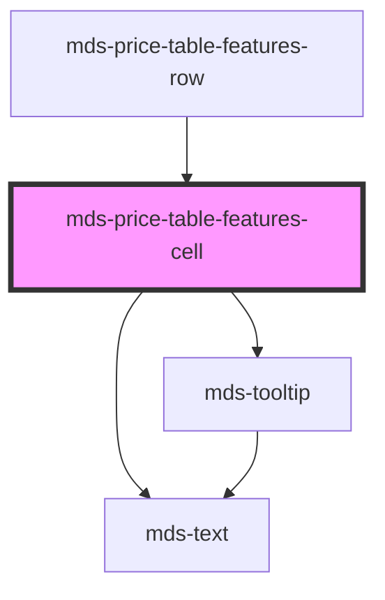

# mds-price-table-features-cell

<!-- Auto Generated Below -->

## Properties

| Property    | Attribute   | Description                                        | Type                                                   | Default     |
| ----------- | ----------- | -------------------------------------------------- | ------------------------------------------------------ | ----------- |
| `supported` | `supported` | Specifies the support type which is represented    | `"custom" \| "false" \| "text" \| "true" \| undefined` | `'true'`    |
| `tip`       | `tip`       | Specifies if the element has a tooltip description | `string \| undefined`                                  | `undefined` |

## Shadow Parts

| Part        | Description |
| ----------- | ----------- |
| `"icon"`    |             |
| `"text"`    |             |
| `"tooltip"` |             |

## CSS Custom Properties

| Name                                                     | Description                                              |
| -------------------------------------------------------- | -------------------------------------------------------- |
| `--mds-price-table-features-cell-icon-supported-color`   | Sets the border-color of the component                   |
| `--mds-price-table-features-cell-icon-unsupported-color` | Sets the border-width of the separators of the component |
| `--mds-price-table-features-cell-padding`                | Sets the cell padding of the component                   |

## Dependencies

### Used by

 - [mds-price-table-features-row](../mds-price-table-features-row)

### Depends on

- [mds-text](../mds-text)
- [mds-tooltip](../mds-tooltip)

### Graph

----------------------------------------------

Built with love @ **Maggioli Informatica / R&D Department**
