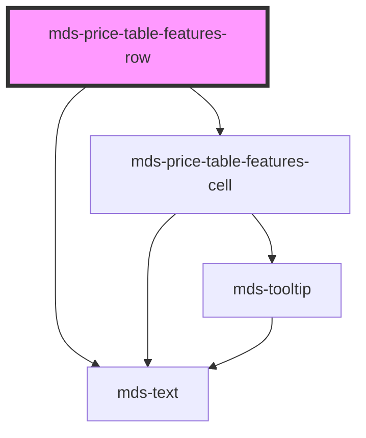

# mds-price-table-features-row

<!-- Auto Generated Below -->

## Properties

| Property | Attribute | Description                                  | Type                  | Default     |
| -------- | --------- | -------------------------------------------- | --------------------- | ----------- |
| `label`  | `label`   | Sets an horizontal title for the feature row | `string \| undefined` | `undefined` |

## CSS Custom Properties

| Name                                          | Description                            |
| --------------------------------------------- | -------------------------------------- |
| `--mds-price-table-features-row-cell-padding` | Sets the cell padding of the component |

## Dependencies

### Depends on

- [mds-price-table-features-cell](../mds-price-table-features-cell)
- [mds-text](../mds-text)

### Graph

----------------------------------------------

Built with love @ **Maggioli Informatica / R&D Department**
