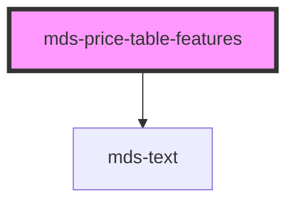

# mds-price-table-features


This is a web-component from Maggioli Design System [Magma](https://magma.maggiolicloud.it), built with StencilJS, TypeScript, Storybook. It's based on the web-component standard and it's designed to be agnostic from the JavaScript framework you are using.

<!-- Auto Generated Below -->


## Usage

### 1. Description

The `<mds-price-table-features>` web component is the feature-matrix block of the Magma Design System pricing-table family. It is a compound child of [`<mds-price-table>`](../../mds-price-table) and renders a table inside its shadow root, turning its slotted rows into the side-by-side feature comparison grid of a pricing table.

#### Semantic Behavior

- **Compound child only**: Must be placed as a direct slot child of `<mds-price-table>`; it is not used standalone. Its own default slot expects only `mds-price-table-features-row` elements, which in turn hold `mds-price-table-features-cell` children.
- **Table wrapper, not a leaf**: The host owns the structural table; the slotted rows and their cells supply the actual row/cell semantics.
- **Optional header band**: A header (shadow part `header`) is rendered only when `label` is set, displaying the title. With no `label` the header is omitted and the table starts at the first row.
- **No state, events, or form association**: The component is purely presentational. Cell content and per-cell rendering (supported / unsupported / text / label) are decided entirely by the child cells.

#### Properties & Visual Configurations

This component has essentially one configurable prop:

- **`label`**: Sets an optional title rendered in the header band above the matrix. Provide it to name the feature group (e.g. a section heading shared across all plan columns); omit it when the matrix should appear without a heading.

All other variation comes from the slotted children rather than from props. Column widths are computed by each `mds-price-table-features-row`, and the visual treatment of each cell is driven by the `type` prop on `mds-price-table-features-cell`. Spacing and dividers can be tuned through the `--mds-price-table-features-padding` and `--mds-price-table-features-border-color` CSS custom properties listed in the readme.


### 2. Pattern

Correct and idiomatic ways to use the `<mds-price-table-features>` component, ordered from most common to most specialized. Patterns assume a working knowledge of the compound-component rules documented in [`docs/COMPONENTS.md`](../../../../../../docs/COMPONENTS.md) and the generic stencil rules in [`projects/stencil/SPEC.md`](../../../../SPEC.md).

#### Basic Feature Matrix

The minimal form: place `<mds-price-table-features>` inside [`<mds-price-table>`](../../mds-price-table) and slot [`<mds-price-table-features-row>`](../../mds-price-table-features-row) children. Each row holds one [`<mds-price-table-features-cell>`](../../mds-price-table-features-cell) per plan column. The first cell of every row conventionally uses `type="label"` to identify the feature.

```html
<mds-price-table>
  <mds-price-table-features>
    <mds-price-table-features-row>
      <mds-price-table-features-cell type="label">Utenti</mds-price-table-features-cell>
      <mds-price-table-features-cell type="text">10</mds-price-table-features-cell>
      <mds-price-table-features-cell type="text">50</mds-price-table-features-cell>
      <mds-price-table-features-cell type="text">Illimitati</mds-price-table-features-cell>
    </mds-price-table-features-row>
  </mds-price-table-features>
</mds-price-table>
```

#### Named Section with `label`

Set the `label` prop to render a header band above the matrix. Use this to name a logical group of features - for example "Report e analisi" or "Sicurezza". Omit `label` when no group heading is needed.

```html
<mds-price-table>
  <mds-price-table-features label="Report e analisi">
    <mds-price-table-features-row>
      <mds-price-table-features-cell type="label">Esporta report</mds-price-table-features-cell>
      <mds-price-table-features-cell type="unsupported"></mds-price-table-features-cell>
      <mds-price-table-features-cell type="supported"></mds-price-table-features-cell>
      <mds-price-table-features-cell type="supported"></mds-price-table-features-cell>
    </mds-price-table-features-row>
  </mds-price-table-features>
</mds-price-table>
```

#### Supported and Unsupported Cells

Use `type="supported"` and `type="unsupported"` for boolean feature availability. The cell renders a built-in icon - no slot content is needed (and any content is ignored).

```html
<mds-price-table>
  <mds-price-table-features label="Funzionalita' avanzate">
    <mds-price-table-features-row>
      <mds-price-table-features-cell type="label">Autenticazione SSO</mds-price-table-features-cell>
      <mds-price-table-features-cell type="unsupported"></mds-price-table-features-cell>
      <mds-price-table-features-cell type="supported"></mds-price-table-features-cell>
      <mds-price-table-features-cell type="supported"></mds-price-table-features-cell>
    </mds-price-table-features-row>
    <mds-price-table-features-row>
      <mds-price-table-features-cell type="label">Notifiche email</mds-price-table-features-cell>
      <mds-price-table-features-cell type="supported"></mds-price-table-features-cell>
      <mds-price-table-features-cell type="supported"></mds-price-table-features-cell>
      <mds-price-table-features-cell type="supported"></mds-price-table-features-cell>
    </mds-price-table-features-row>
  </mds-price-table-features>
</mds-price-table>
```

#### Text Cells with Contextual Help

Use `type="text"` to display a value string. Mix inline components such as [`<mds-help>`](../../mds-help) inside the cell slot for additional context.

```html
<mds-price-table>
  <mds-price-table-features label="Archiviazione">
    <mds-price-table-features-row>
      <mds-price-table-features-cell type="label">Spazio incluso</mds-price-table-features-cell>
      <mds-price-table-features-cell type="text">10 GB</mds-price-table-features-cell>
      <mds-price-table-features-cell type="text">100 GB</mds-price-table-features-cell>
      <mds-price-table-features-cell type="text">
        1 TB
        <mds-help placement="top">Può variare in base allo stato del server.</mds-help>
      </mds-price-table-features-cell>
    </mds-price-table-features-row>
  </mds-price-table-features>
</mds-price-table>
```

#### Custom Cell Content via `type="custom"`

Use `type="custom"` when none of the standard rendering modes fits. The slot is rendered without wrapping markup, giving full control over layout and content.

```html
<mds-price-table>
  <mds-price-table-features label="Componenti aggiuntivi">
    <mds-price-table-features-row>
      <mds-price-table-features-cell type="label">Integrazioni API</mds-price-table-features-cell>
      <mds-price-table-features-cell type="unsupported"></mds-price-table-features-cell>
      <mds-price-table-features-cell type="custom">
        <mds-badge label="Su richiesta" variant="info"></mds-badge>
      </mds-price-table-features-cell>
      <mds-price-table-features-cell type="supported"></mds-price-table-features-cell>
    </mds-price-table-features-row>
  </mds-price-table-features>
</mds-price-table>
```

#### Multiple Feature Sections in One Price Table

Compose several `<mds-price-table-features>` blocks inside one [`<mds-price-table>`](../../mds-price-table) to separate logical feature groups. Each block carries its own optional `label` heading.

```html
<mds-price-table>
  <mds-price-table-features label="Funzioni di base">
    <mds-price-table-features-row>
      <mds-price-table-features-cell type="label">Utenti</mds-price-table-features-cell>
      <mds-price-table-features-cell type="text">5</mds-price-table-features-cell>
      <mds-price-table-features-cell type="text">20</mds-price-table-features-cell>
      <mds-price-table-features-cell type="text">Illimitati</mds-price-table-features-cell>
    </mds-price-table-features-row>
  </mds-price-table-features>

  <mds-price-table-features label="Report e analisi">
    <mds-price-table-features-row>
      <mds-price-table-features-cell type="label">Dashboard</mds-price-table-features-cell>
      <mds-price-table-features-cell type="supported"></mds-price-table-features-cell>
      <mds-price-table-features-cell type="supported"></mds-price-table-features-cell>
      <mds-price-table-features-cell type="supported"></mds-price-table-features-cell>
    </mds-price-table-features-row>
    <mds-price-table-features-row>
      <mds-price-table-features-cell type="label">Report avanzati</mds-price-table-features-cell>
      <mds-price-table-features-cell type="unsupported"></mds-price-table-features-cell>
      <mds-price-table-features-cell type="unsupported"></mds-price-table-features-cell>
      <mds-price-table-features-cell type="supported"></mds-price-table-features-cell>
    </mds-price-table-features-row>
  </mds-price-table-features>
</mds-price-table>
```

#### Styling Customization

Tune borders and spacing through the documented CSS custom properties. Set them on the host or on a parent selector; use Magma color tokens wrapped in `rgb(var(...))` so dark mode and high-contrast modes keep working.

```css
.pricing-section mds-price-table-features {
  --mds-price-table-features-border-color: rgb(var(--variant-primary-06));
  --mds-price-table-features-padding: var(--spacing-400);
}
```

To style the header band independently, target the documented `header` shadow part:

```css
.pricing-section mds-price-table-features::part(header) {
  background: rgb(var(--tone-neutral-09));
}
```


### 3. Antipattern

Common incorrect uses of `<mds-price-table-features>`. Each entry pairs the wrong form with the right one and a one-line reason. System-wide rules (boolean-as-string, shadow piercing, Tailwind color utilities, raw native event listening) live in [`docs/COMPONENTS.md`](../../../../../../docs/COMPONENTS.md#system-level-anti-patterns) - they apply here too but are not repeated.

#### Do Not Use Outside `<mds-price-table>`

`<mds-price-table-features>` is a compound child; it requires a [`<mds-price-table>`](../../mds-price-table) parent to align column widths and participate in the shared table layout. Using it standalone breaks the layout contract.

```html
<!-- 🚫 INCORRECT -->
<mds-price-table-features label="Funzioni di base">
  <mds-price-table-features-row>
    <mds-price-table-features-cell type="label">Utenti</mds-price-table-features-cell>
    <mds-price-table-features-cell type="text">10</mds-price-table-features-cell>
  </mds-price-table-features-row>
</mds-price-table-features>

<!-- ✅ CORRECT -->
<mds-price-table>
  <mds-price-table-features label="Funzioni di base">
    <mds-price-table-features-row>
      <mds-price-table-features-cell type="label">Utenti</mds-price-table-features-cell>
      <mds-price-table-features-cell type="text">10</mds-price-table-features-cell>
    </mds-price-table-features-row>
  </mds-price-table-features>
</mds-price-table>
```

#### Do Not Slot Arbitrary HTML Directly Into `<mds-price-table-features>`

The default slot of `<mds-price-table-features>` expects only `mds-price-table-features-row` elements. Slotting raw `<tr>`, `<div>`, or other markup bypasses the row-width calculation logic and breaks the table structure.

```html
<!-- 🚫 INCORRECT -->
<mds-price-table>
  <mds-price-table-features label="Funzioni">
    <tr>
      <td>Utenti</td>
      <td>10</td>
    </tr>
  </mds-price-table-features>
</mds-price-table>

<!-- ✅ CORRECT -->
<mds-price-table>
  <mds-price-table-features label="Funzioni">
    <mds-price-table-features-row>
      <mds-price-table-features-cell type="label">Utenti</mds-price-table-features-cell>
      <mds-price-table-features-cell type="text">10</mds-price-table-features-cell>
    </mds-price-table-features-row>
  </mds-price-table-features>
</mds-price-table>
```

#### Do Not Add Slot Content to `supported` or `unsupported` Cells

`type="supported"` and `type="unsupported"` render a built-in icon and ignore any slotted content. Adding text or components inside these cells is silent dead markup.

```html
<!-- 🚫 INCORRECT -->
<mds-price-table-features-cell type="supported">Incluso</mds-price-table-features-cell>
<mds-price-table-features-cell type="unsupported">Non disponibile</mds-price-table-features-cell>

<!-- ✅ CORRECT -->
<mds-price-table-features-cell type="supported"></mds-price-table-features-cell>
<mds-price-table-features-cell type="unsupported"></mds-price-table-features-cell>
```

#### Do Not Use `type="text"` as a Label Column

The `type="text"` cell wraps its slot in a detail-typography `<mds-text>` element - it is meant for per-plan values, not for the feature name. Use `type="label"` for the first (feature-name) cell of each row.

```html
<!-- 🚫 INCORRECT -->
<mds-price-table-features-row>
  <mds-price-table-features-cell type="text">Spazio di archiviazione</mds-price-table-features-cell>
  <mds-price-table-features-cell type="text">10 GB</mds-price-table-features-cell>
</mds-price-table-features-row>

<!-- ✅ CORRECT -->
<mds-price-table-features-row>
  <mds-price-table-features-cell type="label">Spazio di archiviazione</mds-price-table-features-cell>
  <mds-price-table-features-cell type="text">10 GB</mds-price-table-features-cell>
</mds-price-table-features-row>
```

#### Do Not Omit Consistent Column Count Across Rows

Every `mds-price-table-features-row` in the same section must have the same number of cells. The row component computes each cell width as `100% / cellCount`; mismatched counts produce misaligned columns.

```html
<!-- 🚫 INCORRECT - first row has 4 cells, second has 3 -->
<mds-price-table-features>
  <mds-price-table-features-row>
    <mds-price-table-features-cell type="label">Utenti</mds-price-table-features-cell>
    <mds-price-table-features-cell type="text">5</mds-price-table-features-cell>
    <mds-price-table-features-cell type="text">20</mds-price-table-features-cell>
    <mds-price-table-features-cell type="text">Illimitati</mds-price-table-features-cell>
  </mds-price-table-features-row>
  <mds-price-table-features-row>
    <mds-price-table-features-cell type="label">Supporto</mds-price-table-features-cell>
    <mds-price-table-features-cell type="unsupported"></mds-price-table-features-cell>
    <mds-price-table-features-cell type="supported"></mds-price-table-features-cell>
  </mds-price-table-features-row>
</mds-price-table-features>

<!-- ✅ CORRECT - every row has the same number of cells -->
<mds-price-table-features>
  <mds-price-table-features-row>
    <mds-price-table-features-cell type="label">Utenti</mds-price-table-features-cell>
    <mds-price-table-features-cell type="text">5</mds-price-table-features-cell>
    <mds-price-table-features-cell type="text">20</mds-price-table-features-cell>
    <mds-price-table-features-cell type="text">Illimitati</mds-price-table-features-cell>
  </mds-price-table-features-row>
  <mds-price-table-features-row>
    <mds-price-table-features-cell type="label">Supporto</mds-price-table-features-cell>
    <mds-price-table-features-cell type="unsupported"></mds-price-table-features-cell>
    <mds-price-table-features-cell type="supported"></mds-price-table-features-cell>
    <mds-price-table-features-cell type="supported"></mds-price-table-features-cell>
  </mds-price-table-features-row>
</mds-price-table-features>
```

#### Do Not Customize via Undocumented `::part()` Selectors

The only documented shadow part is `header`. Targeting internal elements (the `table`, `tbody`, or the `mds-text` inside the header) via other `::part()` selectors or `>>>` couples your code to the internal structure and will break on updates.

```css
/* 🚫 INCORRECT */
mds-price-table-features::part(table) {
  border-radius: 8px;
}
mds-price-table-features >>> table {
  border: 2px solid red;
}

/* ✅ CORRECT */
mds-price-table-features {
  --mds-price-table-features-border-color: rgb(var(--variant-primary-06));
  --mds-price-table-features-padding: var(--spacing-400);
}
mds-price-table-features::part(header) {
  background: rgb(var(--tone-neutral-09));
}
```


## Properties

| Property | Attribute | Description                              | Type                  | Default     |
| -------- | --------- | ---------------------------------------- | --------------------- | ----------- |
| `label`  | `label`   | Sets a header title for the entire table | `string \| undefined` | `undefined` |


## Slots

| Slot | Description                                              |
| ---- | -------------------------------------------------------- |
|      | Expects to slot `mds-price-table-features-row` component |


## Shadow Parts

| Part       | Description                                    |
| ---------- | ---------------------------------------------- |
| `"header"` | Selects the HTML element wrapper of label text |


## CSS Custom Properties

| Name                                      | Description                                      |
| ----------------------------------------- | ------------------------------------------------ |
| `--mds-price-table-features-border-color` | Sets the border-color of the children components |
| `--mds-price-table-features-padding`      | Sets the cell padding of the children components |


## Dependencies

### Depends on

- [mds-text](../mds-text)

### Graph


----------------------------------------------

Built with love @ [Gruppo Maggioli](https://www.maggioli.com) from [R&D Department](https://www.maggioli.com/it-it/chi-siamo/ricerca-sviluppo)
