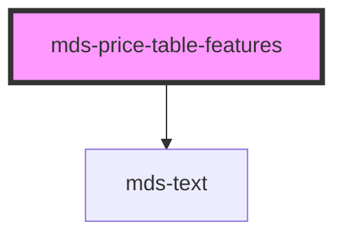

# mds-price-table-features

<!-- Auto Generated Below -->

## Properties

| Property | Attribute | Description                              | Type                  | Default     |
| -------- | --------- | ---------------------------------------- | --------------------- | ----------- |
| `label`  | `label`   | Sets a header title for the entire table | `string \| undefined` | `undefined` |

## Slots

| Slot        | Description                                              |
| ----------- | -------------------------------------------------------- |
| `"default"` | Expects to slot `mds-price-table-features-row` component |

## Shadow Parts

| Part       | Description                                    |
| ---------- | ---------------------------------------------- |
| `"header"` | Selects the HTML element wrapper of label text |

## Dependencies

### Depends on

- [mds-text](../mds-text)

### Graph

----------------------------------------------

Built with love @ **Maggioli Informatica / R&D Department**
