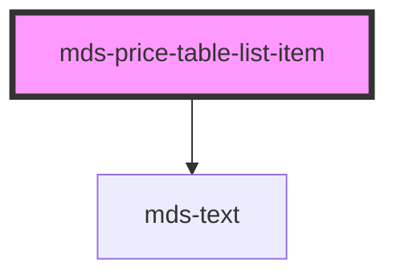

# mds-price-table-list-item


This is a web-component from Maggioli Design System [Magma](https://magma.maggiolicloud.it), built with StencilJS, TypeScript, Storybook. It's based on the web-component standard and it's designed to be agnostic from the JavaScript framework you are using.

<!-- Auto Generated Below -->


## Usage

### 1. Description

The `<mds-price-table-list-item>` web component represents a single feature row inside a [`<mds-price-table-list>`](../../mds-price-table-list), pairing a supported/unsupported status icon with a textual feature label. It is a presentational compound child.

#### Semantic Behavior

- **Compound child only**: It auto-assigns itself to the parent's `item` slot, so it must be a direct child of `<mds-price-table-list>` and is not used standalone.
- **Drives parent layout**: The presence of at least one item is what makes the parent render its separator and feature region.
- **Status icon by `supported`**: When `supported` is `true` it renders a filled check-circle icon; when `false` it renders a horizontal-rule (dash) icon, indicating the feature is absent.
- **Default slot is the label**: Text or markup placed in the default slot becomes the feature description, rendered next to the icon.
- **No interactivity**: The component is purely presentational - it has no role, selection/active/disabled state, emitted events, or keyboard handling.

#### Properties & Visual Configurations

- **`supported`**: Choose `true` for features included in the plan (check icon) and `false` for features not included (dash icon). It is the only semantic switch that changes the rendered icon, and is themeable via the `--mds-price-table-list-item-supported-*` / `-unsupported-*` CSS custom properties.
- **`typography`**: Selects the text scale applied to both the icon wrapper and the label, accepting one of the shared read typography tokens (default `detail`). Use a larger value such as `paragraph` when the list should read at body size, or `caption` for denser tables.


### 2. Pattern

Correct and idiomatic ways to use the `<mds-price-table-list-item>` component, ordered from most common to most specialized. Patterns assume a working knowledge of the compound component rules documented in [`docs/COMPONENTS.md`](../../../../../../docs/COMPONENTS.md) and the generic stencil rules in [`projects/stencil/SPEC.md`](../../../../SPEC.md).

#### Supported Feature Row

The most common form. Place the component as a direct child of [`<mds-price-table-list>`](../../mds-price-table-list) and set `supported` to show the check-circle icon. Text in the default slot becomes the feature label.

```html
<mds-price-table-list>
  <mds-price-table-list-item supported>Accesso base</mds-price-table-list-item>
</mds-price-table-list>
```

#### Unsupported Feature Row

Omit `supported` (or leave it at its default `false`) to render the dash icon, indicating the feature is not included in the plan.

```html
<mds-price-table-list>
  <mds-price-table-list-item>Accesso API</mds-price-table-list-item>
</mds-price-table-list>
```

#### Mixed Feature List

Combine supported and unsupported rows inside one `<mds-price-table-list>` to build the complete plan comparison column.

```html
<mds-price-table-list>
  <mds-price-table-list-item supported>Utenti illimitati</mds-price-table-list-item>
  <mds-price-table-list-item supported>Supporto via chat</mds-price-table-list-item>
  <mds-price-table-list-item supported>Flussi automatizzati</mds-price-table-list-item>
  <mds-price-table-list-item>Analisi avanzata</mds-price-table-list-item>
  <mds-price-table-list-item>Esportazione report</mds-price-table-list-item>
  <mds-price-table-list-item>Accesso API</mds-price-table-list-item>
</mds-price-table-list>
```

#### Feature Row with Contextual Help

The default slot accepts more than plain text. Slot an [`<mds-help>`](../../mds-help) inline next to the label when a feature needs a short explanation.

```html
<mds-price-table-list>
  <mds-price-table-list-item supported>
    20 GB di spazio per utente
    <mds-help>Lo spazio viene condiviso fra tutti i membri del piano.</mds-help>
  </mds-price-table-list-item>
</mds-price-table-list>
```

#### Adjusting Typography Scale

Use the `typography` prop to control text and icon size across the whole row. The default `detail` fits dense tables; switch to `paragraph` for a more readable presentation or `caption` for compact layouts.

```html
<!-- Default (detail) -->
<mds-price-table-list-item supported>Funzionalita di base</mds-price-table-list-item>

<!-- Body-size presentation -->
<mds-price-table-list-item supported typography="paragraph">Funzionalita di base</mds-price-table-list-item>

<!-- Compact table -->
<mds-price-table-list-item typography="caption">Accesso API</mds-price-table-list-item>
```

#### Full Plan Column

The full compound pattern: `<mds-price-table-list>` with header, items, a price, and a call-to-action.

```html
<mds-price-table-list>
  <mds-text typography="h5" slot="header">Piano Business</mds-text>
  <mds-text typography="detail" slot="header">
    Adatto a team di medie dimensioni con esigenze collaborative avanzate.
  </mds-text>

  <mds-price-table-list-item supported>Utenti illimitati</mds-price-table-list-item>
  <mds-price-table-list-item supported>Supporto prioritario</mds-price-table-list-item>
  <mds-price-table-list-item supported>Flussi automatizzati</mds-price-table-list-item>
  <mds-price-table-list-item>Accesso API</mds-price-table-list-item>

  <mds-text typography="h2" slot="price">99 EUR</mds-text>
  <mds-button slot="action" variant="primary" tone="strong">Inizia ora</mds-button>
</mds-price-table-list>
```

#### Styling Customization

Override the icon colors only through the documented `--mds-price-table-list-item-*` CSS custom properties. Use Magma color tokens via `rgb(var(--<token>))` so dark mode and high-contrast keep working.

```css
.promo-column mds-price-table-list-item {
  --mds-price-table-list-item-supported-icon-color: rgb(var(--variant-primary-05));
  --mds-price-table-list-item-supported-icon-color-hover: rgb(var(--variant-primary-04));
  --mds-price-table-list-item-unsupported-icon-color: rgb(var(--tone-neutral-06));
  --mds-price-table-list-item-unsupported-icon-color-hover: rgb(var(--tone-neutral-05));
}
```


### 3. Antipattern

Common incorrect uses of `<mds-price-table-list-item>`. Each entry pairs the wrong form with the right one and a one-line reason. System-wide rules (boolean-as-string, shadow piercing, Tailwind color utilities, raw native event listening) live in [`docs/COMPONENTS.md`](../../../../../../docs/COMPONENTS.md#system-level-anti-patterns) - they apply here too but are not repeated.

#### Do Not Use Outside `<mds-price-table-list>`

The component auto-assigns itself to the parent's `item` slot and is designed exclusively as a child of [`<mds-price-table-list>`](../../mds-price-table-list). Using it standalone produces unstyled output and the icon region becomes orphaned.

```html
<!-- 🚫 INCORRECT -->
<mds-price-table-list-item supported>Funzionalita inclusa</mds-price-table-list-item>

<!-- ✅ CORRECT -->
<mds-price-table-list>
  <mds-price-table-list-item supported>Funzionalita inclusa</mds-price-table-list-item>
</mds-price-table-list>
```

#### Do Not Pass `supported` as a String

`supported` is a boolean prop. Setting `supported="false"` is not the same as omitting it - any non-empty string is truthy in HTML, so the check-circle icon appears even though you intended the unsupported state. Remove the attribute to turn the feature off.

```html
<!-- 🚫 INCORRECT -->
<mds-price-table-list-item supported="false">Accesso API</mds-price-table-list-item>

<!-- ✅ CORRECT -->
<mds-price-table-list-item>Accesso API</mds-price-table-list-item>
```

#### Do Not Use an Unsupported `typography` Value

`typography` accepts only `"caption"`, `"detail"`, and `"paragraph"` (the `TypographyReadType` set). Passing a value outside that set - such as `"h4"` or `"label"` - produces no error but silently breaks the layout because `mds-text` will not recognise the scale.

```html
<!-- 🚫 INCORRECT -->
<mds-price-table-list-item typography="h4" supported>Accesso base</mds-price-table-list-item>
<mds-price-table-list-item typography="label">Analytics</mds-price-table-list-item>

<!-- ✅ CORRECT -->
<mds-price-table-list-item typography="paragraph" supported>Accesso base</mds-price-table-list-item>
<mds-price-table-list-item typography="caption">Analytics</mds-price-table-list-item>
```

#### Do Not Pierce the Shadow DOM to Restyle the Icon

The only supported customization surface for the icon is the four `--mds-price-table-list-item-*` CSS custom properties and the documented `::part(icon)` shadow part. Targeting internal selectors via `>>>`, `/deep/`, or undocumented class names couples your styles to the implementation and will break on minor releases.

```css
/* 🚫 INCORRECT */
mds-price-table-list-item >>> .icon {
  fill: green;
}

/* ✅ CORRECT */
mds-price-table-list-item {
  --mds-price-table-list-item-supported-icon-color: rgb(var(--variant-success-05));
}
/* or, for targeted SVG fill overrides: */
mds-price-table-list-item::part(icon) {
  fill: rgb(var(--variant-success-05));
}
```

#### Do Not Put Block HTML in the Default Slot to Create Layout

The default slot is for the feature label - plain text plus inline helpers such as `<mds-help>`. Inserting block elements, additional icons, or wrapper `<div>` structures breaks the flex row layout that aligns the icon and label.

```html
<!-- 🚫 INCORRECT -->
<mds-price-table-list-item supported>
  <div class="feature-row">
    <mds-icon name="mi/baseline/star"></mds-icon>
    <span>Analisi avanzata</span>
  </div>
</mds-price-table-list-item>

<!-- ✅ CORRECT -->
<mds-price-table-list-item supported>
  Analisi avanzata
  <mds-help>Disponibile solo nei piani premium.</mds-help>
</mds-price-table-list-item>
```


## Properties

| Property     | Attribute    | Description                                  | Type                                   | Default    |
| ------------ | ------------ | -------------------------------------------- | -------------------------------------- | ---------- |
| `supported`  | `supported`  | Specifies if the feature is supported or not | `boolean`                              | `false`    |
| `typography` | `typography` | Specifies if the feature is supported or not | `"caption" \| "detail" \| "paragraph"` | `'detail'` |


## Shadow Parts

| Part     | Description |
| -------- | ----------- |
| `"icon"` |             |


## CSS Custom Properties

| Name                                                       | Description                                            |
| ---------------------------------------------------------- | ------------------------------------------------------ |
| `--mds-price-table-list-item-supported-icon-color`         | Default color of the supported icon in a list item.    |
| `--mds-price-table-list-item-supported-icon-color-hover`   | Color of the supported icon in a list item on hover.   |
| `--mds-price-table-list-item-unsupported-icon-color`       | Default color of the unsupported icon in a list item.  |
| `--mds-price-table-list-item-unsupported-icon-color-hover` | Color of the unsupported icon in a list item on hover. |


## Dependencies

### Depends on

- [mds-text](../mds-text)

### Graph


----------------------------------------------

Built with love @ [Gruppo Maggioli](https://www.maggioli.com) from [R&D Department](https://www.maggioli.com/it-it/chi-siamo/ricerca-sviluppo)
