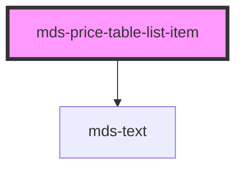

# mds-price-table-list-item

This is a web-component from Maggioli Design System [Magma](https://magma.maggiolicloud.it), built with StencilJS, TypeScript, Storybook. It's based on the web-component standard and it's designed to be agnostic from the JavaScript framework you are using.

<!-- Auto Generated Below -->

## Properties

| Property     | Attribute    | Description                                  | Type                                   | Default    |
| ------------ | ------------ | -------------------------------------------- | -------------------------------------- | ---------- |
| `supported`  | `supported`  | Specifies if the feature is supported or not | `boolean`                              | `false`    |
| `typography` | `typography` | Specifies if the feature is supported or not | `"caption" \| "detail" \| "paragraph"` | `'detail'` |

## Shadow Parts

| Part     | Description |
| -------- | ----------- |
| `"icon"` |             |

## CSS Custom Properties

| Name                                                       | Description                                            |
| ---------------------------------------------------------- | ------------------------------------------------------ |
| `--mds-price-table-list-item-supported-icon-color`         | Default color of the supported icon in a list item.    |
| `--mds-price-table-list-item-supported-icon-color-hover`   | Color of the supported icon in a list item on hover.   |
| `--mds-price-table-list-item-unsupported-icon-color`       | Default color of the unsupported icon in a list item.  |
| `--mds-price-table-list-item-unsupported-icon-color-hover` | Color of the unsupported icon in a list item on hover. |

## Dependencies

### Depends on

- [mds-text](../mds-text)

### Graph

----------------------------------------------

Built with love @ [Gruppo Maggioli](https://www.maggioli.com) from [R&D Department](https://www.maggioli.com/it-it/chi-siamo/ricerca-sviluppo)
